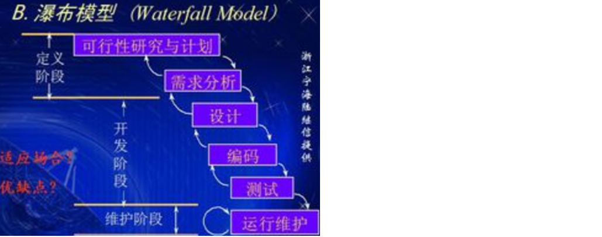
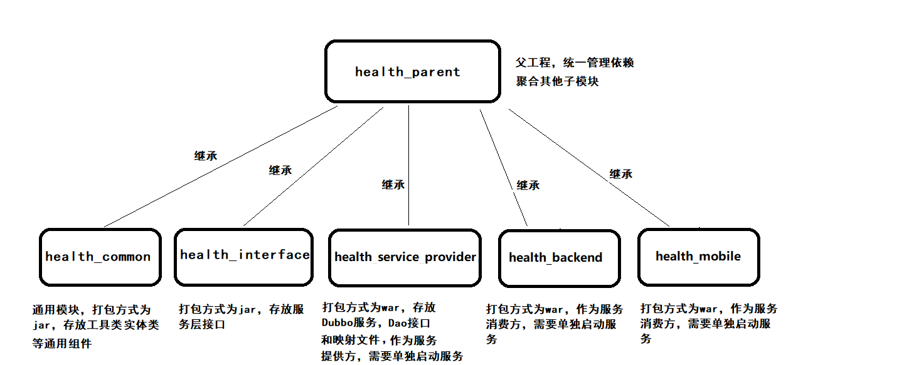
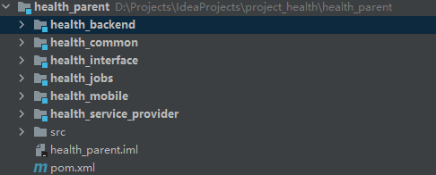
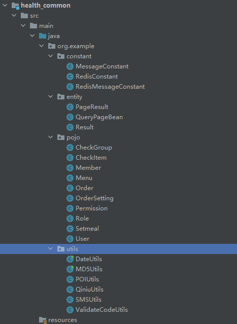
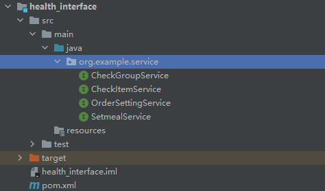
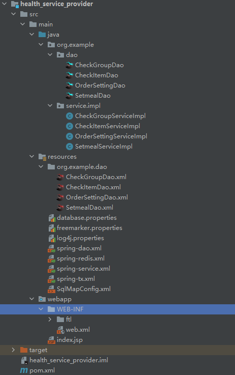
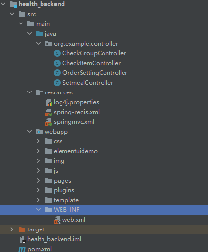

# 第1章 项目概述和环境搭建

## 1. 项目概述

### 1.1 项目介绍

传智健康管理系统是一款应用于健康管理机构的业务系统，实现健康管理机构工作内容可视化、会员管理专业化、健康评估数字化、健康干预流程化、知识库集成化，从而提高健康管理师的工作效率，加强与会员间的互动，增强管理者对健康管理机构运营情况的了解。

详见：资料中的传智健康PRD文档.docx

### 1.2 原型展示

参见资料中的静态原型。

### 1.3 技术架构


### 1.4 技术架构


### 1.5 软件开发流程

软件开发一般会经历如下几个阶段，整个过程是顺序展开，所以通常称为瀑布模型。



```
可行性研究与计划->需求分析->设计->编码->测试->运行维护
```

## 2. 环境搭建

### 2.1 项目结构

本项目采用maven分模块开发方式，即对整个项目拆分为几个maven工程，每个maven工程存放特定的一类代码，具体如下：



各个模块职责定义：

health_parent: 父工程，打包方式为pom，统一锁定依赖的版本，同时聚集其他子模块便于统一执行maven命令

health_common: 通用模块，打包方式为jar，存放项目中使用到的一些工具类，实体类，返回结果和常量值

health_interface: 打包方式为jar，存放服务接口

health_service_provider: Dubbo服务模块，打包方式为war，存放服务实体类、Dao接口、Mapper映射文件等，作为服务提供方，需要部署到tomcat上运行

health_backend: 健康管理后台，打包方式为war，作为Dubbo服务消费方，存放Controller、HTML页面、JS、CSS、Spring配置文件等，需要部署到Tomcat上运行

health_mobile: 移动端前台，打包方式为war，作为Dubbo服务消费方，存放Controller、HTML页面、JS、CSS、Spring配置文件等，需要部署到Tomcat上运行


### 2.2 Maven项目搭建

本项目分为健康管理后台和健康管理前台（微信端）。

#### 2.2.1  health_parent



```xml
<?xml version="1.0" encoding="UTF-8"?>
<project xmlns="http://maven.apache.org/POM/4.0.0"
         xmlns:xsi="http://www.w3.org/2001/XMLSchema-instance"
         xsi:schemaLocation="http://maven.apache.org/POM/4.0.0 http://maven.apache.org/xsd/maven-4.0.0.xsd">
    <modelVersion>4.0.0</modelVersion>

    <groupId>org.example</groupId>
    <artifactId>health_parent</artifactId>
    <version>1.0-SNAPSHOT</version>

    <modules>
        <module>health_common</module>
        <module>health_interface</module>
        <module>health_service_provider</module>
        <module>health_backend</module>
        <module>health_jobs</module>
        <module>health_mobile</module>
    </modules>

    <!--    表示父工程   -->
    <packaging>pom</packaging>

    <!-- 集中定义依赖版本号 -->
    <properties>
        <junit.version>4.12</junit.version>
        <spring.version>5.0.5.RELEASE</spring.version>
        <pagehelper.version>4.1.4</pagehelper.version>
        <servlet-api.version>2.5</servlet-api.version>
        <dubbo.version>2.6.0</dubbo.version>
        <zookeeper.version>3.4.7</zookeeper.version>
        <zkclient.version>0.1</zkclient.version>
        <mybatis.version>3.4.5</mybatis.version>
        <mybatis.spring.version>1.3.1</mybatis.spring.version>
        <mybatis.paginator.version>1.2.15</mybatis.paginator.version>
        <mysql.version>8.0.21</mysql.version>
        <druid.version>1.0.9</druid.version>
        <commons-fileupload.version>1.3.1</commons-fileupload.version>
        <spring.security.version>5.0.5.RELEASE</spring.security.version>
        <poi.version>3.14</poi.version>
        <jedis.version>2.9.0</jedis.version>
        <quartz.version>2.2.1</quartz.version>

        <project.build.sourceEncoding>UTF-8</project.build.sourceEncoding>
        <maven.compiler.encoding>UTF-8</maven.compiler.encoding>
        <java.version>1.8</java.version>
        <maven.compiler.source>1.8</maven.compiler.source>
        <maven.compiler.target>1.8</maven.compiler.target>

    </properties>


    <!-- 依赖管理标签  必须加 -->
    <dependencyManagement>
        <dependencies>
            <!-- Spring -->
            <dependency>
                <groupId>org.springframework</groupId>
                <artifactId>spring-context</artifactId>
                <version>${spring.version}</version>   <!--在前面定义过的-->
            </dependency>
            <dependency>
                <groupId>org.springframework</groupId>
                <artifactId>spring-beans</artifactId>
                <version>${spring.version}</version>
            </dependency>
            <dependency>
                <groupId>org.springframework</groupId>
                <artifactId>spring-web</artifactId>
                <version>${spring.version}</version>
            </dependency>
            <dependency>
                <groupId>org.springframework</groupId>
                <artifactId>spring-webmvc</artifactId>
                <version>${spring.version}</version>
            </dependency>
            <dependency>
                <groupId>org.springframework</groupId>
                <artifactId>spring-jdbc</artifactId>
                <version>${spring.version}</version>
            </dependency>
            <dependency>
                <groupId>org.springframework</groupId>
                <artifactId>spring-aspects</artifactId>
                <version>${spring.version}</version>
            </dependency>
            <dependency>
                <groupId>org.springframework</groupId>
                <artifactId>spring-jms</artifactId>
                <version>${spring.version}</version>
            </dependency>
            <dependency>
                <groupId>org.springframework</groupId>
                <artifactId>spring-context-support</artifactId>
                <version>${spring.version}</version>
            </dependency>
            <dependency>
                <groupId>org.springframework</groupId>
                <artifactId>spring-test</artifactId>
                <version>${spring.version}</version>
            </dependency>

            <!-- dubbo相关 -->
            <dependency>
                <groupId>com.alibaba</groupId>
                <artifactId>dubbo</artifactId>
                <version>${dubbo.version}</version>
            </dependency>
            <dependency>
                <groupId>org.apache.zookeeper</groupId>
                <artifactId>zookeeper</artifactId>
                <version>${zookeeper.version}</version>
            </dependency>
            <dependency>
                <groupId>com.github.sgroschupf</groupId>
                <artifactId>zkclient</artifactId>
                <version>${zkclient.version}</version>
            </dependency>
            <dependency>
                <groupId>junit</groupId>
                <artifactId>junit</artifactId>
                <version>4.12</version>
            </dependency>
            <dependency>
                <groupId>com.alibaba</groupId>
                <artifactId>fastjson</artifactId>
                <version>1.2.47</version>
            </dependency>
            <dependency>
                <groupId>javassist</groupId>
                <artifactId>javassist</artifactId>
                <version>3.12.1.GA</version>
            </dependency>
            <dependency>
                <groupId>commons-codec</groupId>
                <artifactId>commons-codec</artifactId>
                <version>1.10</version>
            </dependency>
            <dependency>
                <groupId>com.github.pagehelper</groupId>
                <artifactId>pagehelper</artifactId>
                <version>${pagehelper.version}</version>
            </dependency>
            <!-- Mybatis -->
            <dependency>
                <groupId>org.mybatis</groupId>
                <artifactId>mybatis</artifactId>
                <version>${mybatis.version}</version>
            </dependency>
            <dependency>
                <groupId>org.mybatis</groupId>
                <artifactId>mybatis-spring</artifactId>
                <version>${mybatis.spring.version}</version>
            </dependency>
            <dependency>
                <groupId>com.github.miemiedev</groupId>
                <artifactId>mybatis-paginator</artifactId>
                <version>${mybatis.paginator.version}</version>
            </dependency>
            <!-- MySql -->
            <dependency>
                <groupId>mysql</groupId>
                <artifactId>mysql-connector-java</artifactId>
                <version>${mysql.version}</version>
            </dependency>
            <!-- 连接池 -->
            <dependency>
                <groupId>com.alibaba</groupId>
                <artifactId>druid</artifactId>
                <version>${druid.version}</version>
            </dependency>
            <!-- 文件上传组件 -->
            <dependency>
                <groupId>commons-fileupload</groupId>
                <artifactId>commons-fileupload</artifactId>
                <version>${commons-fileupload.version}</version>
            </dependency>
            <dependency>
                <groupId>org.quartz-scheduler</groupId>
                <artifactId>quartz</artifactId>
                <version>${quartz.version}</version>
            </dependency>
            <dependency>
                <groupId>org.quartz-scheduler</groupId>
                <artifactId>quartz-jobs</artifactId>
                <version>${quartz.version}</version>
            </dependency>
            <dependency>
                <groupId>com.sun.jersey</groupId>
                <artifactId>jersey-client</artifactId>
                <version>1.18.1</version>
            </dependency>
            <dependency>
                <groupId>com.qiniu</groupId>
                <artifactId>qiniu-java-sdk</artifactId>
                <version>7.2.0</version>
            </dependency>
            <!--POI报表-->
            <dependency>
                <groupId>org.apache.poi</groupId>
                <artifactId>poi</artifactId>
                <version>${poi.version}</version>
            </dependency>
            <dependency>
                <groupId>org.apache.poi</groupId>
                <artifactId>poi-ooxml</artifactId>
                <version>${poi.version}</version>
            </dependency>
            <dependency>
                <groupId>redis.clients</groupId>
                <artifactId>jedis</artifactId>
                <version>${jedis.version}</version>
            </dependency>
            <!-- 安全框架 -->
            <dependency>
                <groupId>org.springframework.security</groupId>
                <artifactId>spring-security-web</artifactId>
                <version>${spring.security.version}</version>
            </dependency>
            <dependency>
                <groupId>org.springframework.security</groupId>
                <artifactId>spring-security-config</artifactId>
                <version>${spring.security.version}</version>
            </dependency>
            <dependency>
                <groupId>org.springframework.security</groupId>
                <artifactId>spring-security-taglibs</artifactId>
                <version>${spring.security.version}</version>
            </dependency>
            <dependency>
                <groupId>com.github.penggle</groupId>
                <artifactId>kaptcha</artifactId>
                <version>2.3.2</version>
                <exclusions>
                    <exclusion>
                        <groupId>javax.servlet</groupId>
                        <artifactId>javax.servlet-api</artifactId>
                    </exclusion>
                </exclusions>
            </dependency>
            <dependency>
                <groupId>org.dom4j</groupId>
                <artifactId>dom4j</artifactId>
                <version>2.1.1</version>
            </dependency>
            <dependency>
                <groupId>xml-apis</groupId>
                <artifactId>xml-apis</artifactId>
                <version>1.4.01</version>
            </dependency>
        </dependencies>
    </dependencyManagement>
    <dependencies>
        <dependency>
            <groupId>javax.servlet</groupId>
            <artifactId>servlet-api</artifactId>
            <version>${servlet-api.version}</version>
            <scope>provided</scope>
        </dependency>
    </dependencies>
</project>
```


#### 2.2.2 health_common



```xml
<?xml version="1.0" encoding="UTF-8"?>
<project xmlns="http://maven.apache.org/POM/4.0.0"
         xmlns:xsi="http://www.w3.org/2001/XMLSchema-instance"
         xsi:schemaLocation="http://maven.apache.org/POM/4.0.0 http://maven.apache.org/xsd/maven-4.0.0.xsd">
    <parent>
        <artifactId>health_parent</artifactId>
        <groupId>org.example</groupId>
        <version>1.0-SNAPSHOT</version>
    </parent>
    <modelVersion>4.0.0</modelVersion>

    <artifactId>health_common</artifactId>

    <packaging>jar</packaging>

    <dependencies>
        <dependency>
            <groupId>com.aliyun</groupId>
            <artifactId>aliyun-java-sdk-core</artifactId>
            <version>3.3.1</version>
        </dependency>
        <dependency>
            <groupId>com.aliyun</groupId>
            <artifactId>aliyun-java-sdk-dysmsapi</artifactId>
            <version>1.0.0</version>
        </dependency>
        <dependency>
            <groupId>com.github.pagehelper</groupId>
            <artifactId>pagehelper</artifactId>
        </dependency>
        <!-- Mybatis -->
        <dependency>
            <groupId>org.mybatis</groupId>
            <artifactId>mybatis</artifactId>
        </dependency>
        <dependency>
            <groupId>org.mybatis</groupId>
            <artifactId>mybatis-spring</artifactId>
        </dependency>
        <dependency>
            <groupId>com.github.miemiedev</groupId>
            <artifactId>mybatis-paginator</artifactId>
        </dependency>
        <!-- MySql -->
        <dependency>
            <groupId>mysql</groupId>
            <artifactId>mysql-connector-java</artifactId>
        </dependency>
        <!-- 连接池 -->
        <dependency>
            <groupId>com.alibaba</groupId>
            <artifactId>druid</artifactId>
        </dependency>
        <dependency>
            <groupId>commons-fileupload</groupId>
            <artifactId>commons-fileupload</artifactId>
        </dependency>
        <!-- Spring -->
        <dependency>
            <groupId>org.springframework</groupId>
            <artifactId>spring-context</artifactId>
        </dependency>
        <dependency>
            <groupId>org.springframework</groupId>
            <artifactId>spring-beans</artifactId>
        </dependency>
        <dependency>
            <groupId>org.springframework</groupId>
            <artifactId>spring-web</artifactId>
        </dependency>
        <dependency>
            <groupId>org.springframework</groupId>
            <artifactId>spring-webmvc</artifactId>
        </dependency>
        <dependency>
            <groupId>org.springframework</groupId>
            <artifactId>spring-jdbc</artifactId>
        </dependency>
        <dependency>
            <groupId>org.springframework</groupId>
            <artifactId>spring-aspects</artifactId>
        </dependency>
        <dependency>
            <groupId>org.springframework</groupId>
            <artifactId>spring-jms</artifactId>
        </dependency>
        <dependency>
            <groupId>org.springframework</groupId>
            <artifactId>spring-context-support</artifactId>
        </dependency>
        <dependency>
            <groupId>org.springframework</groupId>
            <artifactId>spring-test</artifactId>
        </dependency>
        <!-- dubbo相关 -->
        <dependency>
            <groupId>com.alibaba</groupId>
            <artifactId>dubbo</artifactId>
        </dependency>
        <dependency>
            <groupId>org.apache.zookeeper</groupId>
            <artifactId>zookeeper</artifactId>
        </dependency>
        <dependency>
            <groupId>com.github.sgroschupf</groupId>
            <artifactId>zkclient</artifactId>
        </dependency>
        <dependency>
            <groupId>junit</groupId>
            <artifactId>junit</artifactId>
        </dependency>
        <dependency>
            <groupId>com.alibaba</groupId>
            <artifactId>fastjson</artifactId>
        </dependency>
        <dependency>
            <groupId>javassist</groupId>
            <artifactId>javassist</artifactId>
        </dependency>
        <dependency>
            <groupId>commons-codec</groupId>
            <artifactId>commons-codec</artifactId>
        </dependency>
        <dependency>
            <groupId>org.apache.poi</groupId>
            <artifactId>poi</artifactId>
        </dependency>
        <dependency>
            <groupId>redis.clients</groupId>
            <artifactId>jedis</artifactId>
        </dependency>
        <dependency>
            <groupId>com.qiniu</groupId>
            <artifactId>qiniu-java-sdk</artifactId>
        </dependency>
        <dependency>
            <groupId>com.sun.jersey</groupId>
            <artifactId>jersey-client</artifactId>
        </dependency>
        <dependency>
            <groupId>org.apache.poi</groupId>
            <artifactId>poi-ooxml</artifactId>
        </dependency>
        <dependency>
            <groupId>org.springframework.security</groupId>
            <artifactId>spring-security-web</artifactId>
        </dependency>
        <dependency>
            <groupId>org.springframework.security</groupId>
            <artifactId>spring-security-config</artifactId>
        </dependency>
        <dependency>
            <groupId>org.springframework.security</groupId>
            <artifactId>spring-security-taglibs</artifactId>
        </dependency>
        <dependency>
            <groupId>org.freemarker</groupId>
            <artifactId>freemarker</artifactId>
            <version>2.3.31</version>
        </dependency>
    </dependencies>
</project>
```


#### 2.2.3 health_interface



```xml
<?xml version="1.0" encoding="UTF-8"?>
<project xmlns="http://maven.apache.org/POM/4.0.0"
         xmlns:xsi="http://www.w3.org/2001/XMLSchema-instance"
         xsi:schemaLocation="http://maven.apache.org/POM/4.0.0 http://maven.apache.org/xsd/maven-4.0.0.xsd">
    <parent>
        <artifactId>health_parent</artifactId>
        <groupId>org.example</groupId>
        <version>1.0-SNAPSHOT</version>
    </parent>
    <modelVersion>4.0.0</modelVersion>

    <artifactId>health_interface</artifactId>

    <dependencies>
        <dependency>
            <groupId>org.example</groupId>
            <artifactId>health_common</artifactId>
            <version>1.0-SNAPSHOT</version>
        </dependency>
    </dependencies>
</project>
```


#### 2.2.4 health_service_provider



存放服务类、Dao接口和Mapper映射文件

pom.xml:

```xml
<?xml version="1.0" encoding="UTF-8"?>

<project xmlns="http://maven.apache.org/POM/4.0.0" xmlns:xsi="http://www.w3.org/2001/XMLSchema-instance"
  xsi:schemaLocation="http://maven.apache.org/POM/4.0.0 http://maven.apache.org/xsd/maven-4.0.0.xsd">
  <modelVersion>4.0.0</modelVersion>

  <groupId>org.example</groupId>
  <artifactId>health_service_provider</artifactId>
  <version>1.0-SNAPSHOT</version>
  <packaging>war</packaging>

  <name>health_service_provider Maven Webapp</name>
  <!-- FIXME change it to the project's website -->
  <url>http://www.example.com</url>

  <dependencies>
    <dependency>
      <groupId>org.example</groupId>
      <artifactId>health_interface</artifactId>
      <version>1.0-SNAPSHOT</version>
    </dependency>
    <dependency>
      <groupId>org.example</groupId>
      <artifactId>health_common</artifactId>
      <version>1.0-SNAPSHOT</version>
    </dependency>
<!--    <dependency>-->
<!--      <groupId>com.baomidou</groupId>-->
<!--      <artifactId>mybatis-plus-boot-starter</artifactId>-->
<!--      <version>3.4.3.4</version>-->
<!--    </dependency>-->
    <dependency>
      <groupId>com.baomidou</groupId>
      <artifactId>mybatis-plus</artifactId>
      <version>3.4.3.4</version>
    </dependency>
  </dependencies>

  <build>
    <plugins>
      <plugin>
        <groupId>org.apache.tomcat.maven</groupId>
        <artifactId>tomcat7-maven-plugin</artifactId>
        <version>2.1</version>
        <configuration>
          <!-- 指定端口 -->
          <port>81</port>
          <!--  请求路径  -->
          <path>/</path>
        </configuration>
      </plugin>

      <plugin>
        <groupId>org.apache.maven.plugins</groupId>
        <artifactId>maven-war-plugin</artifactId>
        <version>3.2.2</version>
<!--        <configuration>-->
<!--          <failOnMissingWebXml>false</failOnMissingWebXml>-->
<!--        </configuration>-->
      </plugin>
        <plugin>
            <groupId>org.apache.maven.plugins</groupId>
            <artifactId>maven-compiler-plugin</artifactId>
            <configuration>
                <source>7</source>
                <target>7</target>
            </configuration>
        </plugin>
    </plugins>
  </build>

</project>

```

log4j.properties:

```properties
### direct log messages to stdout ###
log4j.appender.stdout=org.apache.log4j.ConsoleAppender
log4j.appender.stdout.Target=System.err
log4j.appender.stdout.layout=org.apache.log4j.PatternLayout
log4j.appender.stdout.layout.ConversionPattern=%d{ABSOLUTE} %5p %c{1}:%L - %m%n

### direct messages to file mylog.log ###
log4j.appender.file=org.apache.log4j.FileAppender
log4j.appender.file.File=c:\\mylog.log
log4j.appender.file.layout=org.apache.log4j.PatternLayout
log4j.appender.file.layout.ConversionPattern=%d{ABSOLUTE} %5p %c{1}:%L - %m%n

### set log levels - for more verbose logging change 'info' to 'debug' ###

log4j.rootLogger=debug, stdout
```

resources目录下：SqlMapConfig.xml

```xml
<?xml version="1.0" encoding="UTF-8" ?>
<!DOCTYPE configuration PUBLIC "-//mybatis.org//DTD Config 3.0//EN"
        "http://mybatis.org/dtd/mybatis-3-config.dtd">
<configuration>
    <plugins>
        <!-- com.github.pagehelper 为 PageHelper 类所在包名 -->
        <plugin interceptor="com.github.pagehelper.PageHelper">
            <!-- 设置数据库类型 Oracle,Mysql,MariaDB,SQLite,Hsqldb,PostgreSQL 六种数据库-->
            <property name="dialect" value="mysql"/>
        </plugin>
    </plugins>
</configuration>
```

spring-dao.xml

```xml
<?xml version="1.0" encoding="UTF-8"?>
<beans xmlns="http://www.springframework.org/schema/beans"
       xmlns:context="http://www.springframework.org/schema/context"
       xmlns:p="http://www.springframework.org/schema/p"
       xmlns:aop="http://www.springframework.org/schema/aop"
       xmlns:tx="http://www.springframework.org/schema/tx"
       xmlns:xsi="http://www.w3.org/2001/XMLSchema-instance"
       xsi:schemaLocation="http://www.springframework.org/schema/beans
							http://www.springframework.org/schema/beans/spring-beans-4.2.xsd
							http://www.springframework.org/schema/context
							http://www.springframework.org/schema/context/spring-context.xsd
							http://www.springframework.org/schema/aop
							http://www.springframework.org/schema/aop/spring-aop.xsd
							http://www.springframework.org/schema/tx
							http://www.springframework.org/schema/tx/spring-tx.xsd
							http://www.springframework.org/schema/util
							http://www.springframework.org/schema/util/spring-util.xsd">

<!--    <context:property-placeholder location="classpath:database.properties" ignore-resource-not-found="true"/>-->
    <context:property-placeholder location="classpath:database.properties" ignore-resource-not-found="true"/>

    <!--数据源-->
    <bean id="dataSource"
          class="com.alibaba.druid.pool.DruidDataSource" destroy-method="close">
        <property name="username" value="${jdbc.username}" />
        <property name="password" value="${jdbc.password}" />
        <property name="driverClassName" value="${jdbc.driver}" />
        <property name="url" value="${jdbc.url}" />
    </bean>

    <!--spring和mybatis整合的工厂bean-->
    <bean id="sqlSessionFactory" class="org.mybatis.spring.SqlSessionFactoryBean">
        <property name="dataSource" ref="dataSource" />
        <property name="configLocation" value="classpath:SqlMapConfig.xml" />
    </bean>

    <!--批量扫描接口生成代理对象-->
    <bean class="org.mybatis.spring.mapper.MapperScannerConfigurer">
        <!--指定接口所在的包-->
        <property name="basePackage" value="org.example.dao" />
    </bean>
</beans>
```

database.properties

```properties
jdbc.driver=com.mysql.cj.jdbc.Driver
jdbc.username=root
jdbc.password=root
jdbc.url=jdbc:mysql://localhost:3306/health?useUnicode=true&characterEncoding=UTF-8&serverTimezone=UTC
out_put_path=D:/Projects/IdeaProjects/project_health/health_parent/health_mobile/src/main/webapp/pages
```

spring-tx.xml

```xml
<?xml version="1.0" encoding="UTF-8"?>
<beans xmlns="http://www.springframework.org/schema/beans"
       xmlns:xsi="http://www.w3.org/2001/XMLSchema-instance"
       xmlns:context="http://www.springframework.org/schema/context"
       xmlns:tx="http://www.springframework.org/schema/tx"
       xmlns:mvc="http://www.springframework.org/schema/mvc"
       xsi:schemaLocation="http://www.springframework.org/schema/beans
                        http://www.springframework.org/schema/beans/spring-beans.xsd
                        http://www.springframework.org/schema/mvc
                        http://www.springframework.org/schema/mvc/spring-mvc.xsd
                        http://www.springframework.org/schema/tx
                        http://www.springframework.org/schema/tx/spring-tx.xsd
                        http://www.springframework.org/schema/context
                        http://www.springframework.org/schema/context/spring-context.xsd">
    <!-- 事务管理器  -->
    <bean id="transactionManager"
          class="org.springframework.jdbc.datasource.DataSourceTransactionManager">
        <property name="dataSource" ref="dataSource"/>
    </bean>
    <!--
        开启事务控制的注解支持
        注意：此处必须加入proxy-target-class="true"，
              需要进行事务控制，会由Spring框架产生代理对象，
              Dubbo需要将Service发布为服务，要求必须使用cglib创建代理对象。
    -->
    <tx:annotation-driven transaction-manager="transactionManager"
                          proxy-target-class="true"/>
</beans>
```

spring-service.xml

```xml
<?xml version="1.0" encoding="UTF-8"?>
<beans xmlns="http://www.springframework.org/schema/beans"
       xmlns:xsi="http://www.w3.org/2001/XMLSchema-instance"
       xmlns:context="http://www.springframework.org/schema/context"
       xmlns:dubbo="http://code.alibabatech.com/schema/dubbo"
       xmlns:mvc="http://www.springframework.org/schema/mvc"
       xsi:schemaLocation="http://www.springframework.org/schema/beans
                            http://www.springframework.org/schema/beans/spring-beans.xsd
                            http://www.springframework.org/schema/mvc
                            http://www.springframework.org/schema/mvc/spring-mvc.xsd
                            http://code.alibabatech.com/schema/dubbo
                            http://code.alibabatech.com/schema/dubbo/dubbo.xsd
                            http://www.springframework.org/schema/context
                            http://www.springframework.org/schema/context/spring-context.xsd">

    <context:property-placeholder location="classpath:*.properties" ignore-resource-not-found="true"/>

    <!-- 指定应用名称 -->
    <dubbo:application name="health_service_provider"/>
    <!--指定暴露服务的端口，如果不指定默认为20880-->
    <!--    <dubbo:protocol name="dubbo" port="20887"/>-->
    <dubbo:protocol name="dubbo" port="20880"/>
    <!--指定服务注册中心地址-->
    <dubbo:registry address="zookeeper://127.0.0.1:2181"/>
    <!--    <dubbo:registry address="zookeeper://192.168.100.130:2181"/>-->
    <!--批量扫描，发布服务-->
    <dubbo:annotation package="org.example.service"/>

    <bean id="freemarkerConfig"
          class="org.springframework.web.servlet.view.freemarker.FreeMarkerConfigurer">
        <!--指定模板文件所在目录-->
        <property name="templateLoaderPath" value="/WEB-INF/ftl/"/>
        <!--指定字符集-->
        <property name="defaultEncoding" value="UTF-8"/>
    </bean>
</beans>
```

web.xml

```xml
<!DOCTYPE web-app PUBLIC
        "-//Sun Microsystems, Inc.//DTD Web Application 2.3//EN"
        "http://java.sun.com/dtd/web-app_2_3.dtd" >
<web-app>
  <display-name>Archetype Created Web Application</display-name>
  <!-- 加载spring容器 -->
  <context-param>
    <param-name>contextConfigLocation</param-name>
    <param-value>classpath*:spring*.xml</param-value>
  </context-param>
  <listener>
    <listener-class>org.springframework.web.context.ContextLoaderListener</listener-class>
  </listener>
</web-app>
```


#### 2.2.5 health_backend



存放Controller、页面等

pom.xml

```xml
<?xml version="1.0" encoding="UTF-8"?>

<project xmlns="http://maven.apache.org/POM/4.0.0" xmlns:xsi="http://www.w3.org/2001/XMLSchema-instance"
  xsi:schemaLocation="http://maven.apache.org/POM/4.0.0 http://maven.apache.org/xsd/maven-4.0.0.xsd">
  <modelVersion>4.0.0</modelVersion>

  <groupId>org.example</groupId>
  <artifactId>health_backend</artifactId>
  <version>1.0-SNAPSHOT</version>
  <packaging>war</packaging>

  <name>health_backend Maven Webapp</name>
  <!-- FIXME change it to the project's website -->
  <url>http://www.example.com</url>

  <dependencies>
    <dependency>
      <groupId>org.example</groupId>
      <artifactId>health_interface</artifactId>
      <version>1.0-SNAPSHOT</version>
    </dependency>
  </dependencies>

  <build>
    <plugins>
      <plugin>
        <groupId>org.apache.tomcat.maven</groupId>
        <artifactId>tomcat7-maven-plugin</artifactId>
        <version>2.1</version>
        <configuration>
          <!-- 指定端口 -->
          <port>82</port>
          <!-- 请求路径 -->
          <path>/</path>
        </configuration>
      </plugin>

      <plugin>
        <groupId>org.apache.maven.plugins</groupId>
        <artifactId>maven-war-plugin</artifactId>
        <version>3.2.2</version>
        <!--        <configuration>-->
        <!--          <failOnMissingWebXml>false</failOnMissingWebXml>-->
        <!--        </configuration>-->
      </plugin>
        <plugin>
            <groupId>org.apache.maven.plugins</groupId>
            <artifactId>maven-compiler-plugin</artifactId>
            <configuration>
                <source>8</source>
                <target>8</target>
            </configuration>
        </plugin>
    </plugins>
  </build>
</project>

```

log4j.properties

```properties
### direct log messages to stdout ###
log4j.appender.stdout=org.apache.log4j.ConsoleAppender
log4j.appender.stdout.Target=System.err
log4j.appender.stdout.layout=org.apache.log4j.PatternLayout
log4j.appender.stdout.layout.ConversionPattern=%d{ABSOLUTE} %5p %c{1}:%L - %m%n

### direct messages to file mylog.log ###
log4j.appender.file=org.apache.log4j.FileAppender
log4j.appender.file.File=c:\\mylog.log
log4j.appender.file.layout=org.apache.log4j.PatternLayout
log4j.appender.file.layout.ConversionPattern=%d{ABSOLUTE} %5p %c{1}:%L - %m%n

### set log levels - for more verbose logging change 'info' to 'debug' ###

log4j.rootLogger=info, stdout
```

springmvc.xml

```xml
<?xml version="1.0" encoding="UTF-8"?>
<beans xmlns="http://www.springframework.org/schema/beans"
       xmlns:xsi="http://www.w3.org/2001/XMLSchema-instance"
       xmlns:context="http://www.springframework.org/schema/context"
       xmlns:dubbo="http://code.alibabatech.com/schema/dubbo"
       xmlns:mvc="http://www.springframework.org/schema/mvc"
       xsi:schemaLocation="http://www.springframework.org/schema/beans
						http://www.springframework.org/schema/beans/spring-beans.xsd
						http://www.springframework.org/schema/mvc
						http://www.springframework.org/schema/mvc/spring-mvc.xsd
						http://code.alibabatech.com/schema/dubbo
						http://code.alibabatech.com/schema/dubbo/dubbo.xsd
						http://www.springframework.org/schema/context
						http://www.springframework.org/schema/context/spring-context.xsd">
    <mvc:annotation-driven>
        <mvc:message-converters register-defaults="true">
            <bean class="com.alibaba.fastjson.support.spring.FastJsonHttpMessageConverter">
                <property name="supportedMediaTypes" value="application/json"/>
                <property name="features">
                    <list>
                        <value>WriteMapNullValue</value>
                        <value>WriteDateUseDateFormat</value>
                    </list>
                </property>
            </bean>
        </mvc:message-converters>
    </mvc:annotation-driven>
    <!-- 指定应用名称 -->
    <dubbo:application name="health_backend" />
    <!--指定服务注册中心地址-->
    <dubbo:registry address="zookeeper://127.0.0.1:2181"/>
<!--    <dubbo:registry address="zookeeper://192.168.100.130:2181"/>-->
    <!--批量扫描-->
    <dubbo:annotation package="org.example.controller" />
    <!--
        超时全局设置 10分钟
        check=false 不检查服务提供方，开发阶段建议设置为false
        check=true 启动时检查服务提供方，如果服务提供方没有启动则报错
    -->
    <dubbo:consumer timeout="600000" check="false"/>
    <!--文件上传组件-->
    <bean id="multipartResolver"
          class="org.springframework.web.multipart.commons.CommonsMultipartResolver">
        <property name="maxUploadSize" value="104857600" />
        <property name="maxInMemorySize" value="4096" />
        <property name="defaultEncoding" value="UTF-8"/>
    </bean>

    <import resource="spring-redis.xml"></import>
</beans>
```

web.xml

```xml
<!DOCTYPE web-app PUBLIC
        "-//Sun Microsystems, Inc.//DTD Web Application 2.3//EN"
        "http://java.sun.com/dtd/web-app_2_3.dtd">
<web-app>
  <display-name>Archetype Created Web Application</display-name>
  <!-- 解决post乱码 -->
  <filter>
    <filter-name>CharacterEncodingFilter</filter-name>
    <filter-class>org.springframework.web.filter.CharacterEncodingFilter</filter-class>
    <init-param>
      <param-name>encoding</param-name>
      <param-value>utf-8</param-value>
    </init-param>
    <init-param>
      <param-name>forceEncoding</param-name>
      <param-value>true</param-value>
    </init-param>
  </filter>
  <filter-mapping>
    <filter-name>CharacterEncodingFilter</filter-name>
    <url-pattern>/*</url-pattern>
  </filter-mapping>

  <servlet>
    <servlet-name>springmvc</servlet-name>
    <servlet-class>org.springframework.web.servlet.DispatcherServlet</servlet-class>
    <!-- 指定加载的配置文件 ，通过参数contextConfigLocation加载 -->
    <init-param>
      <param-name>contextConfigLocation</param-name>
      <param-value>classpath:springmvc.xml</param-value>
    </init-param>
    <load-on-startup>1</load-on-startup>
  </servlet>
  <servlet-mapping>
    <servlet-name>springmvc</servlet-name>
    <url-pattern>*.do</url-pattern>
  </servlet-mapping>
</web-app>
```


## 3. Power Designer使用

### 3.1 Power Designer介绍

PowerDesigner是Sybase公司的一款软件，使用它可以方便地对系统进行分析设计，他几乎包括了数据库模型设计的全过程。利用PowerDesigner可以制作数据流程图、概念数据模型、物理数据模型、面向对象模型。

在项目设计阶段通常会使用PowerDesigner进行数据库设计。使用PowerDesigner可以更加直观的表现出数据库中表之间的关系，并且可以直接导出相应的建表语句。

### 3.2 Power Designer使用

#### 3.2.1 创建物理数据模型

操作步骤：

（1）创建数据模型PDM


（2）选择数据库类型


（3）创建表和字段


指定表名


创建字段


设置某个字段属性，在字段上右键


添加外键约束


#### 3.2.2 从PDM导出SQL脚本

可以通过PowerDesigner设计的PDM模型导出为SQL脚本，如下：


#### 3.2.3 逆向工程

上面我们是首先创建PDM模型，然后通过PowerDesigner提供的功能导出SQL脚本。实际上这个过程也可以反过来，也就是我们可以通过SQL脚本逆向生成PDM模型，这称为逆向工程，操作如下：


#### 3.2.4 生成数据库报表文件

通过PowerDesigner提供的功能，可以将PDM模型生成报表文件，具体操作如下：

（1）打开报表向导窗口


（2）指定报表名称和语言


（3）选择报表格式和样式


（4）选择对象类型


（5）执行生成操作


## 4. ElementUI

### 4.1 ElementUI介绍

ElementUI是一套基于VUE2.0的桌面端组件库，ElementUI提供了丰富的组件帮助开发人员快速构建功能强大、风格统一的页面。

官网地址：http://element-cn.eleme.io/#/zh-CN

```html
<!-- 引入ElementUI样式 -->
<link rel="stylesheet" href="https://unpkg.com/element-ui/lib/theme-chalk/index.css">
<script src="https://unpkg.com/vue/dist/vue.js"></script>
<!-- 引入ElementUI组件库 -->
<script src="https://unpkg.com/element-ui/lib/index.js"></script>
```

### 4.2 常用组件

#### 4.2.1 Container 布局容器

用于布局的容器组件，方便快速搭建页面的基本结构：

`<el-container>`：外层容器。当子元素中包含 `<el-header>` 或 `<el-footer>` 时，全部子元素会垂直上下排列，否则会水平左右排列

`<el-header>`：顶栏容器

`<el-aside>`：侧边栏容器

`<el-main>`：主要区域容器

`<el-footer>`：底栏容器

~~~html
<body>
  <div id="app">
    <el-container>
      <el-header>Header</el-header>
      <el-container>
        <el-aside width="200px">Aside</el-aside>
        <el-container>
          <el-main>Main</el-main>
          <el-footer>Footer</el-footer>
        </el-container>
      </el-container>
    </el-container>
  </div>
  <style>
    .el-header, .el-footer {
      background-color: #B3C0D1;
      color: #333;
      text-align: left;
      line-height: 60px;
    }

    .el-aside {
      background-color: #D3DCE6;
      color: #333;
      text-align: center;
      line-height: 200px;
    }

    .el-main {
      background-color: #E9EEF3;
      color: #333;
      text-align: center;
      line-height: 590px;
    }
  </style>
</body>
<script>
  new Vue({
    el:'#app'
  });
</script>
~~~

#### 4.2.2 Dropdown 下拉菜单

将动作或菜单折叠到下拉菜单中。

~~~html
<el-dropdown split-button size="small" trigger="click">
  个人中心
  <el-dropdown-menu>
    <el-dropdown-item >退出系统</el-dropdown-item>
    <el-dropdown-item divided>修改密码</el-dropdown-item>
    <el-dropdown-item divided>联系管理员</el-dropdown-item>
  </el-dropdown-menu>
</el-dropdown>
~~~

#### 4.2.3 NavMenu 导航菜单

为网站提供导航功能的菜单。

~~~html
<el-menu>
  <el-submenu index="1">
    <template slot="title">
      <i class="el-icon-location"></i>
      <span slot="title">导航一</span>
    </template>
    <el-menu-item>选项1</el-menu-item>
    <el-menu-item>选项2</el-menu-item>
    <el-menu-item>选项3</el-menu-item>
  </el-submenu>
  <el-submenu index="2">
    <template slot="title">
      <i class="el-icon-menu"></i>
      <span slot="title">导航二</span>
    </template>
    <el-menu-item>选项1</el-menu-item>
    <el-menu-item>选项2</el-menu-item>
    <el-menu-item>选项3</el-menu-item>
  </el-submenu>
</el-menu>
~~~

#### 4.2.4 Table 表格

用于展示多条结构类似的数据，可对数据进行排序、筛选、对比或其他自定义操作。

```html
<el-table :data="tableData" stripe>
  <el-table-column prop="date" label="日期"></el-table-column>
  <el-table-column prop="name" label="姓名"></el-table-column>
  <el-table-column prop="address" label="地址"></el-table-column>
  <el-table-column label="操作" align="center">
    <!--
		slot-scope：作用域插槽，可以获取表格数据
    	scope：代表表格数据，可以通过scope.row来获取表格当前行数据，scope不是固定写法
    -->
    <template slot-scope="scope">
      <el-button type="primary" size="mini" @click="handleUpdate(scope.row)">编辑</el-button>
      <el-button type="danger" size="mini"  @click="handleDelete(scope.row)">删除</el-button>
    </template>
  </el-table-column>
</el-table>
<script>
  new Vue({
    el:'#app',
    data:{
      tableData: [{
        date: '2016-05-02',
        name: '王小虎',
        address: '上海市普陀区金沙江路 1518 弄'
      }, {
        date: '2016-05-04',
        name: '王小虎',
        address: '上海市普陀区金沙江路 1517 弄'
      }, {
        date: '2016-05-01',
        name: '王小虎',
        address: '上海市普陀区金沙江路 1519 弄'
      }]
    },
    methods:{
      handleUpdate(row){
        alert(row.date);
      },
      handleDelete(row){
        alert(row.date);
      }
    }
  });
</script>
```

#### 4.2.5 Pagination 分页

当数据量过多时，使用分页分解数据。

```html
<!--
	current-change：内置的事件，当前页码改变时会触发，可以获取到改变之后的页码
-->
<el-pagination
               @current-change="handleCurrentChange"
               current-page="5"
               page-size="10"
               layout="total, prev, pager, next, jumper"
               :total="305">
</el-pagination>
<script>
  new Vue({
    el:'#app',
    methods:{
      handleCurrentChange(page){
        alert(page);
      }
    }
  });
</script>
```

#### 4.2.6 Message 消息提示

常用于主动操作后的反馈提示。

~~~html
<el-button :plain="true" @click="open1">消息</el-button>
<el-button :plain="true" @click="open2">成功</el-button>
<el-button :plain="true" @click="open3">警告</el-button>
<el-button :plain="true" @click="open4">错误</el-button>
<script>
  new Vue({
    el: '#app',
    methods: {
      open1() {
        this.$message('这是一条消息提示');
      },
      open2() {
        this.$message({
          message: '恭喜你，这是一条成功消息',
          type: 'success'
        });
      },
      open3() {
        this.$message({
          message: '警告哦，这是一条警告消息',
          type: 'warning'
        });
      },
      open4() {
        this.$message.error('错了哦，这是一条错误消息');
      }
    }
  })
</script>
~~~

#### 4.2.7 Tabs 标签页

分隔内容上有关联但属于不同类别的数据集合。

~~~html
<h3>基础的、简洁的标签页</h3>
<!--
	通过value属性来指定当前选中的标签页
-->
<el-tabs value="first">
  <el-tab-pane label="用户管理" name="first">用户管理</el-tab-pane>
  <el-tab-pane label="配置管理" name="second">配置管理</el-tab-pane>
  <el-tab-pane label="角色管理" name="third">角色管理</el-tab-pane>
  <el-tab-pane label="定时任务补偿" name="fourth">定时任务补偿</el-tab-pane>
</el-tabs>
<h3>选项卡样式的标签页</h3>
<el-tabs value="first" type="card">
  <el-tab-pane label="用户管理" name="first">用户管理</el-tab-pane>
  <el-tab-pane label="配置管理" name="second">配置管理</el-tab-pane>
  <el-tab-pane label="角色管理" name="third">角色管理</el-tab-pane>
  <el-tab-pane label="定时任务补偿" name="fourth">定时任务补偿</el-tab-pane>
</el-tabs>
<h3>卡片化的标签页</h3>
<el-tabs value="first" type="border-card">
  <el-tab-pane label="用户管理" name="first">用户管理</el-tab-pane>
  <el-tab-pane label="配置管理" name="second">配置管理</el-tab-pane>
  <el-tab-pane label="角色管理" name="third">角色管理</el-tab-pane>
  <el-tab-pane label="定时任务补偿" name="fourth">定时任务补偿</el-tab-pane>
</el-tabs>
<script>
  new Vue({
    el: '#app'
  })
</script>
~~~


#### 4.2.8 Form 表单

由输入框、选择器、单选框、多选框等控件组成，用以收集、校验、提交数据。在 Form 组件中，每一个表单域由一个 Form-Item 组件构成，表单域中可以放置各种类型的表单控件，包括 Input、Select、Checkbox、Radio、Switch、DatePicker、TimePicker。

~~~html
<!--
	rules：表单验证规则
-->
<el-form ref="form" :model="form" :rules="rules" label-width="80px">
  <!--
  	prop：表单域 model 字段，在使用 validate、resetFields 方法的情况下，该属性是必填的
  -->
  <el-form-item label="活动名称" prop="name">
    <el-input v-model="form.name"></el-input>
  </el-form-item>
  <el-form-item label="活动区域" prop="region">
    <el-select v-model="form.region" placeholder="请选择活动区域">
      <el-option label="区域一" value="shanghai"></el-option>
      <el-option label="区域二" value="beijing"></el-option>
    </el-select>
  </el-form-item>
  <el-form-item label="活动时间">
    <el-col :span="11">
      <el-date-picker type="date" placeholder="选择日期" v-model="form.date1" style="width: 100%;"></el-date-picker>
    </el-col>
    <el-col class="line" :span="2">-</el-col>
    <el-col :span="11">
      <el-time-picker type="fixed-time" placeholder="选择时间" v-model="form.date2" style="width: 100%;"></el-time-picker>
    </el-col>
  </el-form-item>
  <el-form-item label="即时配送">
    <el-switch v-model="form.delivery"></el-switch>
  </el-form-item>
  <el-form-item label="活动性质">
    <el-checkbox-group v-model="form.type">
      <el-checkbox label="美食/餐厅线上活动" name="type"></el-checkbox>
      <el-checkbox label="地推活动" name="type"></el-checkbox>
      <el-checkbox label="线下主题活动" name="type"></el-checkbox>
      <el-checkbox label="单纯品牌曝光" name="type"></el-checkbox>
    </el-checkbox-group>
  </el-form-item>
  <el-form-item label="特殊资源">
    <el-radio-group v-model="form.resource">
      <el-radio label="线上品牌商赞助"></el-radio>
      <el-radio label="线下场地免费"></el-radio>
    </el-radio-group>
  </el-form-item>
  <el-form-item label="活动形式">
    <el-input type="textarea" v-model="form.desc"></el-input>
  </el-form-item>
  <el-form-item>
    <el-button type="primary" @click="onSubmit">立即创建</el-button>
  </el-form-item>
</el-form>
<script>
  new Vue({
    el: '#app',
    data:{
      form: {
        name: '',
        region: '',
        date1: '',
        date2: '',
        delivery: false,
        type: [],
        resource: '',
        desc: ''
      },
      //定义校验规则
      rules: {
        name: [
          { required: true, message: '请输入活动名称', trigger: 'blur' },
          { min: 3, max: 5, message: '长度在 3 到 5 个字符', trigger: 'blur' }
        ],
        region: [
          { required: true, message: '请选择活动区域', trigger: 'change' }
        ]
      }
    },
    methods:{
      onSubmit() {
        console.log(this.form);
        //validate：对整个表单进行校验的方法，参数为一个回调函数。
        //该回调函数会在校验结束后被调用，并传入两个参数：是否校验成功和未通过校验的字段。
        this.$refs['form'].validate((valid) => {
          if (valid) {
            alert('submit!');
          } else {
            console.log('error submit!!');
            return false;
          }
        });
      }
    }
  })
</script>
~~~


