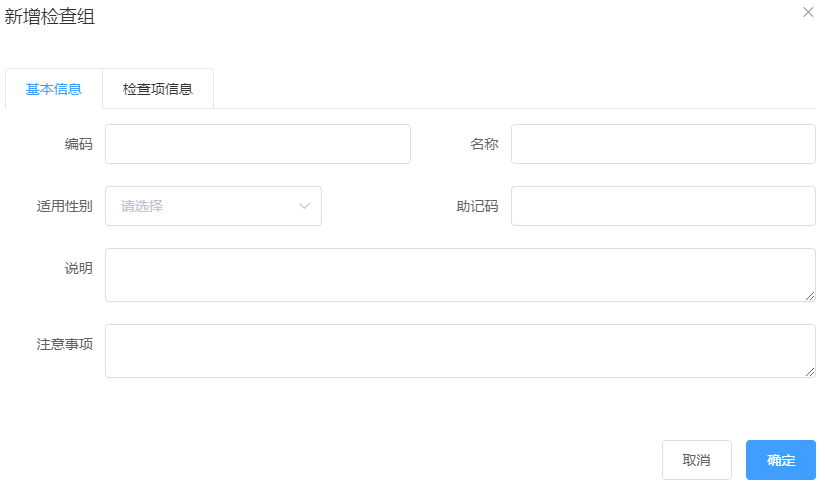

# 二、预约管理-检查组管理

## 1. 需求分析

检查组其实就是多个检查项的集合，例如有一个检查组为“一般检查”，这个检查组可以包括多个检查项：身高、体重、收缩压、舒张压等。所以在添加检查组时需要选择这个检查组包括的检查项。


检查组对应的实体类为CheckGroup，对应的数据表为t_checkgroup，检查组和检查项是多对多关系，所以需要中间表t_checkgroup_checkitem进行关联。

## 2. 新增检查组

### 2.1 完善页面

检查组管理页面对应的是checkgroup.html页面，根据产品设计的原型已经完成了页面基本结构的编写，现在需要完善页面动态效果。

#### 2.1.1 弹出新增窗口

页面中已经提供了新增窗口，只是出于隐藏状态。只需要将控制展示状态的属性dialogFormVisible改为true即可显示出新增窗口。点击新建按钮时绑定的方法为handleCreate，所以在handleCreate方法中修改dialogFormVisible属性的值为true即可。同时为了增加用户体验度，需要每次点击新建按钮时清空表单输入项。

由于新增检查组时还需要选择此检查组包含的检查项，所以新增检查组窗口分为两部分信息：基本信息和检查项信息，如下图：




新建按钮绑定单击事件，对应的处理函数为handleCreate

~~~html
<el-button type="primary" class="butT" @click="handleCreate()">新建</el-button>
~~~

```javascript
// 重置表单
resetForm() {
	this.formData = {};
},
// 弹出添加窗口
handleCreate() {
	this.resetForm();
	this.dialogFormVisible = true;
}
```

#### 2.1.2 动态展示检查项列表

现在虽然已经完成了新增窗口的弹出，但是在检查项信息标签页中需要动态展示所有的检查项信息列表数据，并且可以进行勾选。具体操作步骤如下：

（1）定义模型数据

~~~javascript
tableData:[],//新增和编辑表单中对应的检查项列表数据
checkitemIds:[],//新增和编辑表单中检查项对应的复选框，基于双向绑定可以进行回显和数据提交
~~~

（2）动态展示检查项列表数据，数据来源于上面定义的tableData模型数据

~~~html
<table class="datatable">
  <thead>
    <tr>
      <th>选择</th>
      <th>项目编码</th>
      <th>项目名称</th>
      <th>项目说明</th>
    </tr>
  </thead>
  <tbody>
    <tr v-for="c in tableData">
      <td>
        <input :id="c.id" v-model="checkitemIds" type="checkbox" :value="c.id">
      </td>
      <td><label :for="c.id">{{c.code}}</label></td>
      <td><label :for="c.id">{{c.name}}</label></td>
      <td><label :for="c.id">{{c.remark}}</label></td>
    </tr>
  </tbody>
</table>
~~~

（3）完善handleCreate方法，发送ajax请求查询所有检查项数据并将结果赋值给tableData模型数据用于页面表格展示

~~~javascript
// 弹出添加窗口
handleCreate() {
  this.dialogFormVisible = true;
  this.resetForm();
  //默认切换到第一个标签页（基本信息）
  this.activeName='first';
  //重置
  this.checkitemIds = [];
  //发送ajax请求查询所有检查项信息
  axios.get("/checkitem/findAll.do").then((res)=> {
    if(res.data.flag){
      //将检查项列表数据赋值给模型数据用于页面表格展示
      this.tableData = res.data.data;
    }else{
      this.$message.error(res.data.message);
    }
  });
}
~~~

（4）分别在CheckItemController、CheckItemService、CheckItemServiceImpl、CheckItemDao、CheckItemDao.xml中扩展方法查询所有检查项数据

CheckItemController：

~~~java
//查询所有
@RequestMapping("/findAll")
public Result findAll(){
  List<CheckItem> checkItemList = checkItemService.findAll();
  if(checkItemList != null && checkItemList.size() > 0){
    Result result = new Result(true, MessageConstant.QUERY_CHECKITEM_SUCCESS);
    result.setData(checkItemList);
    return result;
  }
  return new Result(false,MessageConstant.QUERY_CHECKITEM_FAIL);
}
~~~

CheckItemService：

~~~java
public List<CheckItem> findAll();
~~~

CheckItemServiceImpl：

~~~java
public List<CheckItem> findAll() {
  return checkItemDao.findAll();
}
~~~

CheckItemDao：

~~~java
public List<CheckItem> findAll();
~~~

CheckItemDao.xml：

~~~xml
<select id="findAll" resultType="com.itheima.pojo.CheckItem">
  select * from t_checkitem
</select>
~~~

#### 2.1.3 提交请求

当用户点击新增窗口中的确定按钮时发送ajax请求将数据提交到后台进行数据库操作。提交到后台的数据分为两部分：检查组基本信息（对应的模型数据为formData）和检查项id数组（对应的模型数据为checkitemIds）。

为确定按钮绑定单击事件，对应的处理函数为handleAdd

~~~html
<el-button type="primary" @click="handleAdd()">确定</el-button>
~~~

完善handleAdd方法

~~~javascript
//添加
handleAdd () {
  //发送ajax请求将模型数据提交到后台处理
  axios.post(
    		"/checkgroup/add.do?checkitemIds=" + this.checkitemIds,
    		this.formData
  			)
    .then((response)=> {
      //关闭新增窗口
      this.dialogFormVisible = false;
      if(response.data.flag){
        //新增成功，弹出成功提示
        this.$message({
          message: response.data.message,
          type: 'success'
        });
      }else{
        //新增失败，弹出错误提示
        this.$message.error(response.data.message);
      }
  }).finally(()=> {
    this.findPage();
  });
}
~~~

### 2.2 后台代码

#### 2.2.1 Controller

在health_backend工程中创建CheckGroupController

~~~java
package com.itheima.controller;
import com.alibaba.dubbo.config.annotation.Reference;
import com.itheima.constant.MessageConstant;
import com.itheima.entity.PageResult;
import com.itheima.entity.QueryPageBean;
import com.itheima.entity.Result;
import com.itheima.pojo.CheckGroup;
import com.itheima.pojo.CheckItem;
import com.itheima.service.CheckGroupService;
import org.springframework.web.bind.annotation.RequestBody;
import org.springframework.web.bind.annotation.RequestMapping;
import org.springframework.web.bind.annotation.RestController;
import java.util.List;
/**
 * 检查组管理
 */
@RestController
@RequestMapping("/checkgroup")
public class CheckGroupController {
    @Reference
    private CheckGroupService checkGroupService;

    //新增
    @RequestMapping("/add")
    public Result add(@RequestBody CheckGroup checkGroup,Integer[] checkitemIds){
        try {
            checkGroupService.add(checkGroup,checkitemIds);
        }catch (Exception e){
            //新增失败
            return new Result(false, MessageConstant.ADD_CHECKGROUP_FAIL);
        }
        //新增成功
        return new Result(true,MessageConstant.ADD_CHECKGROUP_SUCCESS);
    }
}
~~~

#### 2.2.2 服务接口

在health_interface工程中创建CheckGroupService接口

~~~java
package com.itheima.service;
import com.itheima.entity.PageResult;
import com.itheima.pojo.CheckGroup;
import java.util.List;
/**
 * 检查组服务接口
 */
public interface CheckGroupService {
    void add(CheckGroup checkGroup,Integer[] checkitemIds);
}
~~~

#### 2.2.3 服务实现类

在health_service_provider工程中创建CheckGroupServiceImpl实现类

~~~java
package com.itheima.service;
import com.alibaba.dubbo.config.annotation.Service;
import com.github.pagehelper.Page;
import com.github.pagehelper.PageHelper;
import com.itheima.dao.CheckGroupDao;
import com.itheima.entity.PageResult;
import com.itheima.pojo.CheckGroup;
import com.itheima.pojo.CheckItem;
import org.springframework.beans.factory.annotation.Autowired;
import org.springframework.transaction.annotation.Transactional;
import java.util.HashMap;
import java.util.List;
import java.util.Map;
/**
 * 检查组服务
 */
@Service(interfaceClass = CheckGroupService.class)
@Transactional
public class CheckGroupServiceImpl implements CheckGroupService {
    @Autowired
    private CheckGroupDao checkGroupDao;
    
    //添加检查组合，同时需要设置检查组合和检查项的关联关系
    public void add(CheckGroup checkGroup, Integer[] checkitemIds) {
        checkGroupDao.add(checkGroup);
        setCheckGroupAndCheckItem(checkGroup.getId(),checkitemIds);
    }
  	//设置检查组合和检查项的关联关系
    public void setCheckGroupAndCheckItem(Integer checkGroupId,Integer[] checkitemIds){
          if(checkitemIds != null && checkitemIds.length > 0){
              for (Integer checkitemId : checkitemIds) {
                  Map<String,Integer> map = new HashMap<>();
                  map.put("checkgroup_id",checkGroupId);
                  map.put("checkitem_id",checkitemId);
                  checkGroupDao.setCheckGroupAndCheckItem(map);
              }
          }
      }
}
~~~

#### 2.2.4 Dao接口

创建CheckGroupDao接口

~~~java
package com.itheima.dao;
import com.github.pagehelper.Page;
import com.itheima.pojo.CheckGroup;
import java.util.List;
import java.util.Map;
/**
 * 持久层Dao接口
 */
public interface CheckGroupDao {
    void add(CheckGroup checkGroup);
    void setCheckGroupAndCheckItem(Map map);
}
~~~

#### 2.2.5 Mapper映射文件

创建CheckGroupDao.xml映射文件

~~~xml
<?xml version="1.0" encoding="UTF-8" ?>
<!DOCTYPE mapper PUBLIC "-//mybatis.org//DTD Mapper 3.0//EN"
        "http://mybatis.org/dtd/mybatis-3-mapper.dtd" >
<mapper namespace="com.itheima.dao.CheckGroupDao">
    <!--新增-->
    <insert id="add" parameterType="com.itheima.pojo.CheckGroup">
        <selectKey resultType="java.lang.Integer" order="AFTER" keyProperty="id">
            SELECT LAST_INSERT_ID()
        </selectKey>
        insert into t_checkgroup(code,name,sex,helpCode,remark,attention)
            values 
      	(#{code},#{name},#{sex},#{helpCode},#{remark},#{attention})
    </insert>
	<!--设置检查组和检查项的关联关系-->
    <insert id="setCheckGroupAndCheckItem" parameterType="hashmap">
        insert into t_checkgroup_checkitem(checkgroup_id,checkitem_id) 
      		values
      	(#{checkgroup_id},#{checkitem_id})
    </insert>
</mapper>
~~~

## 3. 检查组分页

### 3.1 完善页面

#### 3.1.1 定义分页相关模型数据

```javascript
pagination: {//分页相关模型数据
  currentPage: 1,//当前页码
  pageSize:10,//每页显示的记录数
  total:0,//总记录数
  queryString:null//查询条件
},
dataList: [],//当前页要展示的分页列表数据
```

#### 3.1.2 定义分页方法

在页面中提供了findPage方法用于分页查询，为了能够在checkgroup.html页面加载后直接可以展示分页数据，可以在VUE提供的钩子函数created中调用findPage方法

```javascript
//钩子函数，VUE对象初始化完成后自动执行
created() {
  this.findPage();
}
```

```javascript
//分页查询
findPage() {
  //分页参数
  var param = {
    currentPage:this.pagination.currentPage,//页码
    pageSize:this.pagination.pageSize,//每页显示的记录数
    queryString:this.pagination.queryString//查询条件
  };
  //请求后台
  axios.post("/checkgroup/findPage.do",param).then((response)=> {
    //为模型数据赋值，基于VUE的双向绑定展示到页面
    this.dataList = response.data.rows;
    this.pagination.total = response.data.total;
  });
}
```

#### 3.1.3 完善分页方法执行时机

除了在created钩子函数中调用findPage方法查询分页数据之外，当用户点击查询按钮或者点击分页条中的页码时也需要调用findPage方法重新发起查询请求。

为查询按钮绑定单击事件，调用findPage方法

```html
<el-button @click="findPage()" class="dalfBut">查询</el-button>
```

为分页条组件绑定current-change事件，此事件是分页条组件自己定义的事件，当页码改变时触发，对应的处理函数为handleCurrentChange

```html
<el-pagination
               class="pagiantion"
               @current-change="handleCurrentChange"
               :current-page="pagination.currentPage"
               :page-size="pagination.pageSize"
               layout="total, prev, pager, next, jumper"
               :total="pagination.total">
</el-pagination>
```

定义handleCurrentChange方法

```javascript
//切换页码
handleCurrentChange(currentPage) {
  //currentPage为切换后的页码
  this.pagination.currentPage = currentPage;
  this.findPage();
}
```

### 3.2 后台代码

#### 3.2.1 Controller

在CheckGroupController中增加分页查询方法

```java
//分页查询
@RequestMapping("/findPage")
public PageResult findPage(@RequestBody QueryPageBean queryPageBean){
  PageResult pageResult = checkGroupService.pageQuery(
    queryPageBean.getCurrentPage(), 
    queryPageBean.getPageSize(), 
    queryPageBean.getQueryString()
  );
  return pageResult;
}
```

#### 3.2.2 服务接口

在CheckGroupService服务接口中扩展分页查询方法

```java
public PageResult pageQuery(Integer currentPage, Integer pageSize, String queryString);
```

#### 3.2.3 服务实现类

在CheckGroupServiceImpl服务实现类中实现分页查询方法，基于Mybatis分页助手插件实现分页

```java
public PageResult pageQuery(Integer currentPage, Integer pageSize, String queryString) {
  PageHelper.startPage(currentPage,pageSize);
  Page<CheckItem> page = checkGroupDao.selectByCondition(queryString);
  return new PageResult(page.getTotal(),page.getResult());
}
```

#### 3.2.4 Dao接口

在CheckGroupDao接口中扩展分页查询方法

```java
public Page<CheckGroup> selectByCondition(String queryString);
```

#### 3.2.5 Mapper映射文件

在CheckGroupDao.xml文件中增加SQL定义

```xml
<select id="selectByCondition" parameterType="string" resultType="com.itheima.pojo.CheckGroup">
  select * from t_checkgroup
  <if test="value != null and value.length > 0">
    where code = #{value} or name = #{value} or helpCode = #{value}
  </if>
</select>
```


## 4. 编辑检查组

### 4.1 完善页面

用户点击编辑按钮时，需要弹出编辑窗口并且将当前记录的数据进行回显，用户修改完成后点击确定按钮将修改后的数据提交到后台进行数据库操作。此处进行数据回显的时候，除了需要检查组基本信息的回显之外，还需要回显当前检查组包含的检查项（以复选框勾选的形式回显）。

#### 4.1.1 绑定单击事件

需要为编辑按钮绑定单击事件，并且将当前行数据作为参数传递给处理函数

```html
<el-button type="primary" size="mini" @click="handleUpdate(scope.row)">编辑</el-button>
```

```javascript
handleUpdate(row) {
  alert(row);
}
```

#### 4.1.2 弹出编辑窗口回显数据

当前页面的编辑窗口已经提供好了，默认处于隐藏状态。在handleUpdate方法中需要将编辑窗口展示出来，并且需要发送多个ajax请求分别查询当前检查组数据、所有检查项数据、当前检查组包含的检查项id用于基本数据回显

```javascript
handleUpdate(row) {
  //发送ajax请求根据id查询检查组信息，用于基本信息回显
  axios.get("/checkgroup/findById.do?id=" + row.id).then((res)=>{
    if(res.data.flag){
      //弹出编辑窗口
      this.dialogFormVisible4Edit = true;
      //默认选中第一个标签页
      this.activeName='first';
      //为模型数据赋值，通过VUE数据双向绑定进行信息的回显
      this.formData = res.data.data;
      //发送ajax请求查询所有的检查项信息，用于检查项表格展示
      axios.get("/checkitem/findAll.do").then((res)=> {
        if(res.data.flag){
          //为模型数据赋值，通过VUE数据双向绑定进行信息的回显
          this.tableData = res.data.data;
          //查询当前检查组包含的所有检查项id，用于页面回显
          axios.get("/checkgroup/findCheckItemIdsByCheckGroupId.do?id=" + row.id).then((res)=> {
            //为模型数据赋值，通过VUE数据双向绑定进行信息的回显
            if(res.data.flag){
                this.checkitemIds = res.data.data;
            }else{
                this.$message.error(res.data.message);
            }
          });
        }else{
          this.$message.error(res.data.message);
        }
      });
    }else{
      this.$message.error("获取数据失败，请刷新当前页面");
    }
  });
}
```

#### 4.1.3 发送请求

在编辑窗口中修改完成后，点击确定按钮需要提交请求，所以需要为确定按钮绑定事件并提供处理函数handleEdit

```html
<el-button type="primary" @click="handleEdit()">确定</el-button>
```

```javascript
//编辑
handleEdit() {
  //发送ajax请求，提交模型数据
  axios.post("/checkgroup/edit.do?checkitemIds="+this.checkitemIds,this.formData).
  then((response)=> {
    //隐藏编辑窗口
    this.dialogFormVisible4Edit = false;
    if(response.data.flag){
      this.$message({
        message: response.data.message,
        type: 'success'
      });
    }else{
      this.$message.error(response.data.message);
    }
  }).finally(()=> {
    this.findPage();
  });
}
```

### 4.2 后台代码

#### 4.2.1 Controller

在CheckGroupController中增加方法

```java
//根据id查询
@RequestMapping("/findById")
public Result findById(Integer id){
  CheckGroup checkGroup = checkGroupService.findById(id);
  if(checkGroup != null){
    Result result = new Result(true, MessageConstant.QUERY_CHECKGROUP_SUCCESS);
    result.setData(checkGroup);
    return result;
  }
  return new Result(false,MessageConstant.QUERY_CHECKGROUP_FAIL);
}

//根据检查组合id查询对应的所有检查项id
@RequestMapping("/findCheckItemIdsByCheckGroupId")
public Result findCheckItemIdsByCheckGroupId(Integer id){
    try{
        List<Integer> checkitemIds = 
            checkGroupService.findCheckItemIdsByCheckGroupId(id);
        return new Result(true,MessageConstant.QUERY_CHECKITEM_SUCCESS,checkitemIds);
    }catch (Exception e){
        e.printStackTrace();
        return new Result(false, MessageConstant.QUERY_CHECKITEM_FAIL);
    }
}

//编辑
@RequestMapping("/edit")
public Result edit(@RequestBody CheckGroup checkGroup,Integer[] checkitemIds){
  try {
    checkGroupService.edit(checkGroup,checkitemIds);
  }catch (Exception e){
    return new Result(false,MessageConstant.EDIT_CHECKGROUP_FAIL);
  }
  return new Result(true,MessageConstant.EDIT_CHECKGROUP_SUCCESS);
}
```

#### 4.2.2 服务接口

在CheckGroupService服务接口中扩展方法

```java
CheckGroup findById(Integer id);
List<Integer> findCheckItemIdsByCheckGroupId(Integer id);
public void edit(CheckGroup checkGroup,Integer[] checkitemIds);
```

#### 4.2.3 服务实现类

在CheckGroupServiceImpl实现类中实现编辑方法

```java
public CheckGroup findById(Integer id) {
  return checkGroupDao.findById(id);
}

public List<Integer> findCheckItemIdsByCheckGroupId(Integer id) {
  return checkGroupDao.findCheckItemIdsByCheckGroupId(id);
}

//编辑检查组，同时需要更新和检查项的关联关系
public void edit(CheckGroup checkGroup, Integer[] checkitemIds) {
  //根据检查组id删除中间表数据（清理原有关联关系）
  checkGroupDao.deleteAssociation(checkGroup.getId());
  //向中间表(t_checkgroup_checkitem)插入数据（建立检查组和检查项关联关系）
  setCheckGroupAndCheckItem(checkGroup.getId(),checkitemIds);
  //更新检查组基本信息
  checkGroupDao.edit(checkGroup);
}

//向中间表(t_checkgroup_checkitem)插入数据（建立检查组和检查项关联关系）
public void setCheckGroupAndCheckItem(Integer checkGroupId,Integer[] checkitemIds){
  if(checkitemIds != null && checkitemIds.length > 0){
    for (Integer checkitemId : checkitemIds) {
      Map<String,Integer> map = new HashMap<>();
      map.put("checkgroup_id",checkGroupId);
      map.put("checkitem_id",checkitemId);
      checkGroupDao.setCheckGroupAndCheckItem(map);
    }
  }
}
```

#### 4.2.4 Dao接口

在CheckGroupDao接口中扩展方法

```java
CheckGroup findById(Integer id);
List<Integer> findCheckItemIdsByCheckGroupId(Integer id);
void setCheckGroupAndCheckItem(Map map);
void deleteAssociation(Integer id);
void edit(CheckGroup checkGroup);
```

#### 4.2.5 Mapper映射文件

在CheckGroupDao.xml中扩展SQL语句

~~~xml
<select id="findById" parameterType="int" resultType="com.itheima.pojo.CheckGroup">
  select * from t_checkgroup where id = #{id}
</select>
<select id="findCheckItemIdsByCheckGroupId" parameterType="int" resultType="int">
  select checkitem_id from t_checkgroup_checkitem where checkgroup_id = #{id}
</select>
<!--向中间表插入数据（建立检查组和检查项关联关系）-->
<insert id="setCheckGroupAndCheckItem" parameterType="hashmap">
  insert into t_checkgroup_checkitem(checkgroup_id,checkitem_id) 
  	values
  (#{checkgroup_id},#{checkitem_id})
</insert>
<!--根据检查组id删除中间表数据（清理原有关联关系）-->
<delete id="deleteAssociation" parameterType="int">
  delete from t_checkgroup_checkitem where checkgroup_id = #{id}
</delete>
<!--编辑-->
<update id="edit" parameterType="com.itheima.pojo.CheckGroup">
  update t_checkgroup
  <set>
    <if test="name != null">
      name = #{name},
    </if>
    <if test="sex != null">
      sex = #{sex},
    </if>
    <if test="code != null">
      code = #{code},
    </if>
    <if test="helpCode != null">
      helpCode = #{helpCode},
    </if>
    <if test="attention != null">
      attention = #{attention},
    </if>
    <if test="remark != null">
      remark = #{remark},
    </if>
  </set>
  where id = #{id}
</update>
~~~

## 5. 完整代码

### 5.1 前端

```html
<!DOCTYPE html>
<html>
    <head>
        <!-- 页面meta -->
        <meta charset="utf-8">
        <meta http-equiv="X-UA-Compatible" content="IE=edge">
        <title>传智健康</title>
        <meta name="description" content="传智健康">
        <meta name="keywords" content="传智健康">
        <meta content="width=device-width,initial-scale=1,maximum-scale=1,user-scalable=no" name="viewport">
        <!-- 引入样式 -->
        <link rel="stylesheet" href="../plugins/elementui/index.css">
        <link rel="stylesheet" href="../plugins/font-awesome/css/font-awesome.min.css">
        <link rel="stylesheet" href="../css/style.css">
        <!-- 引入组件库 -->
        <script type="text/javascript" src="../js/jquery.min.js"></script>
        <script src="../js/vue.js"></script>
        <script src="../plugins/elementui/index.js"></script>
        <script src="../js/axios-0.18.0.js"></script>
        <style>
            .datatable {
                position: relative;
                box-sizing: border-box;
                -webkit-box-flex: 1;
                width: 100%;
                max-width: 100%;
                font-size: 14px;
                color: rgb(96, 98, 102);
                overflow: hidden;
                flex: 1 1 0%;
            }
            .datatable td, .datatable th {
                padding: 12px 0;
                min-width: 0;
                -webkit-box-sizing: border-box;
                box-sizing: border-box;
                text-overflow: ellipsis;
                vertical-align: middle;
                position: relative;
                text-align: left;
            }
        </style>
    </head>
    <body class="hold-transition">
        <div id="app">
            <div class="content-header">
                <h1>预约管理<small>检查组管理</small></h1>
                <el-breadcrumb separator-class="el-icon-arrow-right" class="breadcrumb">
                    <el-breadcrumb-item :to="{ path: '/' }">首页</el-breadcrumb-item>
                    <el-breadcrumb-item>预约管理</el-breadcrumb-item>
                    <el-breadcrumb-item>检查组管理</el-breadcrumb-item>
                </el-breadcrumb>
            </div>
            <div class="app-container">
                <div class="box">
                    <div class="filter-container">
                        <el-input placeholder="编码/名称/助记码" v-model="pagination.queryString" style="width: 200px;" class="filter-item" @keyup.enter.native="handleFilter"></el-input>
                        <el-button @click="findPage()" class="dalfBut">查询</el-button>
                        <el-button type="primary" class="butT" @click="handleCreate()">新建</el-button>
                    </div>
                    <el-table size="small" current-row-key="id" :data="dataList" stripe highlight-current-row>
                        <el-table-column type="index" align="center" label="序号"></el-table-column>
                        <el-table-column prop="code" label="检查组编码" align="center"></el-table-column>
                        <el-table-column prop="name" label="检查组名称" align="center"></el-table-column>
                        <el-table-column label="适用性别" align="center">
                            <template slot-scope="scope">
                                <span>{{ scope.row.sex == '0' ? '不限' : scope.row.sex == '1' ? '男' : '女'}}</span>
                            </template>
                        </el-table-column>
                        <el-table-column prop="helpCode" label="助记码" align="center"></el-table-column>
                        <el-table-column prop="remark" label="说明" align="center"></el-table-column>
                        <el-table-column label="操作" align="center">
                            <template slot-scope="scope">
                                <el-button type="primary" size="mini" @click="handleUpdate(scope.row)">编辑</el-button>
                                <el-button size="mini" type="danger" @click="handleDelete(scope.row)">删除</el-button>
                            </template>
                        </el-table-column>
                    </el-table>
                    <div class="pagination-container">
                        <el-pagination
                            class="pagiantion"
                            @current-change="handleCurrentChange"
                            :current-page="pagination.currentPage"
                            :page-size="pagination.pageSize"
                            layout="total, prev, pager, next, jumper"
                            :total="pagination.total">
                        </el-pagination>
                    </div>
                    <!-- 新增标签弹层 -->
                    <div class="add-form">
                        <el-dialog title="新增检查组" :visible.sync="dialogFormVisible">
                            <template>
                                <el-tabs v-model="activeName" type="card">
                                    <el-tab-pane label="基本信息" name="first">
                                        <el-form label-position="right" label-width="100px">
                                            <el-row>
                                                <el-col :span="12">
                                                    <el-form-item label="编码">
                                                        <el-input v-model="formData.code"/>
                                                    </el-form-item>
                                                </el-col>
                                                <el-col :span="12">
                                                    <el-form-item label="名称">
                                                        <el-input v-model="formData.name"/>
                                                    </el-form-item>
                                                </el-col>
                                            </el-row>
                                            <el-row>
                                                <el-col :span="12">
                                                    <el-form-item label="适用性别">
                                                        <el-select v-model="formData.sex">
                                                            <el-option label="不限" value="0"></el-option>
                                                            <el-option label="男" value="1"></el-option>
                                                            <el-option label="女" value="2"></el-option>
                                                        </el-select>
                                                    </el-form-item>
                                                </el-col>
                                                <el-col :span="12">
                                                    <el-form-item label="助记码">
                                                        <el-input v-model="formData.helpCode"/>
                                                    </el-form-item>
                                                </el-col>
                                            </el-row>
                                            <el-row>
                                                <el-col :span="24">
                                                    <el-form-item label="说明">
                                                        <el-input v-model="formData.remark" type="textarea"></el-input>
                                                    </el-form-item>
                                                </el-col>
                                            </el-row>
                                            <el-row>
                                                <el-col :span="24">
                                                    <el-form-item label="注意事项">
                                                        <el-input v-model="formData.attention" type="textarea"></el-input>
                                                    </el-form-item>
                                                </el-col>
                                            </el-row>
                                        </el-form>
                                    </el-tab-pane>
                                    <el-tab-pane label="检查项信息" name="second">
									<div class="checkScrol">
                                        <table class="datatable">
                                            <thead>
                                            <tr>
                                                <th>选择</th>
                                                <th>项目编码</th>
                                                <th>项目名称</th>
                                                <th>项目说明</th>
                                            </tr>
                                            </thead>
                                            <tbody>
                                            <tr v-for="c in tableData">
                                                <td>
                                                    <input :id="c.id" v-model="checkitemIds" type="checkbox" :value="c.id">
                                                </td>
                                                <td><label :for="c.id">{{c.code}}</label></td>
                                                <td><label :for="c.id">{{c.name}}</label></td>
                                                <td><label :for="c.id">{{c.remark}}</label></td>
                                            </tr>
                                            </tbody>
                                        </table>
									</div>
                                    </el-tab-pane>
                                </el-tabs>
                            </template>
                            <div slot="footer" class="dialog-footer">
                                <el-button @click="dialogFormVisible = false">取消</el-button>
                                <el-button type="primary" @click="handleAdd()">确定</el-button>
                            </div>
                        </el-dialog>
                    </div>

                    <!-- 编辑标签弹层 -->
                    <div class="add-form">
                        <el-dialog title="编辑检查组" :visible.sync="dialogFormVisible4Edit">
                            <template>
                                <el-tabs v-model="activeName" type="card">
                                    <el-tab-pane label="基本信息" name="first">
                                        <el-form label-position="right" label-width="100px">
                                            <el-row>
                                                <el-col :span="12">
                                                    <el-form-item label="编码">
                                                        <el-input v-model="formData.code"/>
                                                    </el-form-item>
                                                </el-col>
                                                <el-col :span="12">
                                                    <el-form-item label="名称">
                                                        <el-input v-model="formData.name"/>
                                                    </el-form-item>
                                                </el-col>
                                            </el-row>
                                            <el-row>
                                                <el-col :span="12">
                                                    <el-form-item label="适用性别">
                                                        <el-select v-model="formData.sex">
                                                            <el-option label="不限" value="0"></el-option>
                                                            <el-option label="男" value="1"></el-option>
                                                            <el-option label="女" value="2"></el-option>
                                                        </el-select>
                                                    </el-form-item>
                                                </el-col>
                                                <el-col :span="12">
                                                    <el-form-item label="助记码">
                                                        <el-input v-model="formData.helpCode"/>
                                                    </el-form-item>
                                                </el-col>
                                            </el-row>
                                            <el-row>
                                                <el-col :span="24">
                                                    <el-form-item label="说明">
                                                        <el-input v-model="formData.remark" type="textarea"></el-input>
                                                    </el-form-item>
                                                </el-col>
                                            </el-row>
                                            <el-row>
                                                <el-col :span="24">
                                                    <el-form-item label="注意事项">
                                                        <el-input v-model="formData.attention" type="textarea"></el-input>
                                                    </el-form-item>
                                                </el-col>
                                            </el-row>
                                        </el-form>
                                    </el-tab-pane>
                                    <el-tab-pane label="检查项信息" name="second">
										<div class="checkScrol">
											<table class="datatable">
												<thead>
													<tr>
														<th>选择</th>
														<th>项目编码</th>
														<th>项目名称</th>
														<th>项目说明</th>
													</tr>
												</thead>
												<tbody>
													<tr v-for="c in tableData">
														<td>
															<input :id="c.id" v-model="checkitemIds" type="checkbox" :value="c.id">
														</td>
														<td><label :for="c.id">{{c.code}}</label></td>
														<td><label :for="c.id">{{c.name}}</label></td>
														<td><label :for="c.id">{{c.remark}}</label></td>
													</tr>
												</tbody>
											</table>
										</div>
                                    </el-tab-pane>
                                </el-tabs>
                            </template>
                            <div slot="footer" class="dialog-footer">
                                <el-button @click="dialogFormVisible4Edit = false">取消</el-button>
                                <el-button type="primary" @click="handleEdit()">确定</el-button>
                            </div>
                        </el-dialog>
                    </div>
                </div>
            </div>
        </div>
    </body>

    <script>
        var vue = new Vue({
            el: '#app',
            data:{
                activeName:'first',//添加/编辑窗口Tab标签名称
                pagination: {//分页相关属性
                    currentPage: 1,
                    pageSize:10,
                    total:100,
                    queryString:null,
                },
                dataList: [],//列表数据
                formData: {},//表单数据
                tableData:[],//新增和编辑表单中对应的检查项列表数据
                checkitemIds:[],//新增和编辑表单中检查项对应的复选框，基于双向绑定可以进行回显和数据提交
                dialogFormVisible: false,//控制添加窗口显示/隐藏
                dialogFormVisible4Edit:false//控制编辑窗口显示/隐藏
            },
            created() {
                this.findPage();
            },
            methods: {
                //编辑
                handleEdit() {
                    // 发送ajax请求，将修改后的表单数据（检查组基本信息、勾选的检查项）提交到后台进行处理
                    axios.post("/checkgroup/edit.do?checkItemIds="+this.checkitemIds, this.formData).then((res)=>{
                        // 关闭编辑窗口
                        this.dialogFormVisible4Edit = false;
                        if(res.data.flag){
                            // 操作成功
                            this.$message({
                                type:'success',
                                message:res.data.message
                            });
                        }else {
                            // 操作失败
                            this.$message.error(res.data.message);
                        }
                    }).finally(()=>{
                        this.findPage();
                    });
                },
                //添加
                handleAdd () {
                    //发送ajax请求，将表单数据提交到后台进行处理
                    axios.post("/checkgroup/add.do?checkItemIds="+this.checkitemIds, this.formData).then((res)=>{
                        this.dialogFormVisible = false;
                        if(res.data.flag){
                            // 操作成功
                            this.$message({
                                type:'success',
                                message:res.data.message
                            });
                        }else{
                            this.$message.error(res.data.message);
                        }
                    }).finally(()=>{
                        // 重新进行分页查询
                        this.findPage();
                    });
                },
                //分页查询
                findPage() {
                    // 封装分页参数
                    var param = {
                        currentPage: this.pagination.currentPage,
                        pageSize: this.pagination.pageSize,
                        queryString: this.pagination.queryString
                    };
                    // 发送ajax请求，提交分页相关参数
                    axios.post("/checkgroup/findPage.do", param).then((res)=>{
                        // 为vue对象的模型数据赋值，基于双向数据绑定展示到页面
                        this.dataList = res.data.rows;  // 当前也展示的数据集合
                        this.pagination.total = res.data.total;  // 总数据量
                    });
                },
                // 重置表单
                resetForm() {
                    // 重置数据
                    this.formData = {}
                },
                // 弹出添加窗口
                handleCreate() {
                    this.resetForm();
                    this.dialogFormVisible = true;
                    // 发送ajax请求，查询所有的检查项信息，转为json，赋值给tableData
                    this.activeName = 'first';  // 默认选中first对应的tab
                    this.checkitemIds = [];  // 重置复选框
                    axios.get("/checkgroup/findAll.do").then((res)=>{
                        if(res.data.flag){
                            // 查询检查项数据成功
                            this.tableData = res.data.data;
                        }else {
                            this.$message.error(res.data.message);
                        }
                    });
                },
                // 弹出编辑窗口
                handleUpdate(row) {
                    // 1. 点确定的时候弹出编辑框，检查项回显
                    this.dialogFormVisible4Edit = true;
                    this.resetForm();
                    this.activeName = 'first';
                    // 发送ajax请求，根据检查组ID查询当前检查组数据，用于基本信息的回显
                    axios.get("/checkgroup/findById.do?id="+row.id).then((res)=>{  //数据回显
                        if(res.data.flag){
                            // 查询到数据
                            this.formData = res.data.data;
                        }else {
                            this.$message.error(res.data.message);
                        }
                    });
                    // 发送ajax请求，查询所有的检查项数据，用于展示检查项列表
                    axios.get("/checkitem/findAll.do").then((res)=>{
                        if(res.data.flag){
                            // 查询检查项数据成功
                            this.tableData = res.data.data;
                            // 发送ajax请求，根据检查组ID查询当前检查组包含的检查项ID，用于页面复选框回显
                            axios.get("/checkitem/findCheckItemIdsByCheckGroupId.do?checkgroupId=" + row.id).then((res) => {
                                if(res.data.flag){
                                    this.checkitemIds = res.data.data;
                                }
                            });
                        }else {
                            this.$message.error(res.data.message);
                        }
                    });
                },
                //切换页码
                handleCurrentChange(currentPage) {
                    // 为模型数据赋值（当前页面）
                    this.pagination.currentPage = currentPage;
                    this.findPage();
                },
                // 删除
                handleDelete(row) {
                    // 提示是否确定删除，确定的话发送删除请求
                    // 后端：查询检查组和检查项表关系是否存在，否则无法删除
                    // 查询检查组和套餐表关系是否存在，存在则无法删除
                    this.$confirm('确定要删除检查组吗，是否继续?','提示',{
                        confirmButtonText: '确定',
                        cancelButtonText: '取消',
                        type: 'warning'
                    }).then(()=>{
                        // 发送删除请求
                        axios.get("/checkgroup/deleteById.do?id="+row.id).then((res)=>{
                            this.$message({
                                message:res.data.message,
                                type:res.data.flag?'success':'error'
                            });
                            // 重新加载数据
                            this.findPage();
                        });
                    }).catch(()=>{
                        this.$message({
                            type:'info',
                            message:'已取消删除'
                        });
                    });
                }
            }
        })
    </script>
</html>
```

### 5.2 Controller

```java
package org.example.controller;

import org.example.constant.MessageConstant;
import org.example.entity.PageResult;
import org.example.entity.QueryPageBean;
import org.example.entity.Result;
import org.example.pojo.CheckGroup;
import org.example.service.CheckGroupService;
import com.alibaba.dubbo.config.annotation.Reference;
import org.springframework.web.bind.annotation.RequestBody;
import org.springframework.web.bind.annotation.RequestMapping;
import org.springframework.web.bind.annotation.RestController;

import java.sql.ResultSet;
import java.util.List;

/**
 * 检查组管理
 */
@RestController
@RequestMapping("/checkgroup")
public class CheckGroupController {
    @Reference
    public CheckGroupService checkGroupService;
    //新增
    @RequestMapping("/add")
    public Result add(@RequestBody CheckGroup checkGroup, Integer[] checkitemIds){
        try{
            checkGroupService.add(checkGroup,checkitemIds);
            return new Result(true, MessageConstant.ADD_CHECKGROUP_SUCCESS);
        }catch (Exception e){
            e.printStackTrace();
            return new Result(false, MessageConstant.ADD_CHECKGROUP_FAIL);
        }
    }

    //分页查询
    @RequestMapping("/findPage")
    public PageResult findPage(@RequestBody QueryPageBean pageBean){
        return checkGroupService.findPage(pageBean);
    }

    //根据id查询检查组
    @RequestMapping("/findById")
    public Result findById(Integer id){
        try{
            CheckGroup checkGroup = checkGroupService.findById(id);
            return new Result(true, MessageConstant.QUERY_CHECKGROUP_SUCCESS,checkGroup);
        }catch (Exception e){
            e.printStackTrace();
            return new Result(false, MessageConstant.QUERY_CHECKGROUP_FAIL);
        }
    }

    //编辑
    @RequestMapping("/edit")
    public Result edit(@RequestBody CheckGroup checkGroup,Integer[] checkitemIds){
        try{
            checkGroupService.edit(checkGroup,checkitemIds);
            return new Result(true, MessageConstant.EDIT_CHECKGROUP_SUCCESS);
        }catch (Exception e){
            e.printStackTrace();
            return new Result(false, MessageConstant.EDIT_CHECKGROUP_FAIL);
        }
    }

    //查询所有检查组
    @RequestMapping("/findAll")
    public Result findAll(){
        try{
            List<CheckGroup> list = checkGroupService.findAll();
            return new Result(true, MessageConstant.QUERY_CHECKGROUP_SUCCESS,list);
        }catch (Exception e){
            e.printStackTrace();
            return new Result(false, MessageConstant.QUERY_CHECKGROUP_FAIL);
        }
    }

    // 删除检查组
    @RequestMapping("/deleteById")
    public Result deleteById(Integer id){
        try{
            checkGroupService.deleteById(id);
            return new Result(true, MessageConstant.DELETE_CHECKGROUP_SUCCESS);
        }catch (RuntimeException e){
            e.printStackTrace();
            return new Result(false, e.getMessage());
        }catch (Exception e){
            e.printStackTrace();
            return new Result(false, MessageConstant.DELETE_CHECKGROUP_FAIL);
        }
    }
}
```

### 5.3 Service

```java
package org.example.service;

import org.example.entity.PageResult;
import org.example.entity.QueryPageBean;
import org.example.pojo.CheckGroup;

import java.util.List;

public interface CheckGroupService {
    void add(CheckGroup checkGroup, Integer[] checkitemIds);
    PageResult findPage(QueryPageBean pageBean);
    CheckGroup findById(Integer id);
    void edit(CheckGroup checkGroup, Integer[] checkitemIds);
    List<CheckGroup> findAll();

    void deleteById(Integer id);
}
```

### 5.4 ServiceImpl

```java
package org.example.service.impl;

import com.alibaba.dubbo.config.annotation.Service;
import com.github.pagehelper.Page;
import com.github.pagehelper.PageHelper;
import org.example.constant.MessageConstant;
import org.example.dao.CheckGroupDao;
import org.example.entity.PageResult;
import org.example.entity.QueryPageBean;
import org.example.pojo.CheckGroup;
import org.example.service.CheckGroupService;
import org.springframework.beans.factory.annotation.Autowired;
import org.springframework.transaction.annotation.Transactional;


import java.util.HashMap;
import java.util.List;
import java.util.Map;

/**
 * 检查组服务
 */
@Service(interfaceClass = CheckGroupService.class)
@Transactional
public class CheckGroupServiceImpl implements CheckGroupService {
    @Autowired
    private CheckGroupDao checkGroupDao;
    //新增检查组，同时需要关联检查项（设置多对多关系）
    @Override
    public void add(CheckGroup checkGroup, Integer[] checkitemIds) {
        //新增检查组
        checkGroupDao.add(checkGroup);
        Integer checkGroupId = checkGroup.getId();//检查组id

        //设置检查组和检查项多对多关系
        this.setCheckGroupAndCheckItem(checkGroupId,checkitemIds);
    }

    //分页查询
    @Override
    public PageResult findPage(QueryPageBean pageBean) {
        Integer currentPage = pageBean.getCurrentPage();
        Integer pageSize = pageBean.getPageSize();
        String queryString = pageBean.getQueryString();
        //使用分页助手插件实现分页查询
        PageHelper.startPage(currentPage,pageSize);
        Page<CheckGroup> page = checkGroupDao.findByCondition(queryString);
        return new PageResult(page.getTotal(),page.getResult());
    }

    @Override
    public CheckGroup findById(Integer id) {
        return checkGroupDao.findById(id);
    }

    //编辑检查项信息，同时需要设置关联关系
    @Override
    public void edit(CheckGroup checkGroup, Integer[] checkitemIds) {
        //基本信息修改
        checkGroupDao.edit(checkGroup);
        //清理检查组和检查项的关联关系（操作中间关系表）
        checkGroupDao.deleteAssociation(checkGroup.getId());
        //重新建立检查组和检查项的关联关系
        this.setCheckGroupAndCheckItem(checkGroup.getId(),checkitemIds);
    }

    @Override
    public List<CheckGroup> findAll() {
        return checkGroupDao.findAll();
    }

    //设置检查组和检查项多对多关系
    public void setCheckGroupAndCheckItem(Integer checkGroupId,Integer[] checkitemIds){
        //设置多对多关系
        if(checkitemIds != null && checkitemIds.length > 0){
            for (Integer checkitemId : checkitemIds) {//检查项id
                Map<String,Integer> map = new HashMap<>();
                map.put("checkgroupId",checkGroupId);
                map.put("checkitemId",checkitemId);
                checkGroupDao.setCheckGroupAndCheckItem(map);
            }
        }
    }


    @Override
    public void deleteById(Integer id) {
        //业务角度考虑
        //查询检查组和检查项表关系是否存在，存在则无法删除
        int count = checkGroupDao.findCountByCheckGroupIdO(id);
        if(count>0){
            throw new RuntimeException(MessageConstant.DELETE_CHECKGROUP_FAIL);
        }
        //查询检查组和套餐表关系是否存在，存在则无法删除
        int count2 = checkGroupDao.findCountByCheckGroupIdT(id);
        if(count2>0){
            throw new RuntimeException(MessageConstant.DELETE_CHECKGROUP_FAIL);//一定要install
        }
        //以上两个关系都不存在，则可以删除
        checkGroupDao.deleteById(id);
    }
}
```

### 5.5 Dao接口

```java
package org.example.dao;

import com.github.pagehelper.Page;
import org.example.pojo.CheckGroup;

import java.util.List;
import java.util.Map;

public interface CheckGroupDao {
    void add(CheckGroup checkGroup);
    void setCheckGroupAndCheckItem(Map<String, Integer> map);
    Page<CheckGroup> findByCondition(String queryString);
    CheckGroup findById(Integer id);
    void edit(CheckGroup checkGroup);
    void deleteAssociation(Integer checkgroupId);
    List<CheckGroup> findAll();

    int findCountByCheckGroupIdO(Integer id);

    int findCountByCheckGroupIdT(Integer id);

    void deleteById(Integer id);

    /**
     * 根据setmeal的id从关联表中查找出所有的checkgroup的id的集合，
     * 然后根据id一个一个去checkgroup中获取检查组的基本信息
     * @param id
     * @return
     */
    CheckGroup findCheckGroupBySetmealId(Integer id);
}
```

### 5.6 Mapper

```xml
<?xml version="1.0" encoding="UTF-8" ?>
<!DOCTYPE mapper PUBLIC "-//mybatis.org//DTD Mapper 3.0//EN"
        "http://mybatis.org/dtd/mybatis-3-mapper.dtd" >
<mapper namespace="org.example.dao.CheckGroupDao">
    <resultMap id="baseResultMap" type="org.example.pojo.CheckGroup">
        <id column="id" property="id"/>
        <result column="name" property="name"/>
        <result column="code" property="code"/>
        <result column="helpCode" property="helpCode"/>
        <result column="sex" property="sex"/>
        <result column="remark" property="remark"/>
        <result column="attention" property="attention"/>
    </resultMap>
    <!--配置多对多映射关系-->
    <resultMap id="findByIdResultMap" type="org.example.pojo.CheckGroup" extends="baseResultMap">
        <collection property="checkItems" ofType="org.example.pojo.CheckItem"
                    column="id"
                    select="com.itheima.dao.CheckItemDao.findCheckItemsByCheckGroupId"></collection>
    </resultMap>
    
    <insert id="add" parameterType="org.example.pojo.CheckGroup">
        <selectKey keyProperty="id" resultType="int" order="AFTER">
            select LAST_INSERT_ID()
        </selectKey>
        insert into t_checkgroup(code,name,helpCode,sex,remark,attention)
                      values
        (#{code},#{name},#{helpCode},#{sex},#{remark},#{attention})
    </insert>

    <!--设置检查组和检查项多对多关系，操作的是中间关系表-->
    <insert id="setCheckGroupAndCheckItem" parameterType="map">
        insert into t_checkgroup_checkitem(checkgroup_id,checkitem_id) values (#{checkgroupId},#{checkitemId})
    </insert>

    <!--根据条件查询-->
    <select id="findByCondition" parameterType="string" resultType="org.example.pojo.CheckGroup">
        select * from t_checkgroup
        <if test="value != null and value.length > 0">
            where code = #{value} or name like '%${value}%' or helpCode = #{value}
        </if>
    </select>

    <!--根据id查询-->
    <select id="findById" parameterType="int" resultType="org.example.pojo.CheckGroup">
        select * from t_checkgroup where id = #{id}
    </select>

    <update id="edit" parameterType="org.example.pojo.CheckGroup">
        update t_checkgroup
        <set>
            <if test="name != null">
                name = #{name},
            </if>
            <if test="sex != null">
                sex = #{sex},
            </if>
            <if test="code != null">
                code = #{code},
            </if>
            <if test="helpCode != null">
                helpCode = #{helpCode},
            </if>
            <if test="attention != null">
                attention = #{attention},
            </if>
            <if test="remark != null">
                remark = #{remark},
            </if>
        </set>
        where id = #{id}
    </update>

    <delete id="deleteAssociation" parameterType="int">
        delete from t_checkgroup_checkitem where checkgroup_id = #{checkgroup_id}
    </delete>

    <select id="findAll" resultType="org.example.pojo.CheckGroup">
        select * from t_checkgroup
    </select>

    <!--根据套餐id查询关联的检查组集合-->
    <select id="selectCheckGroupsBySetmealId" parameterType="int" resultMap="findByIdResultMap">
        select * from t_checkgroup where id in (select checkgroup_id from t_setmeal_checkgroup where setmeal_id = #{setmealId})
    </select>

    <!--查询检查组和检查项表关系是否存在-->
    <select id="findCountByCheckGroupIdO" parameterType="Integer" resultType="Integer">
        select count(*) from t_checkgroup_checkitem where checkgroup_id = #{id}
    </select>

    <!--查询检查组和套餐表关系是否存在-->
    <select id="findCountByCheckGroupIdT" parameterType="Integer" resultType="Integer">
        select count(*) from t_setmeal_checkgroup where checkgroup_id = #{id}
    </select>

    <!--删除检查组-->
    <delete id="deleteById" parameterType="Integer">
        delete from t_checkgroup where id=#{id}
    </delete>

    <resultMap id="findCheckGroupBySetmealId" type="org.example.pojo.CheckGroup">
        <id column="id" property="id"/>
        <result column="code" property="code"/>
        <result column="name" property="name"/>
        <result column="helpCode" property="helpCode"/>
        <result column="sex" property="sex"/>
        <result column="remark" property="remark"/>
        <result column="attention" property="attention"/>
        <collection property="checkItems"
                    column="id"
                    ofType="org.example.pojo.CheckItem"
                    select="org.example.dao.CheckItemDao.findCheckItemByCheckGroupId"></collection>
    </resultMap>

    <select id="findCheckGroupBySetmealId" parameterType="Integer" resultMap="findCheckGroupBySetmealId">
        select *
        from t_checkgroup
        where id in(
            select checkgroup_id from t_setmeal_checkgroup where setmeal_id=#{id}
            );
    </select>
</mapper>
```

### 测试

http://localhost:82/pages/main.html


点击预约管理->检查组管理
