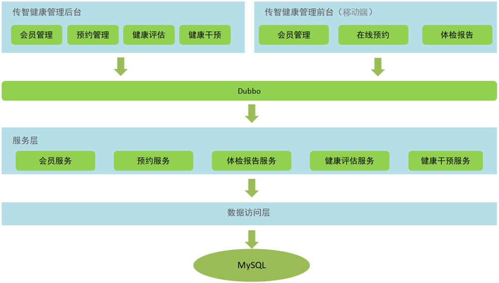
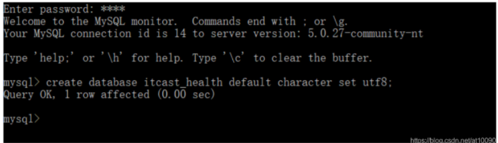
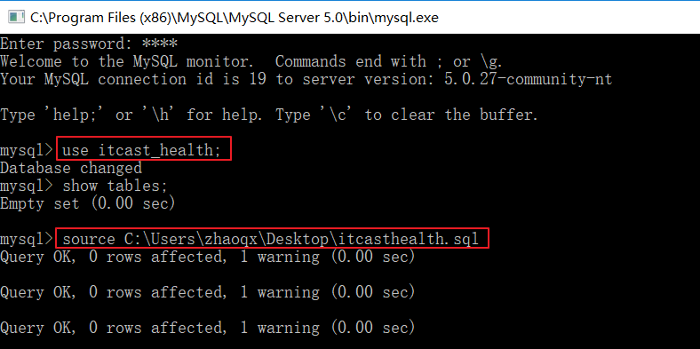
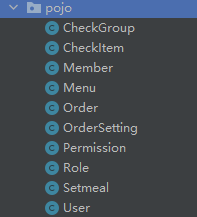
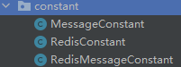

# 一、预约管理-检查项管理

## 1. 需求分析

健康管理系统是一款应用于健康管理机构的业务系统，实现健康管理机构工作内容可视化、患者管理专业化、健康评估数字化、健康干预流程化、知识库集成化，从而提高健康管理师的工作效率，加强与患者间的互动，增强管理者对健康管理机构运营情况的了解。


该系统分为健康后台管理系统和移动端应用两个部分，其中后台系统提供给健康管理机构内部人员使用，微信端应用提供给健康管理机构的用户使用。

项目功能架构图：



后台系统包括：会员管理、预约管理、健康评估、健康干预等功能，移动端有会员管理、体检预约、体检报告等功能。后台系统和移动端应用都会通过Dubbo调用服务层发布的服务来完成具体的操作，本项目属于典型的**SOA架构形式**。


预约管理功能包括：检查项管理、检查组管理、体检套餐管理、预约设置等。预约管理主要是管理一些体检的基础数据。


## 2. 环境搭建

### 2.1 导入预约管理模块数据表

操作步骤：

（1）根据资料中提供的itcasthealth.pdm文件导出SQL脚本


（2）创建本项目使用的数据库health



（3）将PowerDesigner导出的SQL脚本导入health数据库进行建表



### 2.2 导入预约管理模块实体类

在health_common工程中创建pojo包，里面的类为与数据库表对应的实体类



CheckGroup类

```java
package org.example.pojo;

import java.io.Serializable;
import java.util.List;

/**
 * 检查组
 */
public class CheckGroup implements Serializable {
    private Integer id;//主键
    private String code;//编码
    private String name;//名称
    private String helpCode;//助记
    private String sex;//适用性别
    private String remark;//介绍
    private String attention;//注意事项
    private List<CheckItem> checkItems;//一个检查组合包含多个检查项

    public List<CheckItem> getCheckItems() {
        return checkItems;
    }

    public void setCheckItems(List<CheckItem> checkItems) {
        this.checkItems = checkItems;
    }

    public Integer getId() {
        return id;
    }

    public void setId(Integer id) {
        this.id = id;
    }

    public String getCode() {
        return code;
    }

    public void setCode(String code) {
        this.code = code;
    }

    public String getName() {
        return name;
    }

    public void setName(String name) {
        this.name = name;
    }

    public String getHelpCode() {
        return helpCode;
    }

    public void setHelpCode(String helpCode) {
        this.helpCode = helpCode;
    }

    public String getSex() {
        return sex;
    }

    public void setSex(String sex) {
        this.sex = sex;
    }

    public String getRemark() {
        return remark;
    }

    public void setRemark(String remark) {
        this.remark = remark;
    }

    public String getAttention() {
        return attention;
    }

    public void setAttention(String attention) {
        this.attention = attention;
    }

    @Override
    public String toString() {
        return "CheckGroup{" +
                "id=" + id +
                ", code='" + code + '\'' +
                ", name='" + name + '\'' +
                ", helpCode='" + helpCode + '\'' +
                ", sex='" + sex + '\'' +
                ", remark='" + remark + '\'' +
                ", attention='" + attention + '\'' +
                ", checkItems=" + checkItems +
                '}';
    }
}

```

CheckItem类

```java
package org.example.pojo;

import java.io.Serializable;

/**
 * 检查项
 */
public class CheckItem implements Serializable {
    private Integer id;//主键
    private String code;//项目编码
    private String name;//项目名称
    private String sex;//适用性别
    private String age;//适用年龄（范围），例如：20-50
    private Float price;//价格
    private String type;//检查项类型，分为检查和检验两种类型
    private String remark;//项目说明
    private String attention;//注意事项

    public Integer getId() {
        return id;
    }

    public void setId(Integer id) {
        this.id = id;
    }

    public String getCode() {
        return code;
    }

    public void setCode(String code) {
        this.code = code;
    }

    public String getName() {
        return name;
    }

    public void setName(String name) {
        this.name = name;
    }

    public String getSex() {
        return sex;
    }

    public void setSex(String sex) {
        this.sex = sex;
    }

    public String getAge() {
        return age;
    }

    public void setAge(String age) {
        this.age = age;
    }

    public String getRemark() {
        return remark;
    }

    public void setRemark(String remark) {
        this.remark = remark;
    }

    public String getAttention() {
        return attention;
    }

    public void setAttention(String attention) {
        this.attention = attention;
    }

    public Float getPrice() {
        return price;
    }

    public void setPrice(Float price) {
        this.price = price;
    }

    public String getType() {
        return type;
    }

    public void setType(String type) {
        this.type = type;
    }

    @Override
    public String toString() {
        return "CheckItem{" +
                "id=" + id +
                ", code='" + code + '\'' +
                ", name='" + name + '\'' +
                ", sex='" + sex + '\'' +
                ", age='" + age + '\'' +
                ", price=" + price +
                ", type='" + type + '\'' +
                ", remark='" + remark + '\'' +
                ", attention='" + attention + '\'' +
                '}';
    }
}

```

Member类

```java
package org.example.pojo;

import java.io.Serializable;
import java.util.Date;

/**
 * 会员
 */
public class Member implements Serializable{
    private Integer id;//主键
    private String fileNumber;//档案号
    private String name;//姓名
    private String sex;//性别
    private String idCard;//身份证号
    private String phoneNumber;//手机号
    private Date regTime;//注册时间
    private String password;//登录密码
    private String email;//邮箱
    private Date birthday;//出生日期
    private String remark;//备注

    public Integer getId() {
        return id;
    }

    public void setId(Integer id) {
        this.id = id;
    }

    public String getFileNumber() {
        return fileNumber;
    }

    public void setFileNumber(String fileNumber) {
        this.fileNumber = fileNumber;
    }

    public String getName() {
        return name;
    }

    public void setName(String name) {
        this.name = name;
    }

    public String getSex() {
        return sex;
    }

    public void setSex(String sex) {
        this.sex = sex;
    }

    public String getIdCard() {
        return idCard;
    }

    public void setIdCard(String idCard) {
        this.idCard = idCard;
    }

    public String getPhoneNumber() {
        return phoneNumber;
    }

    public void setPhoneNumber(String phoneNumber) {
        this.phoneNumber = phoneNumber;
    }

    public Date getRegTime() {
        return regTime;
    }

    public void setRegTime(Date regtime) {
        this.regTime = regtime;
    }

    public String getPassword() {
        return password;
    }

    public void setPassword(String password) {
        this.password = password;
    }

    public String getEmail() {
        return email;
    }

    public void setEmail(String email) {
        this.email = email;
    }

    public Date getBirthday() {
        return birthday;
    }

    public void setBirthday(Date birthday) {
        this.birthday = birthday;
    }

    public String getRemark() {
        return remark;
    }

    public void setRemark(String remark) {
        this.remark = remark;
    }
}

```

Menu类

```java
package org.example.pojo;

import java.io.Serializable;
import java.util.*;

/**
 * 菜单
 */
public class Menu implements Serializable{
    private Integer id;
    private String name; // 菜单名称
    private String linkUrl; // 访问路径
    private String path;//菜单项所对应的路由路径
    private Integer priority; // 优先级（用于排序）
    private String description; // 描述
    private String icon;//图标
    private Set<Role> roles = new HashSet<Role>(0);//角色集合
    private List<Menu> children = new ArrayList<>();//子菜单集合
    private Integer parentMenuId;//父菜单id

    public Integer getId() {
        return id;
    }

    public void setId(Integer id) {
        this.id = id;
    }

    public String getName() {
        return name;
    }

    public void setName(String name) {
        this.name = name;
    }

    public String getLinkUrl() {
        return linkUrl;
    }

    public void setLinkUrl(String linkUrl) {
        this.linkUrl = linkUrl;
    }

    public String getPath() {
        return path;
    }

    public void setPath(String path) {
        this.path = path;
    }

    public Integer getPriority() {
        return priority;
    }

    public void setPriority(Integer priority) {
        this.priority = priority;
    }

    public String getDescription() {
        return description;
    }

    public void setDescription(String description) {
        this.description = description;
    }

    public Set<Role> getRoles() {
        return roles;
    }

    public void setRoles(Set<Role> roles) {
        this.roles = roles;
    }

    public List<Menu> getChildren() {
        return children;
    }

    public void setChildren(List<Menu> children) {
        this.children = children;
    }

    public String getIcon() {
        return icon;
    }

    public void setIcon(String icon) {
        this.icon = icon;
    }

    public Integer getParentMenuId() {
        return parentMenuId;
    }

    public void setParentMenuId(Integer parentMenuId) {
        this.parentMenuId = parentMenuId;
    }
}

```

Order类

```java
package org.example.pojo;

import java.io.Serializable;
import java.util.Date;

/**
 * 体检预约信息
 */
public class Order implements Serializable{
    public static final String ORDERTYPE_TELEPHONE = "电话预约";
    public static final String ORDERTYPE_WEIXIN = "微信预约";
    public static final String ORDERSTATUS_YES = "已到诊";
    public static final String ORDERSTATUS_NO = "未到诊";
    private Integer id;
    private Integer memberId;//会员id
    private Date orderDate;//预约日期
    private String orderType;//预约类型 电话预约/微信预约
    private String orderStatus;//预约状态（是否到诊）
    private Integer setmealId;//体检套餐id

    public Order() {
    }

    public Order(Integer id) {
        this.id = id;
    }

    public Order(Integer memberId, Date orderDate, String orderType, String orderStatus, Integer setmealId) {
        this.memberId = memberId;
        this.orderDate = orderDate;
        this.orderType = orderType;
        this.orderStatus = orderStatus;
        this.setmealId = setmealId;
    }

    public Order(Integer id, Integer memberId, Date orderDate, String orderType, String orderStatus, Integer setmealId) {
        this.id = id;
        this.memberId = memberId;
        this.orderDate = orderDate;
        this.orderType = orderType;
        this.orderStatus = orderStatus;
        this.setmealId = setmealId;
    }

    public Integer getId() {
        return id;
    }

    public void setId(Integer id) {
        this.id = id;
    }

    public Integer getMemberId() {
        return memberId;
    }

    public void setMemberId(Integer memberId) {
        this.memberId = memberId;
    }

    public Date getOrderDate() {
        return orderDate;
    }

    public void setOrderDate(Date orderDate) {
        this.orderDate = orderDate;
    }

    public String getOrderType() {
        return orderType;
    }

    public void setOrderType(String orderType) {
        this.orderType = orderType;
    }

    public String getOrderStatus() {
        return orderStatus;
    }

    public void setOrderStatus(String orderStatus) {
        this.orderStatus = orderStatus;
    }

    public Integer getSetmealId() {
        return setmealId;
    }

    public void setSetmealId(Integer setmealId) {
        this.setmealId = setmealId;
    }
}

```

Ordersetting类

```java
package org.example.pojo;

import java.io.Serializable;
import java.util.Date;

/**
 * 预约设置
 */
public class OrderSetting implements Serializable{
    private Integer id ;
    private Date orderDate;//预约设置日期
    private int number;//可预约人数
    private int reservations ;//已预约人数

    public OrderSetting() {
    }

    public OrderSetting(Date orderDate, int number) {
        this.orderDate = orderDate;
        this.number = number;
    }

    public Integer getId() {
        return id;
    }

    public void setId(Integer id) {
        this.id = id;
    }

    public Date getOrderDate() {
        return orderDate;
    }

    public void setOrderDate(Date orderDate) {
        this.orderDate = orderDate;
    }

    public int getNumber() {
        return number;
    }

    public void setNumber(int number) {
        this.number = number;
    }

    public int getReservations() {
        return reservations;
    }

    public void setReservations(int reservations) {
        this.reservations = reservations;
    }
}

```

Permission类

```java
package org.example.pojo;

import java.io.Serializable;
import java.util.HashSet;
import java.util.Set;

/**
 * 权限
 */
public class Permission implements Serializable{
    private Integer id;
    private String name; // 权限名称
    private String keyword; // 权限关键字，用于权限控制
    private String description; // 描述
    private Set<Role> roles = new HashSet<Role>(0);

    public Integer getId() {
        return id;
    }

    public void setId(Integer id) {
        this.id = id;
    }

    public String getName() {
        return name;
    }

    public void setName(String name) {
        this.name = name;
    }

    public String getKeyword() {
        return keyword;
    }

    public void setKeyword(String keyword) {
        this.keyword = keyword;
    }

    public String getDescription() {
        return description;
    }

    public void setDescription(String description) {
        this.description = description;
    }

    public Set<Role> getRoles() {
        return roles;
    }

    public void setRoles(Set<Role> roles) {
        this.roles = roles;
    }
}

```

Role类

```java
package org.example.pojo;

import java.io.Serializable;
import java.util.HashSet;
import java.util.LinkedHashSet;
import java.util.Set;

/**
 * 角色
 */
public class Role implements Serializable {
    private Integer id;
    private String name; // 角色名称
    private String keyword; // 角色关键字，用于权限控制
    private String description; // 描述
    private Set<User> users = new HashSet<User>(0);
    private Set<Permission> permissions = new HashSet<Permission>(0);
    private LinkedHashSet<Menu> menus = new LinkedHashSet<Menu>(0);

    public Integer getId() {
        return id;
    }

    public void setId(Integer id) {
        this.id = id;
    }

    public String getName() {
        return name;
    }

    public void setName(String name) {
        this.name = name;
    }

    public String getKeyword() {
        return keyword;
    }

    public void setKeyword(String keyword) {
        this.keyword = keyword;
    }

    public String getDescription() {
        return description;
    }

    public void setDescription(String description) {
        this.description = description;
    }

    public Set<User> getUsers() {
        return users;
    }

    public void setUsers(Set<User> users) {
        this.users = users;
    }

    public Set<Permission> getPermissions() {
        return permissions;
    }

    public void setPermissions(Set<Permission> permissions) {
        this.permissions = permissions;
    }

    public LinkedHashSet<Menu> getMenus() {
        return menus;
    }

    public void setMenus(LinkedHashSet<Menu> menus) {
        this.menus = menus;
    }
}

```

Setmeal类

```java
package org.example.pojo;

import java.io.Serializable;
import java.util.List;

/**
 * 体检套餐
 */
public class Setmeal implements Serializable {
    private Integer id;
    private String name;
    private String code;
    private String helpCode;
    private String sex;//套餐适用性别：0不限 1男 2女
    private String age;//套餐适用年龄
    private Float price;//套餐价格
    private String remark;
    private String attention;
    private String img;//套餐对应图片存储路径
    private List<CheckGroup> checkGroups;//体检套餐对应的检查组，多对多关系

    public List<CheckGroup> getCheckGroups() {
        return checkGroups;
    }
    public void setCheckGroups(List<CheckGroup> checkGroups) {
        this.checkGroups = checkGroups;
    }
    public Integer getId() {
        return id;
    }

    public void setId(Integer id) {
        this.id = id;
    }

    public String getName() {
        return name;
    }

    public void setName(String name) {
        this.name = name;
    }

    public String getCode() {
        return code;
    }

    public void setCode(String code) {
        this.code = code;
    }

    public String getHelpCode() {
        return helpCode;
    }

    public void setHelpCode(String helpCode) {
        this.helpCode = helpCode;
    }

    public String getSex() {
        return sex;
    }

    public void setSex(String sex) {
        this.sex = sex;
    }

    public String getAge() {
        return age;
    }

    public void setAge(String age) {
        this.age = age;
    }

    public Float getPrice() {
        return price;
    }

    public void setPrice(Float price) {
        this.price = price;
    }

    public String getRemark() {
        return remark;
    }

    public void setRemark(String remark) {
        this.remark = remark;
    }

    public String getAttention() {
        return attention;
    }

    public void setAttention(String attention) {
        this.attention = attention;
    }

    public String getImg() {
        return img;
    }

    public void setImg(String img) {
        this.img = img;
    }

    @Override
    public String toString() {
        return "Setmeal{" +
                "id=" + id +
                ", name='" + name + '\'' +
                ", code='" + code + '\'' +
                ", helpCode='" + helpCode + '\'' +
                ", sex='" + sex + '\'' +
                ", age='" + age + '\'' +
                ", price=" + price +
                ", remark='" + remark + '\'' +
                ", attention='" + attention + '\'' +
                ", img='" + img + '\'' +
                ", checkGroups=" + checkGroups +
                '}';
    }
}

```

User类

```java
package org.example.pojo;

import java.io.Serializable;
import java.util.Date;
import java.util.HashSet;
import java.util.Set;

/**
 * 用户
 */
public class User implements Serializable{
    private Integer id; // 主键
    private Date birthday; // 生日
    private String gender; // 性别
    private String username; // 用户名，唯一
    private String password; // 密码
    private String remark; // 备注
    private String station; // 状态
    private String telephone; // 联系电话
    private Set<Role> roles = new HashSet<Role>(0);//对应角色集合

    public Integer getId() {
        return id;
    }

    public void setId(Integer id) {
        this.id = id;
    }

    public Date getBirthday() {
        return birthday;
    }

    public void setBirthday(Date birthday) {
        this.birthday = birthday;
    }

    public String getGender() {
        return gender;
    }

    public void setGender(String gender) {
        this.gender = gender;
    }

    public String getUsername() {
        return username;
    }

    public void setUsername(String username) {
        this.username = username;
    }

    public String getPassword() {
        return password;
    }

    public void setPassword(String password) {
        this.password = password;
    }

    public String getRemark() {
        return remark;
    }

    public void setRemark(String remark) {
        this.remark = remark;
    }

    public String getStation() {
        return station;
    }

    public void setStation(String station) {
        this.station = station;
    }

    public String getTelephone() {
        return telephone;
    }

    public void setTelephone(String telephone) {
        this.telephone = telephone;
    }

    public Set<Role> getRoles() {
        return roles;
    }

    public void setRoles(Set<Role> roles) {
        this.roles = roles;
    }
}

```


### 2.3 导入项目所需公共资源

项目开发过程中一般会提供一些公共资源，供多个模块或者系统使用。放到health_common工程中



返回消息常量类MessageConstant

```java
package org.example.constant;

/**
 * 消息常量
 */
public class MessageConstant {
    public static final String DELETE_CHECKITEM_FAIL = "删除检查项失败";
    public static final String DELETE_CHECKITEM_SUCCESS = "删除检查项成功";
    public static final String ADD_CHECKITEM_SUCCESS = "新增检查项成功";
    public static final String ADD_CHECKITEM_FAIL = "新增检查项失败";
    public static final String EDIT_CHECKITEM_FAIL = "编辑检查项失败";
    public static final String EDIT_CHECKITEM_SUCCESS = "编辑检查项成功";
    public static final String QUERY_CHECKITEM_SUCCESS = "查询检查项成功";
    public static final String QUERY_CHECKITEM_FAIL = "查询检查项失败";
    public static final String UPLOAD_SUCCESS = "上传成功";
    public static final String ADD_CHECKGROUP_FAIL = "新增检查组失败";
    public static final String ADD_CHECKGROUP_SUCCESS = "新增检查组成功";
    public static final String DELETE_CHECKGROUP_FAIL = "删除检查组失败";
    public static final String DELETE_CHECKGROUP_SUCCESS = "删除检查组成功";
    public static final String QUERY_CHECKGROUP_SUCCESS = "查询检查组成功";
    public static final String QUERY_CHECKGROUP_FAIL = "查询检查组失败";
    public static final String EDIT_CHECKGROUP_FAIL = "编辑检查组失败";
    public static final String EDIT_CHECKGROUP_SUCCESS = "编辑检查组成功";
    public static final String PIC_UPLOAD_SUCCESS = "图片上传成功";
    public static final String PIC_UPLOAD_FAIL = "图片上传失败";
    public static final String ADD_SETMEAL_FAIL = "新增套餐失败";
    public static final String ADD_SETMEAL_SUCCESS = "新增套餐成功";
    public static final String IMPORT_ORDERSETTING_FAIL = "批量导入预约设置数据失败";
    public static final String IMPORT_ORDERSETTING_SUCCESS = "批量导入预约设置数据成功";
    public static final String GET_ORDERSETTING_SUCCESS = "获取预约设置数据成功";
    public static final String GET_ORDERSETTING_FAIL = "获取预约设置数据失败";
    public static final String ORDERSETTING_SUCCESS = "预约设置成功";
    public static final String ORDERSETTING_FAIL = "预约设置失败";
    public static final String ADD_MEMBER_FAIL = "新增会员失败";
    public static final String ADD_MEMBER_SUCCESS = "新增会员成功";
    public static final String DELETE_MEMBER_FAIL = "删除会员失败";
    public static final String DELETE_MEMBER_SUCCESS = "删除会员成功";
    public static final String EDIT_MEMBER_FAIL = "编辑会员失败";
    public static final String EDIT_MEMBER_SUCCESS = "编辑会员成功";
    public static final String TELEPHONE_VALIDATECODE_NOTNULL = "手机号和验证码都不能为空";
    public static final String LOGIN_SUCCESS = "登录成功";
    public static final String VALIDATECODE_ERROR = "验证码输入错误";
    public static final String QUERY_ORDER_SUCCESS = "查询预约信息成功";
    public static final String QUERY_ORDER_FAIL = "查询预约信息失败";
    public static final String QUERY_SETMEALLIST_SUCCESS = "查询套餐列表数据成功";
    public static final String QUERY_SETMEALLIST_FAIL = "查询套餐列表数据失败";
    public static final String QUERY_SETMEAL_SUCCESS = "查询套餐数据成功";
    public static final String QUERY_SETMEAL_FAIL = "查询套餐数据失败";
    public static final String EDIT_SETMEAL_SUCCESS = "修改套餐数据成功";
    public static final String EDIT_SETMEAL_FAIL = "修改套餐数据失败";
    public static final String DELETE_SETMEAL_SUCCESS = "删除套餐数据成功";
    public static final String DELETE_SETMEAL_FAIL = "删除套餐数据失败";
    public static final String SEND_VALIDATECODE_FAIL = "验证码发送失败";
    public static final String SEND_VALIDATECODE_SUCCESS = "验证码发送成功";
    public static final String SELECTED_DATE_CANNOT_ORDER = "所选日期不能进行体检预约";
    public static final String ORDER_FULL = "预约已满";
    public static final String HAS_ORDERED = "已经完成预约，不能重复预约";
    public static final String ORDER_SUCCESS = "预约成功";
    public static final String GET_USERNAME_SUCCESS = "获取当前登录用户名称成功";
    public static final String GET_USERNAME_FAIL = "获取当前登录用户名称失败";
    public static final String GET_MENU_SUCCESS = "获取当前登录用户菜单成功";
    public static final String GET_MENU_FAIL = "获取当前登录用户菜单失败";
    public static final String GET_MEMBER_NUMBER_REPORT_SUCCESS = "获取会员统计数据成功";
    public static final String GET_MEMBER_NUMBER_REPORT_FAIL = "获取会员统计数据失败";
    public static final String GET_SETMEAL_COUNT_REPORT_SUCCESS = "获取套餐统计数据成功";
    public static final String GET_SETMEAL_COUNT_REPORT_FAIL = "获取套餐统计数据失败";
    public static final String GET_BUSINESS_REPORT_SUCCESS = "获取运营统计数据成功";
    public static final String GET_BUSINESS_REPORT_FAIL = "获取运营统计数据失败";
    public static final String GET_SETMEAL_LIST_SUCCESS = "查询套餐列表数据成功";
    public static final String GET_SETMEAL_LIST_FAIL = "查询套餐列表数据失败";
}
```

返回结果的Result和PageResult类，放到health_common工程中

```java
package org.example.entity;

import java.io.Serializable;

/**
 * 封装返回结果
 */
public class Result implements Serializable{
    private boolean flag;//执行结果，true为执行成功 false为执行失败
    private String message;//返回结果信息
    private Object data;//返回数据
    public Result(boolean flag, String message) {
        super();
        this.flag = flag;
        this.message = message;
    }

    public Result(boolean flag, String message, Object data) {
        this.flag = flag;
        this.message = message;
        this.data = data;
    }

    public boolean isFlag() {
        return flag;
    }
    public void setFlag(boolean flag) {
        this.flag = flag;
    }
    public String getMessage() {
        return message;
    }
    public void setMessage(String message) {
        this.message = message;
    }

    public Object getData() {
        return data;
    }

    public void setData(Object data) {
        this.data = data;
    }
}

```

```java
package org.example.entity;

import java.io.Serializable;
import java.util.List;

/**
 * 分页结果封装对象
 */
public class PageResult implements Serializable{
    private Long total;//总记录数
    private List rows;//当前页结果
    public PageResult(Long total, List rows) {
        super();
        this.total = total;
        this.rows = rows;
    }
    public Long getTotal() {
        return total;
    }
    public void setTotal(Long total) {
        this.total = total;
    }
    public List getRows() {
        return rows;
    }
    public void setRows(List rows) {
        this.rows = rows;
    }
}

```

封装查询条件的QueryPageBean类，放到health_common工程中

```java
package org.example.entity;

import java.io.Serializable;

/**
 * 封装查询条件
 */
public class QueryPageBean implements Serializable{
    private Integer currentPage;//页码
    private Integer pageSize;//每页记录数
    private String queryString;//查询条件

    public Integer getCurrentPage() {
        return currentPage;
    }

    public void setCurrentPage(Integer currentPage) {
        this.currentPage = currentPage;
    }

    public Integer getPageSize() {
        return pageSize;
    }

    public void setPageSize(Integer pageSize) {
        this.pageSize = pageSize;
    }

    public String getQueryString() {
        return queryString;
    }

    public void setQueryString(String queryString) {
        this.queryString = queryString;
    }
}
```

（4）html、js、css、图片等静态资源，放到health_backend工程中

## 3. 新增检查项

### 3.1 完善页面

检查项管理页面对应的是checkitem.html页面，根据产品设计的原型已经完成了页面基本结构的编写，现在需要完善页面动态效果。

#### 3.1.1 弹出新增窗口

页面中已经提供了新增窗口，只是处于隐藏状态。只需要将控制展示状态的属性dialogFormVisible改为true就可以显示出新增窗口。

新建按钮绑定的方法为handleCreate，所以在handleCreate方法中修改dialogFormVisible属性的值为true即可。同时为了增加用户体验度，需要每次点击新建按钮时清空表单输入项。

```javascript
// 重置表单
resetForm() {
	this.formData = {};
},
// 弹出添加窗口
handleCreate() {
	this.resetForm();
	this.dialogFormVisible = true;
}
```

#### 3.1.2 输入校验

~~~javascript
rules: {//校验规则
	code: [{ required: true, message: '项目编码为必填项', trigger: 'blur' }],
	name: [{ required: true, message: '项目名称为必填项', trigger: 'blur' }]
}
~~~

#### 3.1.3 提交表单数据

点击新增窗口中的确定按钮时，触发handleAdd方法，所以需要在handleAdd方法中进行完善。

~~~javascript
handleAdd () {
  //校验表单输入项是否合法
  this.$refs['dataAddForm'].validate((valid) => {
    if (valid) {
      //表单数据校验通过，发送ajax请求将表单数据提交到后台
      axios.post("/checkitem/add.do",this.formData).then((response)=> {
        //隐藏新增窗口
        this.dialogFormVisible = false;
        //判断后台返回的flag值，true表示添加操作成功，false为添加操作失败
        if(response.data.flag){
          this.$message({
            message: response.data.message,
            type: 'success'
          });
        }else{
          this.$message.error(response.data.message);
        }
      }).finally(()=> {
        this.findPage();
      });
    } else {
      this.$message.error("表单数据校验失败");
      return false;
    }
  });
}
~~~


### 3.2 后台代码

#### 3.2.1 Controller

在health_backend工程中创建CheckItemController

~~~java
package com.itheima.controller;
import com.alibaba.dubbo.config.annotation.Reference;
import com.itheima.constant.MessageConstant;
import com.itheima.entity.PageResult;
import com.itheima.entity.QueryPageBean;
import com.itheima.entity.Result;
import com.itheima.pojo.CheckItem;
import com.itheima.service.CheckItemService;
import org.springframework.web.bind.annotation.RequestBody;
import org.springframework.web.bind.annotation.RequestMapping;
import org.springframework.web.bind.annotation.RequestParam;
import org.springframework.web.bind.annotation.RestController;
import java.util.List;
/**
 * 体检检查项管理
 */
@RestController
@RequestMapping("/checkitem")
public class CheckItemController {
    @Reference
    private CheckItemService checkItemService;

    //新增
    @RequestMapping("/add")
    public Result add(@RequestBody CheckItem checkItem){
        try {
            checkItemService.add(checkItem);
        }catch (Exception e){
            return new Result(false,MessageConstant.ADD_CHECKITEM_FAIL);
        }
        return new Result(true,MessageConstant.ADD_CHECKITEM_SUCCESS);
    }
}
~~~

#### 3.2.2 服务接口

在health_interface工程中创建CheckItemService接口

~~~java
package com.itheima.service;
import com.itheima.pojo.CheckItem;
import java.util.List;
/**
 * 检查项服务接口
 */
public interface CheckItemService {
    public void add(CheckItem checkItem);
}
~~~

#### 3.2.3 服务实现类

在health_service_provider工程中创建CheckItemServiceImpl实现类

~~~java
package com.itheima.service;
import com.alibaba.dubbo.config.annotation.Service;
import com.itheima.dao.CheckItemDao;
import com.itheima.pojo.CheckItem;
import org.springframework.beans.factory.annotation.Autowired;
import org.springframework.transaction.annotation.Transactional;
/**
 * 检查项服务
 */
@Service(interfaceClass = CheckItemService.class)
@Transactional
public class CheckItemServiceImpl implements CheckItemService {
    @Autowired
    private CheckItemDao checkItemDao;
  	//新增
    public void add(CheckItem checkItem) {
        checkItemDao.add(checkItem);
    }
}
~~~

#### 3.2.4 Dao接口

在health_service_provider工程中创建CheckItemDao接口，本项目是基于Mybatis的Mapper代理技术实现持久层操作，故只需要提供接口和Mapper映射文件，无须提供实现类

~~~java
package com.itheima.dao;
import com.itheima.pojo.CheckItem;
/**
 * 持久层Dao接口
 */
public interface CheckItemDao {
    public void add(CheckItem checkItem);
}
~~~

#### 3.2.5 Mapper映射文件

在health_service_provider工程中创建CheckItemDao.xml映射文件，需要和CheckItemDao接口在同一目录下

~~~xml
<?xml version="1.0" encoding="UTF-8" ?>
<!DOCTYPE mapper PUBLIC "-//mybatis.org//DTD Mapper 3.0//EN"
        "http://mybatis.org/dtd/mybatis-3-mapper.dtd" >
<mapper namespace="com.itheima.dao.CheckItemDao">
    <!--新增-->
    <insert id="add" parameterType="com.itheima.pojo.CheckItem">
        insert into t_checkitem(code,name,sex,age,price,type,remark,attention)
                      values 
        (#{code},#{name},#{sex},#{age},#{price},#{type},#{remark},#{attention})
    </insert>
</mapper>
~~~

## 4. 检查项分页

本项目所有分页功能都是基于ajax的异步请求来完成的，请求参数和后台响应数据格式都使用json数据格式。

请求参数包括页码、每页显示记录数、查询条件。

请求参数的json格式为：{currentPage:1,pageSize:10,queryString:''itcast''}

后台响应数据包括总记录数、当前页需要展示的数据集合。

响应数据的json格式为：{total:1000,rows:[]}

如下图：


### 4.1 完善页面

#### 4.1.1 定义分页相关模型数据

```javascript
pagination: {//分页相关模型数据
  currentPage: 1,//当前页码
  pageSize:10,//每页显示的记录数
  total:0,//总记录数
  queryString:null//查询条件
},
dataList: [],//当前页要展示的分页列表数据
```

#### 4.1.2 定义分页方法

在页面中提供了findPage方法用于分页查询，为了能够在checkitem.html页面加载后直接可以展示分页数据，可以在VUE提供的钩子函数created中调用findPage方法

```javascript
//钩子函数，VUE对象初始化完成后自动执行
created() {
  this.findPage();
}
```

```javascript
//分页查询
findPage() {
  //分页参数
  var param = {
    currentPage:this.pagination.currentPage,//页码
    pageSize:this.pagination.pageSize,//每页显示的记录数
    queryString:this.pagination.queryString//查询条件
  };
  //请求后台
  axios.post("/checkitem/findPage.do",param).then((response)=> {
    //为模型数据赋值，基于VUE的双向绑定展示到页面
    this.dataList = response.data.rows;
    this.pagination.total = response.data.total;
  });
}
```

#### 4.1.3 完善分页方法执行时机

除了在created钩子函数中调用findPage方法查询分页数据之外，当用户点击查询按钮或者点击分页条中的页码时也需要调用findPage方法重新发起查询请求。

为查询按钮绑定单击事件，调用findPage方法

~~~html
<el-button @click="findPage()" class="dalfBut">查询</el-button>
~~~

为分页条组件绑定current-change事件，此事件是分页条组件自己定义的事件，当页码改变时触发，对应的处理函数为handleCurrentChange

~~~html
<el-pagination
               class="pagiantion"
               @current-change="handleCurrentChange"
               :current-page="pagination.currentPage"
               :page-size="pagination.pageSize"
               layout="total, prev, pager, next, jumper"
               :total="pagination.total">
</el-pagination>
~~~

定义handleCurrentChange方法

~~~javascript
//切换页码
handleCurrentChange(currentPage) {
  //currentPage为切换后的页码
  this.pagination.currentPage = currentPage;
  this.findPage();
}
~~~

### 4.2 后台代码

#### 4.2.1 Controller

在CheckItemController中增加分页查询方法

~~~java
//分页查询
@RequestMapping("/findPage")
public PageResult findPage(@RequestBody QueryPageBean queryPageBean){
    PageResult pageResult = checkItemService.pageQuery(
    queryPageBean.getCurrentPage(), 
    queryPageBean.getPageSize(), 
    queryPageBean.getQueryString());
    return pageResult;
}
~~~

#### 4.2.2 服务接口

在CheckItemService服务接口中扩展分页查询方法

~~~java
public PageResult pageQuery(Integer currentPage, Integer pageSize, String queryString);
~~~

#### 4.2.3 服务实现类

在CheckItemServiceImpl服务实现类中实现分页查询方法，基于Mybatis分页助手插件实现分页

~~~java
public PageResult pageQuery(Integer currentPage, Integer pageSize, String queryString) {
  PageHelper.startPage(currentPage,pageSize);
  Page<CheckItem> page = checkItemDao.selectByCondition(queryString);
  return new PageResult(page.getTotal(),page.getResult());
}
~~~

#### 4.2.4 Dao接口

在CheckItemDao接口中扩展分页查询方法

~~~java
public Page<CheckItem> selectByCondition(String queryString);
~~~

#### 4.2.5 Mapper映射文件

在CheckItemDao.xml文件中增加SQL定义

~~~xml
<select id="selectByCondition" parameterType="string" 
        resultType="com.itheima.pojo.CheckItem">
  select * from t_checkitem
  <if test="value != null and value.length > 0">
    where code = #{value} or name = #{value}
  </if>
</select>
~~~

## 5. 删除检查项

### 5.1 完善页面

为了防止用户误操作，点击删除按钮时需要弹出确认删除的提示，用户点击取消则不做任何操作，用户点击确定按钮再提交删除请求。

#### 5.1.1 绑定单击事件

需要为删除按钮绑定单击事件，并且将当前行数据作为参数传递给处理函数

~~~html
<el-button size="mini" type="danger" @click="handleDelete(scope.row)">删除</el-button>
~~~

~~~javascript
// 删除
handleDelete(row) {
  alert(row.id);
}
~~~

#### 5.1.2 弹出确认操作提示

用户点击删除按钮会执行handleDelete方法，此处需要完善handleDelete方法，弹出确认提示信息。ElementUI提供了$confirm方法来实现确认提示信息弹框效果

~~~javascript
// 删除
handleDelete(row) {
  //alert(row.id);
  this.$confirm("确认删除当前选中记录吗？","提示",{type:'warning'}).then(()=>{
    //点击确定按钮时只需此处代码
    alert('用户点击的是确定按钮');
  });
}
~~~

#### 5.1.3 发送请求

如果用户点击确定按钮就需要发送ajax请求，并且将当前检查项的id作为参数提交到后台进行删除操作

~~~javascript
// 删除
handleDelete(row) {
  //alert(row.id);
  this.$confirm("确认删除吗？","提示",{type:'warning'}).then(()=>{
    //点击确定按钮时只需此处代码
    //alert('用户点击的是确定按钮');
    axios.get("/checkitem/delete.do?id=" + row.id).then((res)=> {
      if(!res.data.flag){
        //删除失败
        this.$message.error(res.data.message);
      }else{
        //删除成功
        this.$message({
          message: res.data.message,
          type: 'success'
        });
        //调用分页，获取最新分页数据
        this.findPage();
      }
    });
  });
}
~~~

### 5.2 后台代码

#### 5.2.1 Controller

在CheckItemController中增加删除方法

~~~java
//删除
@RequestMapping("/delete")
public Result delete(Integer id){
  try {
    checkItemService.delete(id);
  }catch (RuntimeException e){
    return new Result(false,e.getMessage());
  }catch (Exception e){
    return new Result(false, MessageConstant.DELETE_CHECKITEM_FAIL);
  }
  return new Result(true,MessageConstant.DELETE_CHECKITEM_SUCCESS);
}
~~~

#### 5.2.2 服务接口

在CheckItemService服务接口中扩展删除方法

~~~java
public void delete(Integer id);
~~~

#### 5.2.3 服务实现类

注意：不能直接删除，需要判断当前检查项是否和检查组关联，如果已经和检查组进行了关联则不允许删除

~~~java
//删除
public void delete(Integer id) throws RuntimeException{
  //查询当前检查项是否和检查组关联
  long count = checkItemDao.findCountByCheckItemId(id);
  if(count > 0){
    //当前检查项被引用，不能删除
    throw new RuntimeException("当前检查项被引用，不能删除");
  }
  checkItemDao.deleteById(id);
}
~~~

#### 5.2.4 Dao接口

在CheckItemDao接口中扩展方法findCountByCheckItemId和deleteById

~~~java
public void deleteById(Integer id);
public long findCountByCheckItemId(Integer checkItemId);
~~~

#### 5.2.5 Mapper映射文件

在CheckItemDao.xml中扩展SQL语句

~~~xml
<!--删除-->
<delete id="deleteById" parameterType="int">
  delete from t_checkitem where id = #{id}
</delete>
<!--根据检查项id查询中间关系表-->
<select id="findCountByCheckItemId" resultType="long" parameterType="int">
  select count(*) from t_checkgroup_checkitem where checkitem_id = #{checkitem_id}
</select>
~~~

## 6. 编辑检查项

### 6.1 完善页面

用户点击编辑按钮时，需要弹出编辑窗口并且将当前记录的数据进行回显，用户修改完成后点击确定按钮将修改后的数据提交到后台进行数据库操作。

#### 6.1.1 绑定单击事件

需要为编辑按钮绑定单击事件，并且将当前行数据作为参数传递给处理函数

~~~html
<el-button type="primary" size="mini" @click="handleUpdate(scope.row)">编辑</el-button>
~~~

~~~javascript
handleUpdate(row) {
  alert(row);
}
~~~

#### 6.1.2 弹出编辑窗口回显数据

当前页面中的编辑窗口已经提供好了，默认处于隐藏状态。在handleUpdate方法中需要将编辑窗口展示出来，并且需要发送ajax请求查询当前检查项数据用于回显

~~~javascript
// 弹出编辑窗口
handleUpdate(row) {
  //发送请求获取检查项信息
  axios.get("/checkitem/findById.do?id=" + row.id).then((res)=>{
    if(res.data.flag){
      //设置编辑窗口属性，dialogFormVisible4Edit为true表示显示
      this.dialogFormVisible4Edit = true;
      //为模型数据设置值，基于VUE双向数据绑定回显到页面
      this.formData = res.data.data;
    }else{
      this.$message.error("获取数据失败，请刷新当前页面");
    }
  });
}
~~~

#### 6.1.3 发送请求

在编辑窗口中修改完成后，点击确定按钮需要提交请求，所以需要为确定按钮绑定事件并提供处理函数handleEdit

~~~html
<el-button type="primary" @click="handleEdit()">确定</el-button>
~~~

~~~javascript
//编辑
handleEdit() {
  //表单校验
  this.$refs['dataEditForm'].validate((valid)=>{
    if(valid){
      //表单校验通过，发送请求
      axios.post("/checkitem/edit.do",this.formData).then((response)=> {
        //隐藏编辑窗口
        this.dialogFormVisible4Edit = false;
        if(response.data.flag){
          //编辑成功，弹出成功提示信息
          this.$message({
            message: response.data.message,
            type: 'success'
          });
        }else{
          //编辑失败，弹出错误提示信息
          this.$message.error(response.data.message);
        }
      }).finally(()=> {
        //重新发送请求查询分页数据
        this.findPage();
      });
    }else{
      //表单校验失败
      this.$message.error("表单数据校验失败");
      return false;
    }
  });
}
~~~

### 6.2 后台代码

#### 6.2.1 Controller

在CheckItemController中增加编辑方法

```java
//编辑
@RequestMapping("/edit")
public Result edit(@RequestBody CheckItem checkItem){
  try {
    checkItemService.edit(checkItem);
  }catch (Exception e){
    return new Result(false,MessageConstant.EDIT_CHECKITEM_FAIL);
  }
  return new Result(true,MessageConstant.EDIT_CHECKITEM_SUCCESS);
}

@RequestMapping("/findById")
public Result findById(Integer id){
    try{
        CheckItem checkItem = checkItemService.findById(id);
        return  new Result(true, MessageConstant.QUERY_CHECKITEM_SUCCESS,checkItem);
    }catch (Exception e){
        e.printStackTrace();
        //服务调用失败
        return new Result(false, MessageConstant.QUERY_CHECKITEM_FAIL);
    }
}
```

#### 6.2.2 服务接口

在CheckItemService服务接口中扩展编辑方法

```java
public void edit(CheckItem checkItem);
public CheckItem findById(Integer id);
```

#### 6.2.3 服务实现类

在CheckItemServiceImpl实现类中实现编辑方法

```java
//编辑
public void edit(CheckItem checkItem) {
  checkItemDao.edit(checkItem);
}

public CheckItem findById(Integer id) {
    return checkItemDao.findById(id);
}
```

#### 6.2.4 Dao接口

在CheckItemDao接口中扩展edit方法

```java
public void edit(CheckItem checkItem);
public CheckItem findById(Integer id);
```

#### 6.2.5 Mapper映射文件

在CheckItemDao.xml中扩展SQL语句

```xml
<!--编辑-->
<update id="edit" parameterType="com.itheima.pojo.CheckItem">
  update t_checkitem
  <set>
    <if test="name != null">
      name = #{name},
    </if>
    <if test="sex != null">
      sex = #{sex},
    </if>
    <if test="code != null">
      code = #{code},
    </if>
    <if test="age != null">
      age = #{age},
    </if>
    <if test="price != null">
      price = #{price},
    </if>
    <if test="type != null">
      type = #{type},
    </if>
    <if test="attention != null">
      attention = #{attention},
    </if>
    <if test="remark != null">
      remark = #{remark},
    </if>
  </set>
  where id = #{id}
</update>

<select id="findById" parameterType="int" resultType="com.itheima.pojo.CheckItem">
    select * from t_checkitem where id = #{id}
</select>
```

​      

## 7. 完整代码

#### 前端

```html
<!DOCTYPE html>
<html>
    <head>
        <!-- 页面meta -->
        <meta charset="utf-8">
        <meta http-equiv="X-UA-Compatible" content="IE=edge">
        <title>传智健康</title>
        <meta name="description" content="传智健康">
        <meta name="keywords" content="传智健康">
        <meta content="width=device-width,initial-scale=1,maximum-scale=1,user-scalable=no" name="viewport">
        <!-- 引入样式 -->
        <link rel="stylesheet" href="../plugins/elementui/index.css">
        <link rel="stylesheet" href="../plugins/font-awesome/css/font-awesome.min.css">
        <link rel="stylesheet" href="../css/style.css">
    </head>
    <body class="hold-transition">
        <div id="app">
            <div class="content-header">
                <h1>预约管理<small>检查项管理</small></h1>
                <el-breadcrumb separator-class="el-icon-arrow-right" class="breadcrumb">
<!--                <el-breadcrumb separator="/" class="breadcrumb">-->
                    <el-breadcrumb-item :to="{ path: '/' }">首页</el-breadcrumb-item>
                    <el-breadcrumb-item>预约管理</el-breadcrumb-item>
                    <el-breadcrumb-item>检查项管理</el-breadcrumb-item>
                </el-breadcrumb>
            </div>

            <div class="app-container">
                <div class="box">
                    <div class="filter-container">
                        <el-input placeholder="项目编码/项目名称" v-model="pagination.queryString" style="width: 200px;" class="filter-item"></el-input>
                        <el-button @click="findPage()" class="dalfBut">查询</el-button>
                        <el-button type="primary" class="butT" @click="handleCreate()">新建</el-button>
                    </div>

                    <el-table size="small" current-row-key="id" :data="dataList" stripe highlight-current-row>
                        <el-table-column type="index" align="center" label="序号"></el-table-column>
                        <el-table-column prop="code" label="项目编码" align="center"></el-table-column>
                        <el-table-column prop="name" label="项目名称" align="center"></el-table-column>
                        <el-table-column label="适用性别" align="center">
                            <template slot-scope="scope">
                                <span>{{ scope.row.sex == '0' ? '不限' : scope.row.sex == '1' ? '男' : '女'}}</span>
                            </template>
                        </el-table-column>
                        <el-table-column prop="age" label="适用年龄" align="center"></el-table-column>
                        <el-table-column prop="remark" label="项目说明" align="center"></el-table-column>
                        <el-table-column label="操作" align="center">
                            <template slot-scope="scope">
                                <el-button type="primary" size="mini" @click="handleUpdate(scope.row)">编辑</el-button>
                                <el-button size="mini" type="danger" @click="handleDelete(scope.row)">删除</el-button>
                            </template>
                        </el-table-column>
                    </el-table>

                    <div class="pagination-container">
                        <el-pagination
                            class="pagiantion"
                            @current-change="handleCurrentChange"
                            :current-page="pagination.currentPage"
                            :page-size="pagination.pageSize"
                            layout="total, prev, pager, next, jumper"
                            :total="pagination.total">
                        </el-pagination>
                    </div>

                    <!-- 新增标签弹层 -->
                    <div class="add-form">
                        <el-dialog title="新增检查项" :visible.sync="dialogFormVisible">
                            <el-form ref="dataAddForm" :model="formData" :rules="rules" label-position="right" label-width="100px">
                                <el-row>
                                    <el-col :span="12">
                                        <el-form-item label="项目编码" prop="code">
                                            <el-input v-model="formData.code"/>
                                        </el-form-item>
                                    </el-col>
                                    <el-col :span="12">
                                        <el-form-item label="项目名称" prop="name">
                                            <el-input v-model="formData.name"/>
                                        </el-form-item>
                                    </el-col>
                                </el-row>
                                <el-row>
                                    <el-col :span="12">
                                        <el-form-item label="性别">
                                            <el-select v-model="formData.sex">
                                                <el-option label="不限" value="0"></el-option>
                                                <el-option label="男" value="1"></el-option>
                                                <el-option label="女" value="2"></el-option>
                                            </el-select>
                                        </el-form-item>
                                    </el-col>
                                    <el-col :span="12">
                                        <el-form-item label="适用年龄">
                                            <el-input v-model="formData.age"/>
                                        </el-form-item>
                                    </el-col>
                                </el-row>
                                <el-row>
                                    <el-col :span="12">
                                        <el-form-item label="类型">
                                            <el-select v-model="formData.type">
                                                <el-option label="检查" value="1"></el-option>
                                                <el-option label="检验" value="2"></el-option>
                                            </el-select>
                                        </el-form-item>
                                    </el-col>
                                    <el-col :span="12">
                                        <el-form-item label="价格">
                                            <el-input v-model="formData.price"/>
                                        </el-form-item>
                                    </el-col>
                                </el-row>
                                <el-row>
                                    <el-col :span="24">
                                        <el-form-item label="项目说明">
                                            <el-input v-model="formData.remark" type="textarea"></el-input>
                                        </el-form-item>
                                    </el-col>
                                </el-row>
                                <el-row>
                                    <el-col :span="24">
                                        <el-form-item label="注意事项">
                                            <el-input v-model="formData.attention" type="textarea"></el-input>
                                        </el-form-item>
                                    </el-col>
                                </el-row>
                            </el-form>
                            <div slot="footer" class="dialog-footer">
                                <el-button @click="dialogFormVisible = false">取消</el-button>
                                <el-button type="primary" @click="handleAdd()">确定</el-button>
                            </div>
                        </el-dialog>
                    </div>

                    <!-- 编辑标签弹层 -->
                    <div class="add-form">
                        <el-dialog title="编辑检查项" :visible.sync="dialogFormVisible4Edit">
                            <el-form ref="dataEditForm" :model="formData" :rules="rules" label-position="right" label-width="100px">
                                <el-row>
                                    <el-col :span="12">
                                        <el-form-item label="项目编码" prop="code">
                                            <el-input v-model="formData.code"/>
                                        </el-form-item>
                                    </el-col>
                                    <el-col :span="12">
                                        <el-form-item label="项目名称" prop="name">
                                            <el-input v-model="formData.name"/>
                                        </el-form-item>
                                    </el-col>
                                </el-row>
                                <el-row>
                                    <el-col :span="12">
                                        <el-form-item label="性别">
                                            <el-select v-model="formData.sex">
                                                <el-option label="不限" value="0"></el-option>
                                                <el-option label="男" value="1"></el-option>
                                                <el-option label="女" value="2"></el-option>
                                            </el-select>
                                        </el-form-item>
                                    </el-col>
                                    <el-col :span="12">
                                        <el-form-item label="适用年龄">
                                            <el-input v-model="formData.age"/>
                                        </el-form-item>
                                    </el-col>
                                </el-row>
                                <el-row>
                                    <el-col :span="12">
                                        <el-form-item label="类型">
                                            <el-select v-model="formData.type">
                                                <el-option label="检查" value="1"></el-option>
                                                <el-option label="检验" value="2"></el-option>
                                            </el-select>
                                        </el-form-item>
                                    </el-col>
                                    <el-col :span="12">
                                        <el-form-item label="价格">
                                            <el-input v-model="formData.price"/>
                                        </el-form-item>
                                    </el-col>
                                </el-row>
                                <el-row>
                                    <el-col :span="24">
                                        <el-form-item label="项目说明">
                                            <el-input v-model="formData.remark" type="textarea"></el-input>
                                        </el-form-item>
                                    </el-col>
                                </el-row>
                                <el-row>
                                    <el-col :span="24">
                                        <el-form-item label="注意事项">
                                            <el-input v-model="formData.attention" type="textarea"></el-input>
                                        </el-form-item>
                                    </el-col>
                                </el-row>
                            </el-form>
                            <div slot="footer" class="dialog-footer">
                                <el-button @click="dialogFormVisible4Edit = false">取消</el-button>
                                <el-button type="primary" @click="handleEdit()">确定</el-button>
                            </div>
                        </el-dialog>
                    </div>
                </div>
            </div>
        </div>
    </body>
    <!-- 引入组件库 -->
    <script src="../js/vue.js"></script>
    <script src="../plugins/elementui/index.js"></script>
    <script type="text/javascript" src="../js/jquery.min.js"></script>
    <script src="../js/axios-0.18.0.js"></script>
    <script>
        var vue = new Vue({
            el: '#app',
            data:{
                pagination: {//分页相关模型数据
					  currentPage: 1,//当前页码
					  pageSize:10,//每页显示的记录数
					  total:0,//总记录数
					  queryString:null//查询条件
				},
				dataList: [],//当前页要展示的分页列表数据
                formData: {},//表单数据
                dialogFormVisible:false,//增加表单是否可见
                dialogFormVisible4Edit:false,//编辑表单是否可见
                rules: {//校验规则
                    code: [{ required: true, message: '项目编码为必填项', trigger: 'blur' }],
                    name: [{ required: true, message: '项目名称为必填项', trigger: 'blur' }]
                }
            },
            //钩子函数，VUE对象初始化完成后自动执行
            created() {
                this.findPage();  // vue对象初始化完成后调用分页查询方法，完成分页查询
            },
            methods: {
                //编辑
                handleEdit() {
                    // 进行表单校验
                    this.$refs['dataEditForm'].validate((valid)=>{
                        if(valid){
                            // 表单校验通过，可以提交数据
                            axios.post("/checkitem/edit.do", this.formData).then((res)=>{
                                // 点击确定之后在这里发送编辑请求
                                if (res.data.flag){
                                    // 弹出成功提示信息
                                    this.$message({
                                        type:'success',
                                        message:res.data.message
                                    });
                                }else {
                                    // 执行失败
                                    this.$message.error(res.data.message);
                                }
                            }).finally(()=>{
                                this.findPage();
                                // 隐藏编辑窗口
                                this.dialogFormVisible4Edit = false;
                            });
                        }else {
                            // 表单校验不通过
                            this.$message.error("表单数据校验失败！请检查输入是否正确!");
                            // return false;
                        }
                    });

                },
                //添加
                handleAdd() {
                    // 进行表单校验
                    this.$refs['dataAddForm'].validate((valid) => {
                        if(valid){
                            // 表单校验通过，发送ajax请求，将录入的数据提交到后台进行处理
                            // console.log(this.formData);
                           // 发送请求
                           axios.post("/checkitem/add.do", this.formData).then((res)=> {
                               // 关闭新增窗口
                               this.dialogFormVisible = false;
                               if(res.data.flag){
                                   // 重新调用分页查询方法，查询最新数据
                                   // this.findPage();
                                   // 弹出提示信息
                                   this.$message({
                                       message:res.data.message,
                                       type:'success'
                                   });
                               }else {
                                   // 执行失败
                                   this.$message.error(res.data.message);
                               }
                           }).finally(()=>{
                               this.findPage();
                           });
                        }else{
                           // 校验不通过
                           this.$message.error("数据校验失败，请检查输入的信息是否正确");
                           return false;
                        }
                    });

                },
                //分页查询
                findPage() {
                    // 发送ajax请求，提交分页相关的请求参数（页码，每页显示记录数，查询条件）
                    let param = {
                        currentPage:this.pagination.currentPage,
                        pageSize: this.pagination.pageSize,
                        queryString: this.pagination.queryString
                    };
                    axios.post("/checkitem/findPage.do", param).then((res)=>{
                        // 解析Controller响应返回的数据，为模型数据赋值
                        this.pagination.total = res.data.total;
                        this.dataList = res.data.rows;
                    });
                },
                // 重置表单
                resetForm() {
                    this.formData = {};  // 重置数据
                },
                // 弹出添加窗口
                handleCreate() {
                    this.dialogFormVisible = true;
                    this.resetForm();
                },
                // 弹出编辑窗口
                handleUpdate(row) {
                    /*
                    针对某个数据项点击编辑按钮，先弹出编辑窗口，在编辑窗口中先要实现数据的回显功能
                     */
                    this.dialogFormVisible4Edit = true;
                    // 回显数据，发送ajax请求根据ID查询当前检查项数据
                    axios.get("/checkitem/findById.do?id="+row.id).then((res)=>{
                        if(res.data.flag){
                            // 进行回显，基于Vue的数据绑定实现
                            this.formData = res.data.data;
                        }else {
                            // 查询失败，弹出提示
                            this.$message.error(res.data.message);
                        }
                    });
                },
                //切换页码
                handleCurrentChange(currentPage) {
                    // 设置最新的页码
                    this.pagination.currentPage = currentPage;
                    // 重新调用findPage方法进行分页查询
                    this.findPage();
                },
                // 删除
                handleDelete(row) {
                    // row其实是一个json对象，json对象的结构为
                    // {"age":"0-100", "attention":"无","code":"0011","id":38,"name":"白细胞计数","price":10.0,"remark":"白细胞计数","sex":"0","type":"2"}

                   this.$confirm("你确定要删除当前数据吗?","提示",{// 确认框
                        type: 'warning'
                   }).then(()=>{
                       // 用户点击确定按钮，发送ajax请求，将检查项ID提交到Controller进行处置
                       axios.get("/checkitem/delete.do?id="+row.id).then((res)=>{
                           if(res.data.flag){
                               // 执行成功，弹出成功提示信息
                               this.$message({
                                   type:'success',
                                   message:res.data.message
                               });
                               // 重新进行分页查询
                               this.findPage();
                           }else {
                               // 执行失败
                               this.$message.error(res.data.message);
                           }
                       });
                   }).catch(()=>{
                       // 点击取消执行的操作
                       this.$message({
                           type:'info',
                           message:'操作已取消'
                       });
                   });
                }
            }
        })
    </script>
</html>
```


####  Controller

在health_backend工程中创建CheckItemController

~~~java
package org.example.controller;

import com.alibaba.dubbo.config.annotation.Reference;
import org.example.constant.MessageConstant;
import org.example.entity.PageResult;
import org.example.entity.QueryPageBean;
import org.example.entity.Result;
import org.example.pojo.CheckItem;
import org.example.service.CheckItemService;
import org.springframework.security.access.prepost.PreAuthorize;
import org.springframework.web.bind.annotation.RequestBody;
import org.springframework.web.bind.annotation.RequestMapping;
import org.springframework.web.bind.annotation.RestController;

import java.util.List;

/**
 * 检查项管理
 */

@RestController
@RequestMapping("/checkitem")
public class CheckItemController {
    @Reference
    CheckItemService checkItemService;
    //新增
    @RequestMapping("/add")
    public Result add(@RequestBody CheckItem checkItem){
        try{
            checkItemService.add(checkItem);//发送请求
            return new Result(true, MessageConstant.ADD_CHECKITEM_SUCCESS);
        }catch (Exception e){
            e.printStackTrace();
            return new Result(false, MessageConstant.ADD_CHECKITEM_FAIL);
        }
    }

    //分页查询
    @RequestMapping("/findPage")
    public PageResult findPage(@RequestBody QueryPageBean queryPageBean){
        return checkItemService.findPage(queryPageBean);
    }

    //根据id删除检查项
    @RequestMapping("/delete")
    @PreAuthorize("hasAuthority('CHECKITEM_DELETE')")
    public Result delete(Integer id){
        try{
            checkItemService.delete(id);//发送请求
            return new Result(true, MessageConstant.DELETE_CHECKITEM_SUCCESS);
        }catch (Exception e){
            String message = e.getMessage();
            e.printStackTrace();
            return new Result(false, message);
        }
    }

    //根据id查询检查项
    @RequestMapping("/findById")
    public Result findById(Integer id){
        try{
            CheckItem checkItem = checkItemService.findById(id);//发送请求
            return new Result(true, MessageConstant.QUERY_CHECKITEM_SUCCESS,checkItem);
        }catch (Exception e){
            e.printStackTrace();
            return new Result(false, MessageConstant.QUERY_CHECKITEM_FAIL);
        }
    }

    //编辑
    @RequestMapping("/edit")
    public Result edit(@RequestBody CheckItem checkItem){
        try{
            checkItemService.edit(checkItem);//发送请求
            return new Result(true, MessageConstant.EDIT_CHECKITEM_SUCCESS);
        }catch (Exception e){
            e.printStackTrace();
            return new Result(false, MessageConstant.EDIT_CHECKITEM_FAIL);
        }
    }

    //查询所有检查项
    @RequestMapping("/findAll")
    public Result findAll(){
        try{
            List<CheckItem> list = checkItemService.findAll();//发送请求
            return new Result(true, MessageConstant.QUERY_CHECKITEM_SUCCESS,list);
        }catch (Exception e){
            e.printStackTrace();
            return new Result(false, MessageConstant.QUERY_CHECKITEM_FAIL);
        }
    }
    //根据检查组id查询关联的检查项id
    @RequestMapping("/findCheckItemIdsByCheckGroupId")
    public Result findCheckItemIdsByCheckGroupId(Integer checkgroupId){
        try{
            List<Integer> list = checkItemService.findCheckItemIdsByCheckGroupId(checkgroupId);
            return new Result(true,MessageConstant.QUERY_CHECKITEM_SUCCESS,list);
        }catch (Exception e){
            e.printStackTrace();
            return new Result(false,MessageConstant.QUERY_CHECKITEM_FAIL);
        }
    }
}
~~~


#### 服务接口

在health_interface工程中创建CheckItemService接口

~~~java
package org.example.service;

import org.example.entity.PageResult;
import org.example.entity.QueryPageBean;
import org.example.pojo.CheckItem;

import java.util.List;

public interface CheckItemService {
    void add(CheckItem checkItem);
    PageResult findPage(QueryPageBean queryPageBean);
    void delete(Integer id);
    CheckItem findById(Integer id);
    void edit(CheckItem checkItem);
    List<CheckItem> findAll();
    List<Integer> findCheckItemIdsByCheckGroupId(Integer checkgroupId);
}
~~~

#### 服务实现类

在health_service_provider工程中创建CheckItemServiceImpl实现类

~~~java
package org.example.service.impl;

import com.alibaba.dubbo.config.annotation.Service;
import com.github.pagehelper.Page;
import com.github.pagehelper.PageHelper;
import org.example.constant.MessageConstant;
import org.example.dao.CheckItemDao;
import org.example.entity.PageResult;
import org.example.entity.QueryPageBean;
import org.example.pojo.CheckItem;
import org.example.service.CheckItemService;
import org.springframework.beans.factory.annotation.Autowired;
import org.springframework.transaction.annotation.Transactional;

import java.util.List;

/**
 * 检查项服务
 */

@Service(interfaceClass = CheckItemService.class)
@Transactional
public class CheckItemServiceImpl implements CheckItemService {
    @Autowired
    private CheckItemDao checkItemDao;

    //新增检查项
    @Override
    public void add(CheckItem checkItem) {
        checkItemDao.add(checkItem);
    }

    //分页查询
    @Override
    public PageResult findPage(QueryPageBean queryPageBean) {
        Integer currentPage = queryPageBean.getCurrentPage();
        Integer pageSize = queryPageBean.getPageSize();
        String queryString = queryPageBean.getQueryString();//ThreadLocal
        PageHelper.startPage(currentPage,pageSize);//分页插件，会在执行sql之前将分页关键字追加到SQL后面
        Page<CheckItem> page = checkItemDao.findByCondition(queryString);
        return new PageResult(page.getTotal(),page.getResult());
    }

    //根据id删除检查项
    @Override
    public void delete(Integer id) {
        long count = checkItemDao.selectCountByCheckItemId(id);
        if(count > 0){
            //已经被关联，不能删除
            throw new RuntimeException(MessageConstant.DELETE_CHECKITEM_FAIL);
        }else{
            //可以删除
            checkItemDao.deleteById(id);
        }
    }

    @Override
    public CheckItem findById(Integer id) {
        return checkItemDao.findById(id);
    }

    @Override
    public void edit(CheckItem checkItem) {
        checkItemDao.edit(checkItem);
    }

    @Override
    public List<CheckItem> findAll() {
        return checkItemDao.findAll();
    }

    //根据检查组id查询关联的检查项id
    @Override
    public List<Integer> findCheckItemIdsByCheckGroupId(Integer checkgroupId) {
        return checkItemDao.findCheckItemIdsByCheckGroupId(checkgroupId);
    }
}
~~~

#### Dao接口

在health_service_provider工程中创建CheckItemDao接口，本项目是基于Mybatis的Mapper代理技术实现持久层操作，故只需要提供接口和Mapper映射文件，无须提供实现类

~~~java
package org.example.dao;

import com.github.pagehelper.Page;
import org.example.pojo.CheckItem;

import java.util.List;

public interface CheckItemDao {
    void add(CheckItem checkItem);
    Page<CheckItem> findByCondition(String queryString);
    long selectCountByCheckItemId(Integer checkItemId);
    void deleteById(Integer id);
    CheckItem findById(Integer id);
    void edit(CheckItem checkItem);
    List<CheckItem> findAll();
    List<Integer> findCheckItemIdsByCheckGroupId(Integer checkgroupId);

    /**
     * 根据用户套餐的id得到checkGroup的id，然后根据checkgroup的id得到checkitem的基本信息
     * @param id
     * @return
     */
    CheckItem findCheckItemByCheckGroupId(Integer id);
}
~~~

####  Mapper映射文件

在health_service_provider工程中创建CheckItemDao.xml映射文件，需要和CheckItemDao接口在同一目录下

~~~xml
<?xml version="1.0" encoding="UTF-8" ?>
<!DOCTYPE mapper PUBLIC "-//mybatis.org//DTD Mapper 3.0//EN"
        "http://mybatis.org/dtd/mybatis-3-mapper.dtd" >
<mapper namespace="org.example.dao.CheckItemDao">
    <insert id="add" parameterType="org.example.pojo.CheckItem">
        insert into t_checkitem(code,name,sex,age,price,type,remark,attention)
                      values
        (#{code},#{name},#{sex},#{age},#{price},#{type},#{remark},#{attention})
    </insert>

    <!--根据条件查询-->
    <select id="findByCondition" parameterType="string" resultType="org.example.pojo.CheckItem">
        select * from t_checkitem
        <if test="value != null and value.length > 0">
            where code = #{value} or name = #{value}
        </if>
    </select>

    <select id="selectCountByCheckItemId" parameterType="int" resultType="long">
        select count(1) from t_checkgroup_checkitem where checkitem_id = #{checkitem_id}
    </select>

    <delete id="deleteById" parameterType="int">
        delete from t_checkitem where id = #{id}
    </delete>

    <select id="findById" parameterType="int" resultType="org.example.pojo.CheckItem">
        select * from t_checkitem where id = #{id}
    </select>

    <update id="edit" parameterType="org.example.pojo.CheckItem">
        update t_checkitem
        <set>
            <if test="name != null">
                name = #{name},
            </if>
            <if test="sex != null">
                sex = #{sex},
            </if>
            <if test="code != null">
                code = #{code},
            </if>
            <if test="age != null">
                age = #{age},
            </if>
            <if test="price != null">
                price = #{price},
            </if>
            <if test="type != null">
                type = #{type},
            </if>
            <if test="attention != null">
                attention = #{attention},
            </if>
            <if test="remark != null">
                remark = #{remark},
            </if>
        </set>
        where id = #{id}
    </update>

    <select id="findAll" resultType="org.example.pojo.CheckItem">
        select * from t_checkitem
    </select>

    <select id="findCheckItemIdsByCheckGroupId" parameterType="int" resultType="int">
        select checkitem_id from t_checkgroup_checkitem where checkgroup_id = #{checkgroup_id}
    </select>
    <!--根据检查组id查询关联的检查项-->
    <select id="findCheckItemsByCheckGroupId" parameterType="int" resultType="org.example.pojo.CheckItem">
        select * from t_checkitem where id in (select checkitem_id from t_checkgroup_checkitem where checkgroup_id = #{checkgroup_id})
    </select>

    <select id="findCheckItemByCheckGroupId" parameterType="Integer" resultType="org.example.pojo.CheckItem">
        select * from t_checkitem where id in (
            select checkitem_id from t_checkgroup_checkitem where checkgroup_id=#{id}
        )
    </select>
</mapper>
~~~

### 测试

http://localhost:82/pages/main.html

点击预约管理->检查项