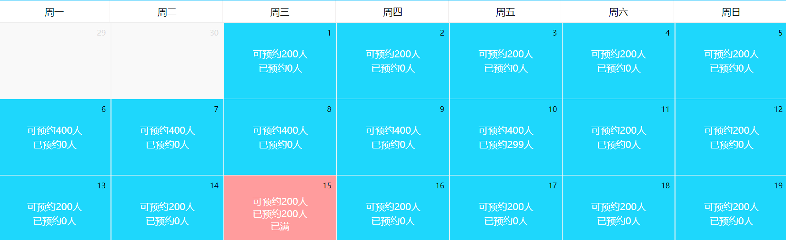

# 四、预约管理-预约设置

## 1. 需求分析

前面我们已经完成了检查项管理、检查组管理、套餐管理等。接下来我们需要进行预约设置，其实就是设置每一天的体检预约最大数量。客户可以通过微信端在线预约，在线预约时需要选择体检的时间，如果客户选择的时间已经预约满则无法进行预约。

## 2. Apache POI

### 2.1 POI介绍

Apache POI是用Java编写的免费开源的跨平台的Java API，Apache POI提供API给Java程序对Microsoft Office格式档案读和写的功能，其中使用最多的就是使用POI操作Excel文件。

jxl：专门操作Excel

maven坐标：

~~~xml
<dependency>
  <groupId>org.apache.poi</groupId>
  <artifactId>poi</artifactId>
  <version>3.14</version>
</dependency>
<dependency>
  <groupId>org.apache.poi</groupId>
  <artifactId>poi-ooxml</artifactId>
  <version>3.14</version>
</dependency>
~~~

POI结构：

~~~xml
HSSF － 提供读写Microsoft Excel XLS格式档案的功能
XSSF － 提供读写Microsoft Excel OOXML XLSX格式档案的功能
HWPF － 提供读写Microsoft Word DOC格式档案的功能
HSLF － 提供读写Microsoft PowerPoint格式档案的功能
HDGF － 提供读Microsoft Visio格式档案的功能
HPBF － 提供读Microsoft Publisher格式档案的功能
HSMF － 提供读Microsoft Outlook格式档案的功能
~~~

### 2.2 入门案例

#### 2.2.1 从Excel文件读取数据

使用POI可以从一个已经存在的Excel文件中读取数据

~~~java
//创建工作簿
XSSFWorkbook workbook = new XSSFWorkbook("D:\\hello.xlsx");
//获取工作表，既可以根据工作表的顺序获取，也可以根据工作表的名称获取
XSSFSheet sheet = workbook.getSheetAt(0);
//遍历工作表获得行对象
for (Row row : sheet) {
  //遍历行对象获取单元格对象
  for (Cell cell : row) {
    //获得单元格中的值
    String value = cell.getStringCellValue();
    System.out.println(value);
  }
}
workbook.close();
~~~

通过上面的入门案例可以看到，POI操作Excel表格封装了几个核心对象：

~~~p
XSSFWorkbook：工作簿
XSSFSheet：工作表
Row：行
Cell：单元格
~~~

上面案例是通过遍历工作表获得行，遍历行获得单元格，最终获取单元格中的值。

还有一种方式就是获取工作表最后一个行号，从而根据行号获得行对象，通过行获取最后一个单元格索引，从而根据单元格索引获取每行的一个单元格对象，代码如下：

~~~java
//创建工作簿
XSSFWorkbook workbook = new XSSFWorkbook("D:\\hello.xlsx");
//获取工作表，既可以根据工作表的顺序获取，也可以根据工作表的名称获取
XSSFSheet sheet = workbook.getSheetAt(0);
//获取当前工作表最后一行的行号，行号从0开始
int lastRowNum = sheet.getLastRowNum();
for(int i=0;i<=lastRowNum;i++){
  //根据行号获取行对象
  XSSFRow row = sheet.getRow(i);
  short lastCellNum = row.getLastCellNum();
  for(short j=0;j<lastCellNum;j++){
    String value = row.getCell(j).getStringCellValue();
    System.out.println(value);
  }
}
workbook.close();
~~~

#### 2.2.2 向Excel文件写入数据

使用POI可以在内存中创建一个Excel文件并将数据写入到这个文件，最后通过输出流将内存中的Excel文件下载到磁盘

~~~java
//在内存中创建一个Excel文件
XSSFWorkbook workbook = new XSSFWorkbook();
//创建工作表，指定工作表名称
XSSFSheet sheet = workbook.createSheet("传智播客");

//创建行，0表示第一行
XSSFRow row = sheet.createRow(0);
//创建单元格，0表示第一个单元格
row.createCell(0).setCellValue("编号");
row.createCell(1).setCellValue("名称");
row.createCell(2).setCellValue("年龄");

XSSFRow row1 = sheet.createRow(1);
row1.createCell(0).setCellValue("1");
row1.createCell(1).setCellValue("小明");
row1.createCell(2).setCellValue("10");

XSSFRow row2 = sheet.createRow(2);
row2.createCell(0).setCellValue("2");
row2.createCell(1).setCellValue("小王");
row2.createCell(2).setCellValue("20");

//通过输出流将workbook对象下载到磁盘
FileOutputStream out = new FileOutputStream("D:\\itcast.xlsx");
workbook.write(out);
out.flush();
out.close();
workbook.close();
~~~

## 3. 批量导入预约设置信息

预约设置信息对应的数据表为t_ordersetting，预约设置操作对应的页面为ordersetting.html

t_ordersetting表结构：


orderDate：预约日期  

number：可预约人数  

reservations：已预约人数


批量导入预约设置信息操作过程：

1、点击模板下载按钮下载Excel模板文件

2、将预约设置信息录入到模板文件中

3、点击上传文件按钮将录入完信息的模板文件上传到服务器

4、通过POI读取上传文件的数据并保存到数据库

### 3.1 完善页面

#### 3.1.1 提供模板文件

资料中已经提供了Excel模板文件ordersetting_template.xlsx，将文件放在health_backend工程的template目录

#### 3.1.2 实现模板文件下载

为模板下载按钮绑定事件实现模板文件下载

~~~html
<el-button style="margin-bottom: 20px;margin-right: 20px" type="primary" 
           @click="downloadTemplate()">模板下载</el-button>
~~~

~~~javascript
//模板文件下载
downloadTemplate(){
	window.location.href="../../template/ordersetting_template.xlsx";
}
~~~

#### 3.1.3 文件上传

使用ElementUI的上传组件实现文件上传并绑定相关事件

~~~html
<el-upload action="/ordersetting/upload.do"
           name="excelFile"
           :show-file-list="false"
           :on-success="handleSuccess"
           :before-upload="beforeUpload">
  <el-button type="primary">上传文件</el-button>
</el-upload>
~~~

~~~javascript
handleSuccess(response, file) {
  if(response.flag){
    this.$message({
      message: response.message,
      type: 'success'
    });
  }else{
    this.$message.error(response.message);
  }
}

beforeUpload(file){
  const isXLS = file.type === 'application/vnd.ms-excel';
  if(isXLS){
    return true;
  }
  const isXLSX = file.type === 'application/vnd.openxmlformats-officedocument.spreadsheetml.sheet';
  if (isXLSX) {
    return true;
  }
  this.$message.error('上传文件只能是xls或者xlsx格式!');
  return false;
}
~~~

### 3.2 后台代码

#### 3.2.1 Controller

将资料中的POIUtils工具类复制到health_common工程

在health_backend工程创建OrderSettingController并提供upload方法

~~~java
package com.itheima.controller;

import com.alibaba.dubbo.config.annotation.Reference;
import com.itheima.constant.MessageConstant;
import com.itheima.entity.Result;
import com.itheima.pojo.OrderSetting;
import com.itheima.service.OrderSettingService;
import com.itheima.utils.POIUtils;
import org.springframework.web.bind.annotation.RequestBody;
import org.springframework.web.bind.annotation.RequestMapping;
import org.springframework.web.bind.annotation.RequestParam;
import org.springframework.web.bind.annotation.RestController;
import org.springframework.web.multipart.MultipartFile;
import java.io.IOException;
import java.util.ArrayList;
import java.util.Date;
import java.util.List;
import java.util.Map;
/**
 * 预约设置
 */
@RestController
@RequestMapping("/ordersetting")
public class OrderSettingController {
    @Reference
    private OrderSettingService orderSettingService;

    /**
     * Excel文件上传，并解析文件内容保存到数据库
     * @param excelFile
     * @return
     */
    @RequestMapping("/upload")
    public Result upload(@RequestParam("excelFile")MultipartFile excelFile){
        try {
            //读取Excel文件数据
            List<String[]> list = POIUtils.readExcel(excelFile);
            if(list != null && list.size() > 0){
                List<OrderSetting> orderSettingList = new ArrayList<>();
                for (String[] strings : list) {
                    OrderSetting orderSetting = 
                      new OrderSetting(new Date(strings[0]), Integer.parseInt(strings[1]));
                    orderSettingList.add(orderSetting);
                }
                orderSettingService.add(orderSettingList);
            }
        } catch (IOException e) {
            e.printStackTrace();
            return new Result(false, MessageConstant.IMPORT_ORDERSETTING_FAIL);
        }
        return new Result(true,MessageConstant.IMPORT_ORDERSETTING_SUCCESS);
    }
}
~~~

#### 3.2.2 服务接口

创建OrderSettingService服务接口并提供新增方法

~~~java
package com.itheima.service;

import com.itheima.pojo.OrderSetting;
import java.util.List;
import java.util.Map;

public interface OrderSettingService {
    public void add(List<OrderSetting> list);
}
~~~

#### 3.2.3 服务实现类

创建服务实现类OrderSettingServiceImpl并实现新增方法

~~~java
package com.itheima.service;

import com.alibaba.dubbo.config.annotation.Service;
import com.itheima.dao.OrderSettingDao;
import com.itheima.pojo.OrderSetting;
import org.springframework.beans.factory.annotation.Autowired;
import org.springframework.transaction.annotation.Transactional;
import java.util.*;
/**
 * 预约设置服务
 */
@Service(interfaceClass = OrderSettingService.class)
@Transactional
public class OrderSettingServiceImpl implements OrderSettingService {
    @Autowired
    private OrderSettingDao orderSettingDao;
    //批量添加
    public void add(List<OrderSetting> list) {
        if(list != null && list.size() > 0){
            for (OrderSetting orderSetting : list) {
                //检查此数据（日期）是否存在
                long count = orderSettingDao.findCountByOrderDate(orderSetting.getOrderDate());
                if(count > 0){
                    //已经存在，执行更新操作
                    orderSettingDao.editNumberByOrderDate(orderSetting);
                }else{
                    //不存在，执行添加操作
                    orderSettingDao.add(orderSetting);
                }
            }
        }
    }
}
~~~

#### 3.2.4 Dao接口

创建Dao接口OrderSettingDao并提供更新和新增方法

~~~java
package com.itheima.dao;

import com.itheima.pojo.OrderSetting;
import java.util.Date;
import java.util.HashMap;
import java.util.List;
import java.util.Map;

public interface OrderSettingDao {
    public void add(OrderSetting orderSetting);
    public void editNumberByOrderDate(OrderSetting orderSetting);
  	public long findCountByOrderDate(Date orderDate);
}
~~~

#### 3.2.5 Mapper映射文件

创建Mapper映射文件OrderSettingDao.xml并提供相关SQL

~~~xml
<?xml version="1.0" encoding="UTF-8" ?>
<!DOCTYPE mapper PUBLIC "-//mybatis.org//DTD Mapper 3.0//EN"
        "http://mybatis.org/dtd/mybatis-3-mapper.dtd" >
<mapper namespace="com.itheima.dao.OrderSettingDao" >
    <!--新增-->
    <insert id="add" parameterType="com.itheima.pojo.OrderSetting">
        insert into t_ordersetting
      		(orderDate,number,reservations)
                      values 
      		(#{orderDate},#{number},#{reservations})
    </insert>
    <!--根据日期更新预约人数-->
    <update id="editNumberByOrderDate" parameterType="com.itheima.pojo.OrderSetting">
        update t_ordersetting set number = #{number} where orderDate = #{orderDate}
    </update>
    <!--根据预约日期查询-->
    <select id="findCountByOrderDate" parameterType="java.util.Date" resultType="long">
        select count(*) from t_ordersetting where orderDate = #{orderDate}
    </select>
</mapper>
~~~

## 4. 日历展示预约设置信息

前面已经完成了预约设置功能，现在就需要通过日历的方式展示出来每天设置的预约人数。

在页面中已经完成了日历的动态展示，我们只需要查询当前月份的预约设置信息并展示到日历中即可，同时在日历中还需要展示已经预约的人数，效果如下：



### 4.1 完善页面

#### 4.1.1 使用静态数据调试

为了能够快速看到效果，我们可以先使用静态数据模拟，然后再改为发送ajax请求查询数据库。

实现步骤：

（1）预约设置数据对应的模型数据为leftobj，在initData方法最后为leftobj模型数据赋值：

~~~javascript
this.leftobj = [
                  { date: 1, number: 120, reservations: 1 },
                  { date: 3, number: 120, reservations: 1 },
                  { date: 4, number: 120, reservations: 120 },
                  { date: 6, number: 120, reservations: 1 },
                  { date: 8, number: 120, reservations: 1 }
                ];
~~~

其中date表示日期，number表示可预约人数，reservations表示已预约人数

（2）使用VUE的v-for标签遍历上面的leftobj模型数据，展示到日历上：

~~~html
<template>
  <template v-for="obj in leftobj">
    <template v-if="obj.date == dayobject.day.getDate()">
      <template v-if="obj.number > obj.reservations">
        <div class="usual">
          <p>可预约{{obj.number}}人</p>
          <p>已预约{{obj.reservations}}人</p>
        </div>
      </template>
      <template v-else>
        <div class="fulled">
          <p>可预约{{obj.number}}人</p>
          <p>已预约{{obj.reservations}}人</p>
          <p>已满</p>
        </div>
      </template>
    </template>
  </template>
  <button v-if="dayobject.day > today" 
          @click="handleOrderSet(dayobject.day)" class="orderbtn">设置</button>
</template>
~~~

#### 4.1.2 发送ajax获取动态数据

将上面的静态模拟数据去掉，改为发送ajax请求，根据当前页面对应的月份查询数据库获取预约设置信息，将查询结果赋值给leftobj模型数据

~~~javascript
//发送ajax请求，根据当前页面对应的月份查询预约设置信息
axios.post(
  "/ordersetting/getOrderSettingByMonth.do?date="+this.currentYear+'-'+this.currentMonth
		  ).then((response)=>{
  if(response.data.flag){
    //为模型数据赋值，通过双向绑定展示到日历中
    this.leftobj = response.data.data;
  }else{
    this.$message.error(response.data.message);
  }
});
~~~

### 4.2 后台代码

#### 4.2.1 Controller

在OrderSettingController中提供getOrderSettingByMonth方法，根据月份查询预约设置信息

~~~java
/**
* 根据日期查询预约设置数据(获取指定日期所在月份的预约设置数据)
* @param date
* @return
*/
@RequestMapping("/getOrderSettingByMonth")
public Result getOrderSettingByMonth(String date){//参数格式为：2019-03
  try{
    List<Map> list = orderSettingService.getOrderSettingByMonth(date);
    //获取预约设置数据成功
    return new Result(true,MessageConstant.GET_ORDERSETTING_SUCCESS,list);
  }catch (Exception e){
    e.printStackTrace();
    //获取预约设置数据失败
    return new Result(false,MessageConstant.GET_ORDERSETTING_FAIL);
  }
}
~~~

#### 4.2.2 服务接口

在OrderSettingService服务接口中扩展方法getOrderSettingByMonth

~~~java
public List<Map> getOrderSettingByMonth(String date);//参数格式为：2019-03
~~~

#### 4.2.3 服务实现类

在OrderSettingServiceImpl服务实现类中实现方法getOrderSettingByMonth

~~~java
//根据日期查询预约设置数据
public List<Map> getOrderSettingByMonth(String date) {//2019-3
  String dateBegin = date + "-1";//2019-3-1
  String dateEnd = date + "-31";//2019-3-31
  Map map = new HashMap();
  map.put("dateBegin",dateBegin);
  map.put("dateEnd",dateEnd);
  List<OrderSetting> list = orderSettingDao.getOrderSettingByMonth(map);
  List<Map> data = new ArrayList<>();
  for (OrderSetting orderSetting : list) {
    Map orderSettingMap = new HashMap();
    orderSettingMap.put("date",orderSetting.getOrderDate().getDate());//获得日期（几号）
    orderSettingMap.put("number",orderSetting.getNumber());//可预约人数
    orderSettingMap.put("reservations",orderSetting.getReservations());//已预约人数
    data.add(orderSettingMap);
  }
  return data;
}
~~~

#### 4.2.4 Dao接口

在OrderSettingDao接口中扩展方法getOrderSettingByMonth

~~~java
public List<OrderSetting> getOrderSettingByMonth(Map date);
~~~

#### 4.2.5 Mapper映射文件

在OrderSettingDao.xml文件中扩展SQL

~~~xml
<!--根据月份查询预约设置信息-->
<select id="getOrderSettingByMonth" 
        parameterType="hashmap" 
        resultType="com.itheima.pojo.OrderSetting">
  select * from t_ordersetting where orderDate between #{dateBegin} and #{dateEnd}
</select>
~~~

## 5. 基于日历实现预约设置

本章节要完成的功能为通过点击日历中的设置按钮来设置对应日期的可预约人数。效果如下：


### 5.1 完善页面

#### 5.1.1 为设置按钮绑定事件

为日历中的设置按钮绑定单击事件，当前日期作为参数

~~~html
<button v-if="dayobject.day > today" 
        @click="handleOrderSet(dayobject.day)" class="orderbtn">设置</button>
~~~

~~~javascript
//预约设置
handleOrderSet(day){
	alert(day);
}
~~~

#### 5.1.2 弹出预约设置窗口并发送ajax请求

完善handleOrderSet方法，弹出预约设置窗口，用户点击确定按钮则发送ajax请求

~~~javascript
//预约设置
handleOrderSet(day){
  this.$prompt('请输入可预约人数', '预约设置', {
    confirmButtonText: '确定',
    cancelButtonText: '取消',
    inputPattern: /^[0-9]*[1-9][0-9]*$/,
    inputErrorMessage: '只能输入正整数'
  }).then(({ value }) => {
    //发送ajax请求根据日期修改可预约人数
    axios.post("/ordersetting/editNumberByDate.do",{
      orderDate:this.formatDate(day.getFullYear(),day.getMonth()+1,day.getDate()), //日期
      number:value   //可预约人数
    }).then((response)=>{
      if(response.data.flag){
        this.initData(this.formatDate(day.getFullYear(), day.getMonth() + 1, 1));
        this.$message({
          type: 'success',
          message: response.data.message
        });
      }else{
        this.$message.error(response.data.message);
      }
    });
  }).catch(() => {
    this.$message({
      type: 'info',
      message: '已取消'
    });
  });
}
~~~

### 5.2 后台代码

#### 5.2.1 Controller

在OrderSettingController中提供方法editNumberByDate

~~~java
/**
* 根据指定日期修改可预约人数
* @param orderSetting
* @return
*/
@RequestMapping("/editNumberByDate")
public Result editNumberByDate(@RequestBody OrderSetting orderSetting){
  try{
    orderSettingService.editNumberByDate(orderSetting);
    //预约设置成功
    return new Result(true,MessageConstant.ORDERSETTING_SUCCESS);
  }catch (Exception e){
    e.printStackTrace();
    //预约设置失败
    return new Result(false,MessageConstant.ORDERSETTING_FAIL);
  }
}
~~~

#### 5.2.2 服务接口

在OrderSettingService服务接口中提供方法editNumberByDate

~~~java
public void editNumberByDate(OrderSetting orderSetting);
~~~

#### 5.2.3 服务实现类

在OrderSettingServiceImpl服务实现类中实现editNumberByDate

~~~java
//根据日期修改可预约人数
public void editNumberByDate(OrderSetting orderSetting) {
  long count = orderSettingDao.findCountByOrderDate(orderSetting.getOrderDate());
  if(count > 0){
    //当前日期已经进行了预约设置，需要进行修改操作
    orderSettingDao.editNumberByOrderDate(orderSetting);
  }else{
    //当前日期没有进行预约设置，进行添加操作
    orderSettingDao.add(orderSetting);
  }
}
~~~

#### 5.2.4 Dao接口

在OrderSettingDao接口中提供方法

~~~java
public void editNumberByOrderDate(OrderSetting orderSetting);
public long findCountByOrderDate(Date orderDate);
~~~

#### 5.2.5 Mapper映射文件

在OrderSettingDao.xml映射文件中提供SQL

~~~xml
<!--根据日期更新可预约人数-->
<update id="editNumberByOrderDate" parameterType="com.itheima.pojo.OrderSetting">
  update t_ordersetting set number = #{number} where orderDate = #{orderDate}
</update>
<!--根据预约日期查询-->
<select id="findCountByOrderDate" parameterType="java.util.Date" resultType="long">
  select count(*) from t_ordersetting where orderDate = #{orderDate}
</select>
~~~


### 6. 完整代码

#### 前端

```html
<!DOCTYPE html>
<html>
    <head>
        <!-- 页面meta -->
        <meta charset="utf-8">
        <meta http-equiv="X-UA-Compatible" content="IE=edge">
        <title>传智健康</title>
        <meta name="description" content="传智健康">
        <meta name="keywords" content="传智健康">
        <meta content="width=device-width,initial-scale=1,maximum-scale=1,user-scalable=no" name="viewport">
        <!-- 引入样式 -->
        <link rel="stylesheet" href="../plugins/elementui/index.css">
        <link rel="stylesheet" href="../plugins/font-awesome/css/font-awesome.min.css">
        <link rel="stylesheet" href="../css/style.css">
        <link rel="stylesheet" href="../css/orderset.css">
        <!-- 引入组件库 -->
        <script src="../js/vue.js"></script>
        <script src="../plugins/elementui/index.js"></script>
        <script type="text/javascript" src="../js/jquery.min.js"></script>
        <script src="../js/axios-0.18.0.js"></script>
    </head>
    <body class="hold-transition">
    <div id="app">
        <div class="content-header">
            <h1>预约管理<small>预约设置</small></h1>
            <el-breadcrumb separator-class="el-icon-arrow-right" class="breadcrumb">
                <el-breadcrumb-item :to="{ path: '/' }">首页</el-breadcrumb-item>
                <el-breadcrumb-item>预约管理</el-breadcrumb-item>
                <el-breadcrumb-item>预约设置</el-breadcrumb-item>
            </el-breadcrumb>
        </div>
        <div class="app-container">
            <div class="box">
                <div class="box ordersetting">
                    <el-card class="box-card">
                        <div class="boxMain">
                            <el-button style="margin-bottom: 20px;margin-right: 20px" type="primary" @click="downloadTemplate()">模板下载</el-button>
                            <el-upload action="/ordersetting/upload.do"
                                       name="excelFile"
                                       :show-file-list="false"
                                       :on-success="handleSuccess"
                                       :before-upload="beforeUpload">
                                <el-button type="primary">上传文件</el-button>
                            </el-upload>
                        </div>
                        <div>
                            操作说明：请点击"模板下载"按钮获取模板文件，在模板文件中录入预约设置数据后点击"上传文件"按钮上传模板文件。
                        </div>
                    </el-card>
                    <div class="calendar">
                        <!-- 年份 月份 -->
                        <div class="month">
                            <div class="currentdate">
                                <span class="choose-year">{{ currentYear }}年</span>
                                <span class="choose-month">{{ currentMonth }}月</span>
                            </div>
                            <div class="choose">
                                <span @click="goCurrentMonth(currentYear,currentMonth)" class="gotoday">今天</span>
                                <span @click="pickPre(currentYear,currentMonth)">❮</span>
                                <span @click="pickNext(currentYear,currentMonth)">❯</span>
                            </div>
                            <div class="clearfix"></div>
                        </div>
                        <!-- 星期 -->
                        <div class="caldate">
                            <ul class="weekdays">
                                <li>周一</li>
                                <li>周二</li>
                                <li>周三</li>
                                <li>周四</li>
                                <li>周五</li>
                                <li>周六</li>
                                <li>周日</li>
                            </ul>
                            <!-- 日期 -->
                            <ul class="days">
                                <!-- v-for循环 每一次循环用<li>标签创建一天 -->
                                <li v-for="dayobject in days">
                                    <template>
                                        <!-- 非当前月份 -->
                                        <div class="other-month" v-if="dayobject.day.getMonth()+1 != currentMonth">
                                            {{ dayobject.day.getDate() }}
                                        </div>
                                        <!-- 当前月 -->
                                        <div class="everyday" v-if="dayobject.day.getMonth()+1 == currentMonth">
                                            <span class="datenumber">{{ dayobject.day.getDate()}}</span>
                                            
                                 <template>
                                                <template v-for="obj in leftobj">
                                                    <template v-if="obj.date == dayobject.day.getDate()">
                                                        <template v-if="obj.number > obj.reservations">
                                                            <div class="usual">
                                                                <p>可预约{{obj.number}}人</p>
                                                                <p>已预约{{obj.reservations}}人</p>
                                                            </div>
                                                        </template>
                                                        <template v-else>
                                                            <div class="fulled">
                                                                <p>可预约{{obj.number}}人</p>
                                                                <p>已预约{{obj.reservations}}人</p>
                                                                <p>已满</p>
                                                            </div>
                                                        </template>
                                                    </template>
                                                </template>
                                                <button v-if="dayobject.day > today" @click="handleOrderSet(dayobject.day)" class="orderbtn">设置</button>
                                            </template>
                                 
                                        </div>
                                    </template>
                                </li>
                            </ul>
                        </div>
                    </div>
                </div>
            </div>
        </div>
    </div>
    </body>
    <!-- 引入组件库 -->
    <script src="../js/vue.js"></script>
    <script src="../plugins/elementui/index.js"></script>
    <script type="text/javascript" src="../js/jquery.min.js"></script>
    <script src="../js/axios-0.18.0.js"></script>
    <script>
        // import {axios} from "../js/axios-0.18.0";

        new Vue({
            el: '#app',
            data:{
                today:new Date(),//当前日期
                currentDay: 1,
                currentMonth: 1,
                LocalMonth: 1,
                currentYear: 1970,
                currentWeek: 1,
                days: [],
                leftobj: []//用于装载页面显示的月份已经进行预约设置的数据
            },
            created: function () {//在vue初始化时调用
                this.initData(null);
            },
            methods: {
            //预约设置
                handleOrderSet(day){
                    // alert(this.formatDate(day.getFullYear(),day.getMonth()+1,day.getDate()));
                    this.$prompt('请输入可预约人数','预约设置',{
                        confirmButtonText:'确定',
                        cancelButtonText:'取消',
                        inputPattern:/^[0-9]*[1-9][0-9]*$/,
                        inputErrorMessage:'只能输入正整数'
                    }).then(({value})=>{
                        // 发送ajax请求，将输入的数据提交到Controller
                        axios.post("/ordersetting/editNumberByDate.do",{
                            number:value,
                            orderDate:this.formatDate(day.getFullYear(),day.getMonth()+1,day.getDate())
                        }).then((res)=>{
                            if(res.data.flag){
                                this.initData(this.formatDate(day.getFullYear(),day.getMonth()+1, 1));
                                this.$message({
                                    type: 'success',
                                    message: res.data.message
                                });
                            }
                        });
                    }).catch(()=>{
                        this.$message({
                            type:'info',
                            message:'取消输入'
                        });
                    });
                },
            //上传之前进行文件格式校验
                beforeUpload(file){
                    const isXLS = file.type === 'application/vnd.ms-excel';
                    if(isXLS){
                        return true;
                    }
                    const isXLSX = file.type === 'application/vnd.openxmlformats-officedocument.spreadsheetml.sheet';
                    if (isXLSX) {
                        return true;
                    }
                    this.$message.error('上传文件只能是xls或者xlsx格式!');
                    return false;
                },
            //下载模板文件
                downloadTemplate(){
                    window.location.href="../template/ordersetting_template.xlsx";
                },
            //上传成功提示
                handleSuccess(response, file) {
                    if(response.flag){
                        this.$message({
                            message: response.message,
                            type: 'success'
                        });
                    }else{
                        this.$message.error(response.message);
                    }
                    console.log(response, file);
                },
                //初始化当前页要展示的日期
            initData: function (cur) {
                    var date;
                    var index = 0;   //控制显示预定的天数
                    if (cur) {
                        date = new Date(cur);
                    } else {
                        var now = new Date();
                        var d = new Date(this.formatDate(now.getFullYear(), now.getMonth(), 1));
                        d.setDate(35);
                        date = new Date(this.formatDate(d.getFullYear(), d.getMonth() + 1, 1));
                    }
                    this.currentDay = date.getDate();
                    this.currentYear = date.getFullYear();
                    this.currentMonth = date.getMonth() + 1;
                    this.currentWeek = date.getDay(); // //本月第一天是周几（周日0 周六 6）
                    var today = new Date();
                    this.LocalMonth = today.getMonth() + 1;
                    if (this.currentWeek == 0) {
                        this.currentWeek = 7;
                    }
                    var str = this.formatDate(this.currentYear, this.currentMonth, this.currentDay);
                    this.days.length = 0;
                    // 今天是周日，放在第一行第7个位置，前面6个
                    //初始化本周
                    for (var i = this.currentWeek - 1; i >= 0; i--) {
                        var d = new Date(str);
                        d.setDate(d.getDate() - i);
                        var dayobject = {};
                        dayobject.day = d;
                        var now = new Date();
                        if (d.getDate() === (now.getDate()) && d.getMonth() === now.getMonth() && d.getFullYear() === now.getFullYear()) {
                            dayobject.index = index++;//从今天开始显示供预定的数量
                        }
                        else if (index != 0 && index < 3)
                            dayobject.index = index++;//从今天开始3天内显示供预定的数量
                        this.days.push(dayobject);//将日期放入data 中的days数组 供页面渲染使用
                    }
                    //其他周
                    for (var i = 1; i <= 35 - this.currentWeek; i++) {
                        var d = new Date(str);
                        d.setDate(d.getDate() + i);
                        var dayobject = {};//dayobject   {day:date,index:2}
                        dayobject.day = d;
                        var now = new Date();
                        if (d.getDate() === (now.getDate()) && d.getMonth() === now.getMonth() && d.getFullYear() === now.getFullYear()) {
                            dayobject.index = index++;
                        }
                        else if (index != 0 && index < 3)
                            dayobject.index = index++;
                        this.days.push(dayobject);
                    }
                    
                    /*this.leftobj = [
                        { date: 1, number: 120, reservations: 1 },
                        { date: 3, number: 120, reservations: 1 },
                        { date: 4, number: 120, reservations: 120 },
                        { date: 6, number: 120, reservations: 1 },
                        { date: 8, number: 120, reservations: 1 }
                    ];*/

                    // 发送ajax请求，根据年月查询对应的预约设置数据，赋值给leftobj对象，用于展示
                    axios.post("/ordersetting/getOrderSettingByMonth.do?date="+this.currentYear+"-"+this.currentMonth).then((res)=>{
                        if(res.data.flag){
                            this.leftobj = res.data.data;
                        }else {
                            this.$message.error(res.data.message);
                        }
                    });
                },
            //切换到当前月份
                goCurrentMonth: function (year, month) {
                    var d = new Date();
                    this.initData(this.formatDate(d.getFullYear(), d.getMonth() + 1, 1));
                },
            //向前一个月
                pickPre: function (year, month) {
                    // setDate(0); 上月最后一天
                    // setDate(-1); 上月倒数第二天
                    // setDate(dx) 参数dx为 上月最后一天的前后dx天
                    var d = new Date(this.formatDate(year, month, 1));
                    d.setDate(0);
                    this.initData(this.formatDate(d.getFullYear(), d.getMonth() + 1, 1));
                },
            //向后一个月
                pickNext: function (year, month) {
                    var d = new Date(this.formatDate(year, month, 1));
                    d.setDate(35);////获取指定天之后的日期
                    this.initData(this.formatDate(d.getFullYear(), d.getMonth() + 1, 1));
                },
                // 返回 类似 2016-01-02 格式的字符串
                formatDate: function (year, month, day) {
                    var y = year;
                    var m = month;
                    if (m < 10) m = "0" + m;
                    var d = day;
                    if (d < 10) d = "0" + d;
                    return y + "-" + m + "-" + d
                }
            }
        })
    </script>
</html>
```

#### Controller

```java
package org.example.controller;

/**
 * @author jml
 * @email ziguiyue@163.com
 * @date 2021/12/18 18:59
 */

import com.alibaba.dubbo.config.annotation.Reference;
import org.example.constant.MessageConstant;
import org.example.entity.Result;
import org.example.pojo.OrderSetting;
import org.example.service.OrderSettingService;
import org.example.utils.POIUtils;
import org.springframework.web.bind.annotation.RequestBody;
import org.springframework.web.bind.annotation.RequestMapping;
import org.springframework.web.bind.annotation.RequestParam;
import org.springframework.web.bind.annotation.RestController;
import org.springframework.web.multipart.MultipartFile;

import java.text.SimpleDateFormat;
import java.util.ArrayList;
import java.util.Date;
import java.util.List;
import java.util.Map;

/**
 * 后台OrderSettingController处理流程
 * 1.接收一个文件类型的变量MultipartFile excelFile
 * 2.List<String[]> list = POIUtils.readExcel(excelFile);//使用POI解析表格数据得到一个List集合，集合里面存储的是一个一个的数组
 * 3.通过遍历List集合将String[]数组转换成OrderSetting，也就是说List<String[]>---->List<OrderSetting>    [[2020/6/17,400],[2020/6/18,
 * 400]]--->[OrderSetting{orderDate=2020/6/17,number=400},OrderSetting{orderDate=2020/6/18,number=400}]
 * 4.通过dubbo远程调用服务实现数据批量导入到数据库
 */

@RestController
@RequestMapping("/ordersetting")
public class OrderSettingController {
    @Reference
    OrderSettingService orderSettingService;

    @RequestMapping("/upload")
    public Result uploadFromOrderSetting(@RequestParam("excelFile") MultipartFile excelFile){
        try {
            // 使用POI解析表格数据
            List<String[]> list = POIUtils.readExcel(excelFile);
            List<OrderSetting> data = new ArrayList<>();
            for (String[] strings :
                    list) {
                String date = strings[0];
                String number = strings[1];
//                OrderSetting orderSetting = new OrderSetting(new SimpleDateFormat("yyyy/MM/dd").parse(date), Integer.parseInt(number));
                OrderSetting orderSetting = new OrderSetting(new Date(date), Integer.parseInt(number));
                data.add(orderSetting);
            }
            // 通过dubbo远程调用服务实现数据批量导入到数据库
            orderSettingService.addFileData(data);
            return new Result(true, MessageConstant.IMPORT_ORDERSETTING_SUCCESS);
        } catch (Exception e) {
            e.printStackTrace();
            return new Result(false, MessageConstant.IMPORT_ORDERSETTING_FAIL);
        }
    }

    @RequestMapping("/getOrderSettingByMonth")
    public Result getOrderSettingByMonth(String date){  // date格式为:yyyy-MM
        try {
            List<Map> list = orderSettingService.getOrderSettingByMonth(date);
            return new Result(true, MessageConstant.GET_ORDERSETTING_SUCCESS, list);
        }catch (Exception e){
            e.printStackTrace();
            return new Result(false, MessageConstant.GET_ORDERSETTING_FAIL);
        }
    }

    @RequestMapping("/editNumberByDate")
    public Result editNumberByDate(@RequestBody OrderSetting orderSetting){
        try {
            orderSettingService.editNumberByDate(orderSetting);
            return new Result(true, MessageConstant.ORDERSETTING_SUCCESS);
        }catch (Exception e){
            e.printStackTrace();
            return new Result(false, MessageConstant.ORDERSETTING_FAIL);
        }
    }
}
```

#### Service

```java
package org.example.service;

import org.example.pojo.OrderSetting;

import java.util.List;
import java.util.Map;

/**
 * @author jml
 * @email ziguiyue@163.com
 * @date 2021/12/18 19:02
 */
public interface OrderSettingService {

    /**
     * 数据批量导入到数据库
     * @param list
     */
    void addFileData(List<OrderSetting> list);

    /**
     * 根据月份查询对应的预约设置数据
     * @param date
     * @return
     */
    List<Map> getOrderSettingByMonth(String date);

    /**
     * 根据日期设置对应的预约设置数据
     * @param orderSetting
     */
    void editNumberByDate(OrderSetting orderSetting);
}
```

#### ServiceImpl

```java
package org.example.service.impl;

import com.alibaba.dubbo.config.annotation.Service;
import org.example.dao.OrderSettingDao;
import org.example.pojo.OrderSetting;
import org.example.service.OrderSettingService;
import org.springframework.beans.factory.annotation.Autowired;

import java.util.*;

/**
 * @author jml
 * @email ziguiyue@163.com
 * @date 2021/12/18 19:03
 */
@Service(interfaceClass = OrderSettingService.class)
public class OrderSettingServiceImpl implements OrderSettingService {

    @Autowired
    OrderSettingDao orderSettingDao;

    /**
     * 数据批量导入到数据库
     * @param list
     */
    @Override
    public void addFileData(List<OrderSetting> list) {
        if(list!=null && list.size()>0){
            for (OrderSetting orderSetting :
                    list) {
                // 判断当前日期是否已经进入了预约设置
                long countByOrderDate = orderSettingDao.findCountByOrderDate(orderSetting.getOrderDate());
//                System.out.println("countByOrderDate:"+countByOrderDate);
//                System.out.println("OrderDate:"+orderSetting.getOrderDate());
                if(countByOrderDate > 0){
                    // 已经进行了预约设置，执行更新操作
                    orderSettingDao.editNumberByOrderDate(orderSetting);
                }else {
                    // 没有进行预约设置，执行插入操作
                    orderSettingDao.addFileData(orderSetting);
                }
            }
        }
    }

    /**
     * 根据月份查询对应的预约设置数据
     *
     * @param date
     * @return
     */
    @Override
    public List<Map> getOrderSettingByMonth(String date) {
        String begin = date + "-1";  // 2021-12-1
        String end = date + "-31";  // 2021-12-31
        Map<String, String> map = new HashMap<>();
        map.put("begin", begin);
        map.put("end", end);
        // 调用Dao，根据日期范围查询预约设置数据
        List<OrderSetting> list = orderSettingDao.getOrderSettingByMonth(map);
        List<Map> result = new ArrayList<>();
        if(list != null && list.size()>0){
            for (OrderSetting orderSetting :
                    list) {
                Map<String, Object> m = new HashMap<>();
                m.put("date", orderSetting.getOrderDate().getDate());  // 获取日期数字
                m.put("number", orderSetting.getNumber());
                m.put("reservations", orderSetting.getReservations());
                result.add(m);
            }
        }
        return result;
    }

    /**
     * 根据日期设置对应的预约设置数据
     *
     * @param orderSetting
     */
    @Override
    public void editNumberByDate(OrderSetting orderSetting) {
        Date orderDate = orderSetting.getOrderDate();
        // 根据日期查询是否已经进入了预约设置
        long count = orderSettingDao.findCountByOrderDate(orderDate);
        System.out.println(count);
        System.out.println();
        if(count>0){
            // 当前日期已经进行了预约设置，需要执行更新操作
            orderSettingDao.editNumberByOrderDate(orderSetting);
        }else {
            orderSettingDao.addFileData(orderSetting);
        }

    }
}
```

#### Dao

```java
package org.example.dao;

import org.example.pojo.OrderSetting;
import org.springframework.stereotype.Repository;

import java.util.Date;
import java.util.List;
import java.util.Map;

/**
 * @author jml
 * @email ziguiyue@163.com
 * @date 2021/12/18 19:03
 */
@Repository
public interface OrderSettingDao {
    /**
     * 判断当前日期是否进行了预约
     * @param orderDate
     * @return
     */
    long findCountByOrderDate(Date orderDate);

    /**
     * 已经进行了预约设置，执行更新操作
     * @param orderSetting
     */
    void editNumberByOrderDate(OrderSetting orderSetting);

    /**
     * 没有进行预约设置，执行插入操作
     * @param orderSetting
     */
    void addFileData(OrderSetting orderSetting);

    /**
     * 根据月份查询对应的预约设置
     * @param map
     * @return
     */
    List<OrderSetting> getOrderSettingByMonth(Map<String, String> map);
}
```

#### Mapper

```xml
<?xml version="1.0" encoding="UTF-8" ?>
<!DOCTYPE mapper PUBLIC "-//mybatis.org//DTD Mapper 3.0//EN"
        "http://mybatis.org/dtd/mybatis-3-mapper.dtd" >
<mapper namespace="org.example.dao.OrderSettingDao">
    <!--执行插入操作-->
    <insert id="addFileData" parameterType="org.example.pojo.OrderSetting">
        insert into t_ordersetting
        (orderDate, number, reservations)
        values
        (#{orderDate,jdbcType=DATE}, #{number}, #{reservations})
    </insert>

    <!--执行编辑操作-->
    <update id="editNumberByOrderDate" parameterType="org.example.pojo.OrderSetting">
        update t_ordersetting
        set number = #{number}
        where orderDate = #{orderDate,jdbcType=DATE}
    </update>

    <!--判断当前日期是否进行了预约设置-->
    <select id="findCountByOrderDate" parameterType="date" resultType="long">
        select count(id) from t_ordersetting where orderDate=#{orderDate,jdbcType=DATE}
    </select>

    <!--根据日期范围查询预约设置数据-->
    <select id="getOrderSettingByMonth" parameterType="map" resultType="org.example.pojo.OrderSetting">
        select * from t_ordersetting where orderDate between #{begin,jdbcType=DATE} and #{end,jdbcType=DATE}
    </select>
</mapper>
```


