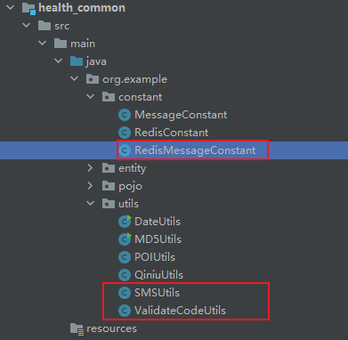
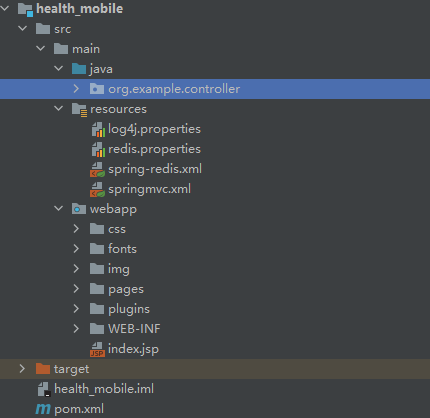
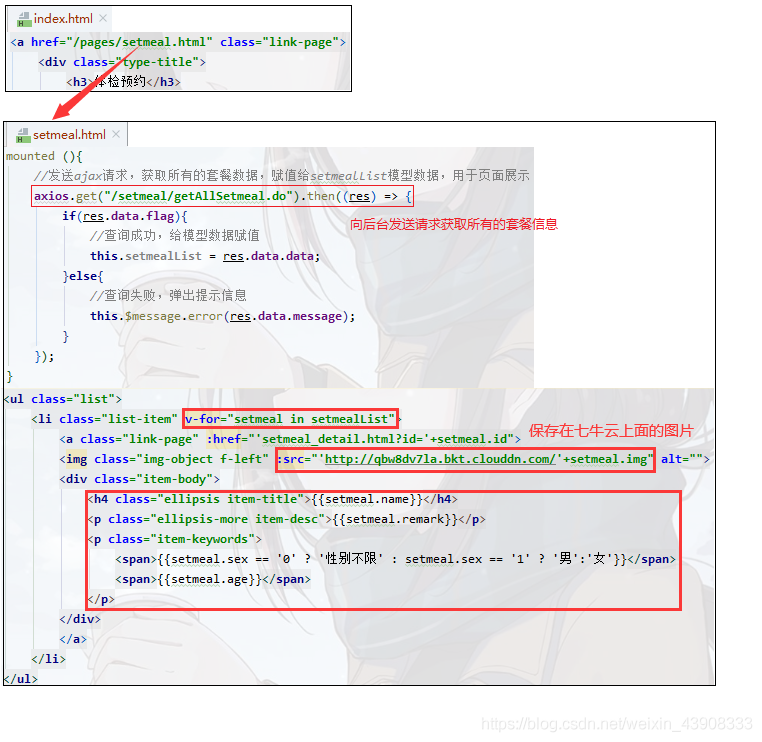
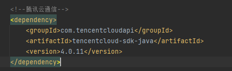
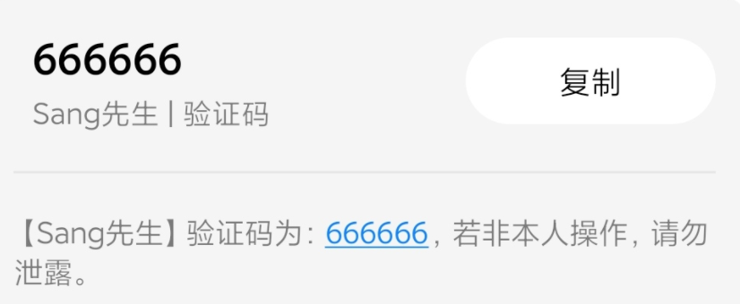
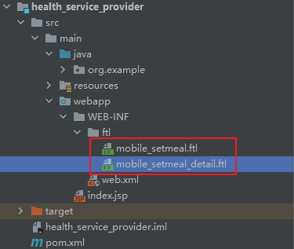

# 健康管理系统第六天（移动端开发之体检预约_经典五表联查_调用阿里云提供的短信服务进行短信验证码发送）

## 1. 移动端开发

### 1.1 移动端开发方式 

随着移动互联网的兴起和手机的普及，目前移动端应用变得愈发重要，成为了各个商家的必争之地。例如，我们可以使用手机购物、支付、打车、玩游戏、订酒店、购票等，以前只能通过PC端完成的事情，现在通过手机都能够实现，而且更加方便，而这些都需要移动端开发进行支持，那如何进行移动端开发呢？

移动端开发主要有三种方式：

1、基于手机API开发（原生APP）

2、基于手机浏览器开发（移动web）

3、混合开发（混合APP）

#### 1.1.1 基于手机API开发

手机端使用手机API，例如使用Android、ios 等进行开发，服务端只是一个数据提供者。手机端请求服务端获取数据（json、xml格式）并在界面进行展示。这种方式相当于传统开发中的C/S模式，即需要在手机上安装一个客户端软件。

这种方式需要针对不同的手机系统分别进行开发，目前主要有以下几个平台：

1、苹果ios系统版本，开发语言是Objective-C

2、安卓Android系统版本，开发语言是Java

3、微软Windows phone系统版本，开发语言是C#

4、塞班symbian系统版本，开发语言是C++

此种开发方式举例：手机淘宝、抖音、今日头条、大众点评

#### 1.1.2 基于手机浏览器开发

生存在浏览器中的应用，基本上可以说是触屏版的网页应用。这种开发方式相当于传统开发中的B/S模式，也就是手机上不需要额外安装软件，直接基于手机上的浏览器进行访问。这就需要我们编写的html页面需要根据不同手机的尺寸进行自适应调节，目前比较流行的是html5开发。除了直接通过手机浏览器访问，还可以将页面内嵌到一些应用程序中，例如通过微信公众号访问html5页面。

这种开发方式不需要针对不同的手机系统分别进行开发，只需要开发一个版本，就可以在不同的手机上正常访问。

本项目会通过将我们开发的html5页面内嵌到微信公众号这种方式进行开发。

#### 1.1.3 混合开发

是半原生半Web的混合类App。需要下载安装，看上去类似原生App，访问的内容是Web网页。其实就是把HTML5页面嵌入到一个原生容器里面。

### 1.2 微信公众号开发

要进行微信公众号开发，首先需要访问微信公众平台，官网：https://mp.weixin.qq.com/。

#### 1.2.1 帐号分类

在微信公众平台可以看到，有四种帐号类型：服务号、订阅号、小程序、企业微信（原企业号）。


本项目会选择订阅号这种方式进行公众号开发。

#### 1.2.2 注册帐号

要开发微信公众号，首先需要注册成为会员，然后就可以登录微信公众平台进行自定义菜单的设置。

注册页面：https://mp.weixin.qq.com/cgi-bin/registermidpage?action=index&lang=zh_CN&token=


选择订阅号进行注册：


输入邮箱、邮箱验证码、密码、确认密码等按照页面流程进行注册

#### 1.2.3 自定义菜单

注册成功后就可以使用注册的邮箱和设置的密码进行登录，登录成功后点击左侧“自定义菜单”进入自定义菜单页面

.png)

在自定义菜单页面可以根据需求创建一级菜单和二级菜单，其中一级菜单最多可以创建3个，每个一级菜单下面最多可以创建5个二级菜单。每个菜单由菜单名称和菜单内容组成，其中菜单内容有3中形式：发送消息、跳转网页、跳转小程序。

#### 1.2.4 上线要求

如果是个人用户身份注册的订阅号，则自定义菜单的菜单内容不能进行跳转网页，因为个人用户目前不支持微信认证，而跳转网页需要微信认证之后才有权限。

如果是企业用户，首先需要进行微信认证，通过后就可以进行跳转网页了，跳转网页的地址要求必须有域名并且域名需要备案通过。


## 2. 需求分析和环境搭建

### 2.1 需求分析

用户在体检之前需要进行预约，可以通过电话方式进行预约，此时会由体检中心客服人员通过后台系统录入预约信息。用户也可以通过手机端自助预约。本章节开发的功能为用户通过手机自助预约。

预约流程如下：

1、访问移动端首页

2、点击体检预约进入体检套餐列表页面

3、在体检套餐列表页面点击具体套餐进入套餐详情页面

4、在套餐详情页面点击立即预约进入预约页面

5、在预约页面录入体检人相关信息点击提交预约


效果如下图：


### 2.2 搭建移动端工程

本项目是基于SOA架构进行开发，前面我们已经完成了后台系统的部分功能开发，在后台系统中都是通过Dubbo调用服务层发布的服务进行相关的操作。本章节我们开发移动端工程也是同样的模式，所以我们也需要在移动端工程中通过Dubbo调用服务层发布的服务，如下图：


#### 2.2.1 导入maven坐标

在health_common工程的pom.xml文件中导入阿里短信发送的maven坐标

~~~xml
<dependency>
  <groupId>com.aliyun</groupId>
  <artifactId>aliyun-java-sdk-core</artifactId>
  <version>3.3.1</version>
</dependency>
<dependency>
  <groupId>com.aliyun</groupId>
  <artifactId>aliyun-java-sdk-dysmsapi</artifactId>
  <version>1.0.0</version>
</dependency>
~~~

#### 2.2.2 导入通用组件

在health_common工程中导入如下通用组件

ValidateCodeUtils工具类：

~~~java
package com.itheima.utils;

import java.util.Random;

/**
 * 随机生成验证码工具类
 */
public class ValidateCodeUtils {
    /**
     * 随机生成验证码
     * @param length 长度为4位或者6位
     * @return
     */
    public static Integer generateValidateCode(int length){
        Integer code =null;
        if(length == 4){
            code = new Random().nextInt(9999);//生成随机数，最大为9999
            if(code < 1000){
                code = code + 1000;//保证随机数为4位数字
            }
        }else if(length == 6){
            code = new Random().nextInt(999999);//生成随机数，最大为999999
            if(code < 100000){
                code = code + 100000;//保证随机数为6位数字
            }
        }else{
            throw new RuntimeException("只能生成4位或6位数字验证码");
        }
        return code;
    }

    /**
     * 随机生成指定长度字符串验证码
     * @param length 长度
     * @return
     */
    public static String generateValidateCode4String(int length){
        Random rdm = new Random();
        String hash1 = Integer.toHexString(rdm.nextInt());
        String capstr = hash1.substring(0, length);
        return capstr;
    }
}
~~~

SMSUtils工具类：

~~~java
package com.itheima.utils;

import com.aliyuncs.DefaultAcsClient;
import com.aliyuncs.IAcsClient;
import com.aliyuncs.dysmsapi.model.v20170525.SendSmsRequest;
import com.aliyuncs.dysmsapi.model.v20170525.SendSmsResponse;
import com.aliyuncs.exceptions.ClientException;
import com.aliyuncs.http.MethodType;
import com.aliyuncs.profile.DefaultProfile;
import com.aliyuncs.profile.IClientProfile;

/**
 * 短信发送工具类
 */
public class SMSUtils {
	public static final String VALIDATE_CODE = "SMS_159620392";//发送短信验证码
	public static final String ORDER_NOTICE = "SMS_159771588";//体检预约成功通知

	/**
	 * 发送短信
	 * @param phoneNumbers
	 * @param param
	 * @throws ClientException
	 */
	public static void sendShortMessage(String templateCode,String phoneNumbers,String param) throws ClientException{
		// 设置超时时间-可自行调整
		System.setProperty("sun.net.client.defaultConnectTimeout", "10000");
		System.setProperty("sun.net.client.defaultReadTimeout", "10000");
		// 初始化ascClient需要的几个参数
		final String product = "Dysmsapi";// 短信API产品名称（短信产品名固定，无需修改）
		final String domain = "dysmsapi.aliyuncs.com";// 短信API产品域名（接口地址固定，无需修改）
		// 替换成你的AK
		final String accessKeyId = "accessKeyId";// 你的accessKeyId,参考本文档步骤2
		final String accessKeySecret = "accessKeySecret";// 你的accessKeySecret，参考本文档步骤2
		// 初始化ascClient,暂时不支持多region（请勿修改）
		IClientProfile profile = DefaultProfile.getProfile("cn-hangzhou", accessKeyId, accessKeySecret);
		DefaultProfile.addEndpoint("cn-hangzhou", "cn-hangzhou", product, domain);
		IAcsClient acsClient = new DefaultAcsClient(profile);
		// 组装请求对象
		SendSmsRequest request = new SendSmsRequest();
		// 使用post提交
		request.setMethod(MethodType.POST);
		// 必填:待发送手机号。支持以逗号分隔的形式进行批量调用，批量上限为1000个手机号码,批量调用相对于单条调用及时性稍有延迟,验证码类型的短信推荐使用单条调用的方式
		request.setPhoneNumbers(phoneNumbers);
		// 必填:短信签名-可在短信控制台中找到
		request.setSignName("传智健康");
		// 必填:短信模板-可在短信控制台中找到
		request.setTemplateCode(templateCode);
		// 可选:模板中的变量替换JSON串,如模板内容为"亲爱的${name},您的验证码为${code}"时,此处的值为
		// 友情提示:如果JSON中需要带换行符,请参照标准的JSON协议对换行符的要求,比如短信内容中包含\r\n的情况在JSON中需要表示成\\r\\n,否则会导致JSON在服务端解析失败
		request.setTemplateParam("{\"code\":\""+param+"\"}");
		// 可选-上行短信扩展码(扩展码字段控制在7位或以下，无特殊需求用户请忽略此字段)
		// request.setSmsUpExtendCode("90997");
		// 可选:outId为提供给业务方扩展字段,最终在短信回执消息中将此值带回给调用者
		// request.setOutId("yourOutId");
		// 请求失败这里会抛ClientException异常
		SendSmsResponse sendSmsResponse = acsClient.getAcsResponse(request);
		if (sendSmsResponse.getCode() != null && sendSmsResponse.getCode().equals("OK")) {
			// 请求成功
			System.out.println("请求成功");
		}
	}
}
~~~

RedisMessageConstant常量类：

~~~java
package com.itheima.constant;

public class RedisMessageConstant {
    public static final String SENDTYPE_ORDER = "001";//用于缓存体检预约时发送的验证码
    public static final String SENDTYPE_LOGIN = "002";//用于缓存手机号快速登录时发送的验证码
    public static final String SENDTYPE_GETPWD = "003";//用于缓存找回密码时发送的验证码
}
~~~

最后定义目录结构如下：




#### 2.2.3 health_mobile

创建移动端工程health_mobile，打包方式为war，用于存放Controller，在Controller中通过Dubbo可以远程访问服务层相关服务，所以需要依赖health_interface接口工程。


pom.xml

```xml
<?xml version="1.0" encoding="UTF-8"?>

<project xmlns="http://maven.apache.org/POM/4.0.0" xmlns:xsi="http://www.w3.org/2001/XMLSchema-instance"
  xsi:schemaLocation="http://maven.apache.org/POM/4.0.0 http://maven.apache.org/xsd/maven-4.0.0.xsd">
  <modelVersion>4.0.0</modelVersion>

  <groupId>org.example</groupId>
  <artifactId>health_mobile</artifactId>
  <version>1.0-SNAPSHOT</version>
  <packaging>war</packaging>

  <name>health_mobile Maven Webapp</name>
  <!-- FIXME change it to the project's website -->
  <url>http://www.example.com</url>

  <properties>
    <project.build.sourceEncoding>UTF-8</project.build.sourceEncoding>
    <maven.compiler.source>1.8</maven.compiler.source>
    <maven.compiler.target>1.8</maven.compiler.target>
  </properties>

  <dependencies>
    <dependency>
      <groupId>org.example</groupId>
      <artifactId>health_interface</artifactId>
      <version>1.0-SNAPSHOT</version>
    </dependency>
  </dependencies>

  <build>
    <plugins>
      <plugin>
        <groupId>org.apache.tomcat.maven</groupId>
        <artifactId>tomcat7-maven-plugin</artifactId>
        <version>2.2</version>
        <configuration>
          <port>80</port>
          <path>/</path>
        </configuration>
      </plugin>
    </plugins>
  </build>
</project>
```

静态资源（CSS、html、img等，详见资料）：



web.xml

```xml
<!DOCTYPE web-app PUBLIC
 "-//Sun Microsystems, Inc.//DTD Web Application 2.3//EN"
 "http://java.sun.com/dtd/web-app_2_3.dtd" >

<web-app>
  <display-name>Archetype Created Web Application</display-name>

  <!--解决post乱码-->
  <filter>
    <filter-name>CharacterEncodingFilter</filter-name>
    <filter-class>org.springframework.web.filter.CharacterEncodingFilter</filter-class>
    <init-param>
      <param-name>encoding</param-name>
      <param-value>utf-8</param-value>
    </init-param>
    <init-param>
      <param-name>forceEncoding</param-name>
      <param-value>true</param-value>
    </init-param>
  </filter>
  <filter-mapping>
    <filter-name>CharacterEncodingFilter</filter-name>
    <url-pattern>/*</url-pattern>
  </filter-mapping>

  <servlet>
    <servlet-name>springmvc</servlet-name>
    <servlet-class>org.springframework.web.servlet.DispatcherServlet</servlet-class>
    <!-- 指定加载的配置文件 ，通过参数contextConfigLocation加载 -->
    <init-param>
      <param-name>contextConfigLocation</param-name>
      <param-value>classpath:springmvc.xml</param-value>
    </init-param>
    <load-on-startup>1</load-on-startup>
  </servlet>
  <servlet-mapping>
    <servlet-name>springmvc</servlet-name>
    <url-pattern>*.do</url-pattern>
  </servlet-mapping>
  <welcome-file-list>
    <welcome-file>/pages/index.html</welcome-file>
  </welcome-file-list>
</web-app>
```

springmvc.xml

```xml
<?xml version="1.0" encoding="UTF-8"?>
<beans xmlns="http://www.springframework.org/schema/beans"
       xmlns:xsi="http://www.w3.org/2001/XMLSchema-instance"
       xmlns:p="http://www.springframework.org/schema/p"
       xmlns:context="http://www.springframework.org/schema/context"
       xmlns:dubbo="http://code.alibabatech.com/schema/dubbo"
       xmlns:mvc="http://www.springframework.org/schema/mvc"
       xsi:schemaLocation="http://www.springframework.org/schema/beans
		 http://www.springframework.org/schema/beans/spring-beans.xsd
          http://www.springframework.org/schema/mvc
          http://www.springframework.org/schema/mvc/spring-mvc.xsd
          http://code.alibabatech.com/schema/dubbo
          http://code.alibabatech.com/schema/dubbo/dubbo.xsd
          http://www.springframework.org/schema/context
          http://www.springframework.org/schema/context/spring-context.xsd">

<mvc:annotation-driven>
    <mvc:message-converters register-defaults="true">
        <bean class="com.alibaba.fastjson.support.spring.FastJsonHttpMessageConverter">
            <property name="supportedMediaTypes" value="application/json"/>
            <property name="features">
                <list>
                    <value>WriteMapNullValue</value>
                    <value>WriteDateUseDateFormat</value>
                </list>
            </property>
        </bean>
    </mvc:message-converters>
</mvc:annotation-driven>
<!--  springMVC No mapping found for HTTP request with URI的问题解决方案  -->
<mvc:default-servlet-handler/>
    <!-- 指定应用名称 -->
<dubbo:application name="health_mobile" />
<!--指定服务注册中心地址-->
<!--<dubbo:registry address="zookeeper://192.168.100.130:2181"/>-->
<dubbo:registry address="zookeeper://127.0.0.1:2181"/>
<!--批量扫描-->
<dubbo:annotation package="org.example.controller" />
<!--
    超时全局设置 10分钟
    check=false 不检查服务提供方，开发阶段建议设置为false
    check=true 启动时检查服务提供方，如果服务提供方没有启动则报错
-->
<dubbo:consumer timeout="600000" check="false"/>
<import resource="spring-redis.xml"></import>
</beans>
```

spring-redis.xml

```xml
<?xml version="1.0" encoding="UTF-8"?>
<beans xmlns="http://www.springframework.org/schema/beans"
       xmlns:xsi="http://www.w3.org/2001/XMLSchema-instance"
       xmlns:p="http://www.springframework.org/schema/p"
       xmlns:context="http://www.springframework.org/schema/context"
       xmlns:dubbo="http://code.alibabatech.com/schema/dubbo"
       xmlns:mvc="http://www.springframework.org/schema/mvc"
       xsi:schemaLocation="http://www.springframework.org/schema/beans
		 http://www.springframework.org/schema/beans/spring-beans.xsd
          http://www.springframework.org/schema/mvc
          http://www.springframework.org/schema/mvc/spring-mvc.xsd
          http://code.alibabatech.com/schema/dubbo
          http://code.alibabatech.com/schema/dubbo/dubbo.xsd
          http://www.springframework.org/schema/context
          http://www.springframework.org/schema/context/spring-context.xsd">

    <context:property-placeholder location="classpath:redis.properties" />

    <!--Jedis连接池的相关配置-->
    <bean id="jedisPoolConfig" class="redis.clients.jedis.JedisPoolConfig">
        <property name="maxTotal">
            <value>${redis.pool.maxActive}</value>
        </property>
        <property name="maxIdle">
            <value>${redis.pool.maxIdle}</value>
        </property>
        <property name="testOnBorrow" value="true"/>
        <property name="testOnReturn" value="true"/>
    </bean>

    <bean id="jedisPool" class="redis.clients.jedis.JedisPool">
        <constructor-arg name="poolConfig" ref="jedisPoolConfig" />
        <constructor-arg name="host" value="${redis.host}" />
        <constructor-arg name="port" value="${redis.port}" type="int" />
        <constructor-arg name="timeout" value="${redis.timeout}" type="int" />
    </bean>
</beans>
```

redis.properties：

~~~properties
#最大分配的对象数
redis.pool.maxActive=200
#最大能够保持idel状态的对象数
redis.pool.maxIdle=50
redis.pool.minIdle=10
redis.pool.maxWaitMillis=20000
#当池内没有返回对象时，最大等待时间
redis.pool.maxWait=300

#格式：redis://:[密码]@[服务器地址]:[端口]/[db index]
#redis.uri = redis://:12345@127.0.0.1:6379/0

redis.host = 127.0.0.1
redis.port = 6379
redis.timeout = 30000
~~~

log4j.properties：

~~~properties
### direct log messages to stdout ###
log4j.appender.stdout=org.apache.log4j.ConsoleAppender
log4j.appender.stdout.Target=System.err
log4j.appender.stdout.layout=org.apache.log4j.PatternLayout
log4j.appender.stdout.layout.ConversionPattern=%d{ABSOLUTE} %5p %c{1}:%L - %m%n

### direct messages to file mylog.log ###
log4j.appender.file=org.apache.log4j.FileAppender
log4j.appender.file.File=c:\\mylog.log
log4j.appender.file.layout=org.apache.log4j.PatternLayout
log4j.appender.file.layout.ConversionPattern=%d{ABSOLUTE} %5p %c{1}:%L - %m%n

### set log levels - for more verbose logging change 'info' to 'debug' ###

log4j.rootLogger=info, stdout
~~~

## 3. 套餐列表页面动态展示

移动端首页为/pages/index.html，效果如下：


点击体检预约直接跳转到体检套餐列表页面（/pages/setmeal.html）

### 3.1 完善页面

#### 3.1.1 展示套餐信息

~~~html
<ul class="list">
  <li class="list-item" v-for="setmeal in setmealList">
    <a class="link-page" :href="'setmeal_detail.html?id='+setmeal.id">
      
      <div class="item-body">
        <h4 class="ellipsis item-title">{{setmeal.name}}</h4>
        <p class="ellipsis-more item-desc">{{setmeal.remark}}</p>
        <p class="item-keywords">
          <span>{{setmeal.sex == '0' ? '性别不限' : setmeal.sex == '1' ? '男':'女'}}</span>
          <span>{{setmeal.age}}</span>
        </p>
      </div>
    </a>
  </li>
</ul>
~~~

#### 3.1.2 获取套餐列表数据

~~~javascript
var vue = new Vue({
  el:'#app',
  data:{
    setmealList:[]
  },
  mounted (){
      //发送ajax请求，获取所有的套餐数据，赋值给setmealList模型数据，用于页面展示
      axios.get("/setmeal/getAllSetmeal.do").then((res) => {
          if(res.data.flag){
              //查询成功，给模型数据赋值
              this.setmealList = res.data.data;
          }else{
              //查询失败，弹出提示信息
              this.$message.error(res.data.message);
          }
      });
  }
});
~~~



### 3.2 后台代码

#### 3.2.1 Controller

在health_mobile工程中创建SetmealController并提供getSetmeal方法，在此方法中通过Dubbo远程调用套餐服务获取套餐列表数据

```java
package com.itheima.controller;

import com.alibaba.dubbo.config.annotation.Reference;
import com.itheima.constant.MessageConstant;
import com.itheima.entity.Result;
import com.itheima.pojo.Setmeal;
import com.itheima.service.SetmealService;
import org.springframework.web.bind.annotation.*;
import java.util.List;

@RestController
@RequestMapping("/setmeal")
public class SetmealController {
    @Reference//(check = false)
    private SetmealService setmealService;

    //获取所有套餐信息
    @RequestMapping("/getSetmeal")
    public Result getSetmeal(){
        try{
            List<Setmeal> list = setmealService.findAll();
            return new Result(true, MessageConstant.GET_SETMEAL_LIST_SUCCESS,list);
        }catch (Exception e){
            e.printStackTrace();
            return new Result(false,MessageConstant.GET_SETMEAL_LIST_FAIL);
        }
    }
}
```

#### 3.2.2 服务接口

在SetmealService服务接口中扩展findAll方法

```
public List<Setmeal> findAll();
```

#### 3.2.3 服务实现类

在SetmealServiceImpl服务实现类中实现findAll方法

~~~java
public List<Setmeal> findAll() {
  return setmealDao.findAll();
}
~~~

#### 3.2.4 Dao接口

在SetmealDao接口中扩展findAll方法

~~~java
public List<Setmeal> findAll();
~~~

#### 3.2.5 Mapper映射文件

在SetmealDao.xml映射文件中扩展SQL语句

~~~xml
<select id="findAll" resultType="com.itheima.pojo.Setmeal">
  select * from t_setmeal
</select>
~~~

由于项目采用的分布式的框架，所以不管是后台管理界面还是移动端界面获取的服务是在同一个接口里面的方法


## 4. 套餐详情页面动态展示

前面我们已经完成了体检套餐列表页面动态展示，点击其中任意一个套餐则跳转到对应的套餐详情页面（/pages/setmeal_detail.html），并且会携带此套餐的id作为参数提交。

请求路径格式：http://localhost/pages/setmeal_detail.html?id=10

在套餐详情页面需要展示当前套餐的信息（包括图片、套餐名称、套餐介绍、适用性别、适用年龄）、此套餐包含的检查组信息、检查组包含的检查项信息等。


### 4.1 完善页面

#### 4.1.1 获取请求参数中套餐id

在页面中已经引入了healthmobile.js文件，此文件中已经封装了getUrlParam方法可以根据URL请求路径中的参数名获取对应的值

~~~javascript
function getUrlParam(paraName) {
    var url = document.location.toString();
    //alert(url);
    var arrObj = url.split("?");
    if (arrObj.length > 1) {
        var arrPara = arrObj[1].split("&");
        var arr;
        for (var i = 0; i < arrPara.length; i++) {
            arr = arrPara[i].split("=");
            if (arr != null && arr[0] == paraName) {
                return arr[1];
            }
        }
        return "";
    }
    else {
        return "";
    }
}
~~~

在setmeal_detail.html中调用上面定义的方法获取套餐id的值

~~~javascript
<script>
  var id = getUrlParam("id");
</script>
~~~

#### 4.1.2 获取套餐详细信息

~~~javascript
<script>
    var vue = new Vue({
        el:'#app',
        data:{
            imgUrl:null,//套餐对应的图片链接
            setmeal:{}
        },
        mounted(){
            axios.post("/setmeal/findById.do?id=" + id).then((response) => {
                if(response.data.flag){
                    this.setmeal = response.data.data;
                    this.imgUrl = 'http://pqjroc654.bkt.clouddn.com/' + this.setmeal.img;
                }
            });
        }
    });
</script>
~~~

#### 4.1.3 展示套餐信息

~~~html
<div class="contentBox">
  <div class="card">
    <div class="project-img">
      
    </div>
    <div class="project-text">
      <h4 class="tit">{{setmeal.name}}</h4>
      <p class="subtit">{{setmeal.remark}}</p>
      <p class="keywords">
        <span>{{setmeal.sex == '0' ? '性别不限' : setmeal.sex == '1' ? '男':'女'}}</span>
        <span>{{setmeal.age}}</span>
      </p>
    </div>
  </div>
  <div class="table-listbox">
    <div class="box-title">
      <i class="icon-zhen"><span class="path1"></span><span class="path2"></span></i>
      <span>套餐详情</span>
    </div>
    <div class="box-table">
      <div class="table-title">
        <div class="tit-item flex2">项目名称</div>
        <div class="tit-item  flex3">项目内容</div>
        <div class="tit-item  flex3">项目解读</div>
      </div>
      <div class="table-content">
        <ul class="table-list">
          <li class="table-item" v-for="checkgroup in setmeal.checkGroups">
            <div class="item flex2">{{checkgroup.name}}</div>
            <div class="item flex3">
              <label v-for="checkitem in checkgroup.checkItems">
                {{checkitem.name}}
              </label>
            </div>
            <div class="item flex3">{{checkgroup.remark}}</div>
          </li>
        </ul>
      </div>
      <div class="box-button">
        <a @click="toOrderInfo()" class="order-btn">立即预约</a>
      </div>
    </div>
  </div>
</div>
~~~

### 4.2 后台代码

#### 4.2.1 Controller

在SetmealController中提供findById方法

~~~java
//根据id查询套餐信息
@RequestMapping("/findById")
public Result findById(int id){
  try{
    Setmeal setmeal = setmealService.findById(id);
    return new Result(true,MessageConstant.QUERY_SETMEAL_SUCCESS,setmeal);
  }catch (Exception e){
    e.printStackTrace();
    return new Result(false,MessageConstant.QUERY_SETMEAL_FAIL);
  }
}
~~~

#### 4.2.2 服务接口

在SetmealService服务接口中提供findById方法

~~~java
public Setmeal findById(int id);
~~~

#### 4.2.3 服务实现类

在SetmealServiceImpl服务实现类中实现findById方法

~~~java
public Setmeal findById(int id) {
  return setmealDao.findById(id);
}
~~~

#### 4.2.4 Dao接口

在SetmealDao接口中提供findById方法

~~~java
public Setmeal findById(int id);
~~~

#### 4.2.5 Mapper映射文件

此处会使用mybatis提供的关联查询，在根据id查询套餐时，同时将此套餐包含的检查组都查询出来，并且将检查组包含的检查项都查询出来。

SetmealDao.xml文件：

~~~xml
<resultMap type="com.itheima.pojo.Setmeal" id="baseResultMap">
  <id column="id" property="id"/>
  <result column="name" property="name"/>
  <result column="code" property="code"/>
  <result column="helpCode" property="helpCode"/>
  <result column="sex" property="sex"/>
  <result column="age" property="age"/>
  <result column="price" property="price"/>
  <result column="remark" property="remark"/>
  <result column="attention" property="attention"/>
  <result column="img" property="img"/>
</resultMap>
<resultMap type="com.itheima.pojo.Setmeal" 
           id="findByIdResultMap" 
           extends="baseResultMap">
  <collection property="checkGroups" 
              javaType="ArrayList"
              ofType="com.itheima.pojo.CheckGroup" 
              column="id"
              select="com.itheima.dao.CheckGroupDao.findCheckGroupById">
  </collection>
</resultMap>
<select id="findById" resultMap="findByIdResultMap">
  select * from t_setmeal  where id=#{id}
</select>
~~~

CheckGroupDao.xml文件：

~~~xml
<resultMap type="com.itheima.pojo.CheckGroup" id="baseResultMap">
  <id column="id" property="id"/>
  <result column="name" property="name"/>
  <result column="code" property="code"/>
  <result column="helpCode" property="helpCode"/>
  <result column="sex" property="sex"/>
  <result column="remark" property="remark"/>
  <result column="attention" property="attention"/>
</resultMap>
<resultMap type="com.itheima.pojo.CheckGroup" 
           id="findByIdResultMap" 
           extends="baseResultMap">
  <collection property="checkItems" 
              javaType="ArrayList"
              ofType="com.itheima.pojo.CheckItem" 
              column="id"
              select="com.itheima.dao.CheckItemDao.findCheckItemById">
  </collection>
</resultMap>
<!--根据套餐id查询检查项信息-->
<select id="findCheckGroupById" resultMap="findByIdResultMap">
  select * from t_checkgroup  
    where id
  	in (select checkgroup_id from t_setmeal_checkgroup where setmeal_id=#{id})
</select>
~~~

CheckItemDao.xml文件：

~~~xml
<!--根据检查组id查询检查项信息-->
<select id="findCheckItemById" resultType="com.itheima.pojo.CheckItem">
  select * from t_checkitem  
    where id
  	in (select checkitem_id from t_checkgroup_checkitem where checkgroup_id=#{id})
</select>
~~~

从setmealDao的映射文件开始进行五表联查


## 5. 短信发送

### 5.1 短信服务介绍

目前市面上有很多第三方提供的短信服务，这些第三方短信服务会和各个运营商（移动、联通、电信）对接，我们只需要注册成为会员并且按照提供的开发文档进行调用就可以发送短信。需要说明的是这些短信服务都是收费的服务。

本项目短信发送我们选择的是阿里云提供的短信服务。

短信服务（Short Message Service）是阿里云为用户提供的一种通信服务的能力，支持快速发送短信验证码、短信通知等。 三网合一专属通道，与工信部携号转网平台实时互联。电信级运维保障，实时监控自动切换，到达率高达99%。短信服务API提供短信发送、发送状态查询、短信批量发送等能力，在短信服务控制台上添加签名、模板并通过审核之后，可以调用短信服务API完成短信发送等操作。

### 5.2 注册阿里云账号

阿里云官网：https://www.aliyun.com/

点击官网首页免费注册跳转到如下注册页面：


### 5.3 设置短信签名

注册成功后，点击登录按钮进行登录。登录后进入短信服务管理页面，选择国内消息菜单：


点击添加签名按钮：


目前个人用户只能申请适用场景为验证码的签名

### 5.4 设置短信模板

在国内消息菜单页面中，点击模板管理标签页：


点击添加模板按钮：


### 5.5 设置access keys

在发送短信时需要进行身份认证，只有认证通过才能发送短信。本小节就是要设置用于发送短信时进行身份认证的key和密钥。鼠标放在页面右上角当前用户头像上，会出现下拉菜单：


点击accesskeys：


点击开始使用子用户AccessKey按钮：


创建成功，其中AccessKeyID为访问短信服务时使用的ID，AccessKeySecret为密钥。

可以在用户详情页面下禁用刚刚创建的AccessKey：


可以设置每日和每月短信发送上限：


由于短信服务是收费服务，所以还需要进行充值才能发送短信：


### 5.6 发送短信之阿里云

#### 5.6.1 导入maven坐标

```xml
<dependency>
  <groupId>com.aliyun</groupId>
  <artifactId>aliyun-java-sdk-core</artifactId>
  <version>3.3.1</version>
</dependency>
<dependency>
  <groupId>com.aliyun</groupId>
  <artifactId>aliyun-java-sdk-dysmsapi</artifactId>
  <version>1.0.0</version>
</dependency>
```

#### 5.6.2 封装工具类

```java
package com.itheima.utils;

import com.aliyuncs.DefaultAcsClient;
import com.aliyuncs.IAcsClient;
import com.aliyuncs.dysmsapi.model.v20170525.SendSmsRequest;
import com.aliyuncs.dysmsapi.model.v20170525.SendSmsResponse;
import com.aliyuncs.exceptions.ClientException;
import com.aliyuncs.http.MethodType;
import com.aliyuncs.profile.DefaultProfile;
import com.aliyuncs.profile.IClientProfile;

/**
 * 短信发送工具类
 */
public class SMSUtils {
	public static final String VALIDATE_CODE = "SMS_159620392";//发送短信验证码
	public static final String ORDER_NOTICE = "SMS_159771588";//体检预约成功通知

	/**
	 * 发送短信
	 * @param phoneNumbers
	 * @param param
	 * @throws ClientException
	 */
	public static void sendShortMessage(String templateCode,String phoneNumbers,String param) throws ClientException{
		// 设置超时时间-可自行调整
		System.setProperty("sun.net.client.defaultConnectTimeout", "10000");
		System.setProperty("sun.net.client.defaultReadTimeout", "10000");
		// 初始化ascClient需要的几个参数
		final String product = "Dysmsapi";// 短信API产品名称（短信产品名固定，无需修改）
		final String domain = "dysmsapi.aliyuncs.com";// 短信API产品域名（接口地址固定，无需修改）
		// 替换成你的AK
		final String accessKeyId = "accessKeyId";// 你的accessKeyId,参考本文档步骤2
		final String accessKeySecret = "accessKeySecret";// 你的accessKeySecret，参考本文档步骤2
		// 初始化ascClient,暂时不支持多region（请勿修改）
		IClientProfile profile = DefaultProfile.getProfile("cn-hangzhou", accessKeyId, accessKeySecret);
		DefaultProfile.addEndpoint("cn-hangzhou", "cn-hangzhou", product, domain);
		IAcsClient acsClient = new DefaultAcsClient(profile);
		// 组装请求对象
		SendSmsRequest request = new SendSmsRequest();
		// 使用post提交
		request.setMethod(MethodType.POST);
		// 必填:待发送手机号。支持以逗号分隔的形式进行批量调用，批量上限为1000个手机号码,批量调用相对于单条调用及时性稍有延迟,验证码类型的短信推荐使用单条调用的方式
		request.setPhoneNumbers(phoneNumbers);
		// 必填:短信签名-可在短信控制台中找到
		request.setSignName("传智健康");
		// 必填:短信模板-可在短信控制台中找到
		request.setTemplateCode(templateCode);
		// 可选:模板中的变量替换JSON串,如模板内容为"亲爱的${name},您的验证码为${code}"时,此处的值为
		// 友情提示:如果JSON中需要带换行符,请参照标准的JSON协议对换行符的要求,比如短信内容中包含\r\n的情况在JSON中需要表示成\\r\\n,否则会导致JSON在服务端解析失败
		request.setTemplateParam("{\"code\":\""+param+"\"}");
		// 可选-上行短信扩展码(扩展码字段控制在7位或以下，无特殊需求用户请忽略此字段)
		// request.setSmsUpExtendCode("90997");
		// 可选:outId为提供给业务方扩展字段,最终在短信回执消息中将此值带回给调用者
		// request.setOutId("yourOutId");
		// 请求失败这里会抛ClientException异常
		SendSmsResponse sendSmsResponse = acsClient.getAcsResponse(request);
		if (sendSmsResponse.getCode() != null && sendSmsResponse.getCode().equals("OK")) {
			// 请求成功
			System.out.println("请求成功");
		}
	}
}
```

#### 5.6.3 测试短信发送

```java
public static void main(String[] args)throws Exception {
		SMSUtils.sendShortMessage("SMS_159620392","13812345678","1234");
}
```

## 6. 发送短信之腾讯云

### 1. 注册腾讯云账号

### 2.进入短信服务的界面

### 3.创建签名

### 4.创建模板

### 5.创建自己的密钥

###  6.根据官网的SDK和API自己封装一个发送短信验证码的工具类

 导入maven坐标

```xml
<dependency>
        <groupId>com.tencentcloudapi</groupId>
        <artifactId>tencentcloud-sdk-java</artifactId>
        <version>3.1.62</version><!-- 注：这里只是示例版本号，请获取并替换为 最新的版本号 -->
</dependency>
```

 

- 自己封装一个工具类（我这里是根据官网的发送短信的SDK进行了修改）

```java
package com.sang.untils;

import com.aliyuncs.exceptions.ClientException;
import com.tencentcloudapi.common.Credential;
import com.tencentcloudapi.common.exception.TencentCloudSDKException;
//导入可选配置类
import com.tencentcloudapi.common.profile.ClientProfile;
import com.tencentcloudapi.common.profile.HttpProfile;
// 导入 SMS 模块的 client
import com.tencentcloudapi.sms.v20190711.SmsClient;
// 导入要请求接口对应的 request response 类
import com.tencentcloudapi.sms.v20190711.models.SendSmsRequest;
import com.tencentcloudapi.sms.v20190711.models.SendSmsResponse;
/**
 * Tencent Cloud Sms Sendsms
 * https://cloud.tencent.com/document/product/382/38778
 *
 */
public class TengXunSMSUtils{
	public static final String VALIDATE_CODE = "866988";

	public static void sendShortMessage(String templateCode, String phoneNum,String param) throws ClientException {
		try {
			/* 必要步骤：
			 * 实例化一个认证对象，入参需要传入腾讯云账户密钥对 secretId 和 secretKey
			 * 本示例采用从环境变量读取的方式，需要预先在环境变量中设置这两个值
			 * 您也可以直接在代码中写入密钥对，但需谨防泄露，不要将代码复制、上传或者分享给他人
			 * CAM 密钥查询：https://console.cloud.tencent.com/cam/capi
			 */
			Credential cred = new Credential("这里填入自己的SecretID", "这里填入自己的SecretKey");
			// 实例化一个 http 选项，可选，无特殊需求时可以跳过
			HttpProfile httpProfile = new HttpProfile();
			/* SDK 默认使用 POST 方法。
			 * 如需使用 GET 方法，可以在此处设置，但 GET 方法无法处理较大的请求 */
			httpProfile.setReqMethod("POST");
			/* SDK 有默认的超时时间，非必要请不要进行调整
			 * 如有需要请在代码中查阅以获取最新的默认值 */
			httpProfile.setConnTimeout(60);
			/* SDK 会自动指定域名，通常无需指定域名，但访问金融区的服务时必须手动指定域名
			 * 例如 SMS 的上海金融区域名为 sms.ap-shanghai-fsi.tencentcloudapi.com */
			httpProfile.setEndpoint("sms.tencentcloudapi.com");
			/* 非必要步骤:
			 * 实例化一个客户端配置对象，可以指定超时时间等配置 */
			ClientProfile clientProfile = new ClientProfile();
			/* SDK 默认用 TC3-HMAC-SHA256 进行签名
			 * 非必要请不要修改该字段 */
			clientProfile.setSignMethod("HmacSHA256");
			clientProfile.setHttpProfile(httpProfile);
			/* 实例化 SMS 的 client 对象
			 * 第二个参数是地域信息，可以直接填写字符串 ap-guangzhou，或者引用预设的常量 */
			SmsClient client = new SmsClient(cred, "ap-guangzhou",clientProfile);
			/* 实例化一个请求对象，根据调用的接口和实际情况，可以进一步设置请求参数
			 * 您可以直接查询 SDK 源码确定接口有哪些属性可以设置
			 * 属性可能是基本类型，也可能引用了另一个数据结构
			 * 推荐使用 IDE 进行开发，可以方便地跳转查阅各个接口和数据结构的文档说明 */
			SendSmsRequest req = new SendSmsRequest();
			/* 填充请求参数，这里 request 对象的成员变量即对应接口的入参
			 * 您可以通过官网接口文档或跳转到 request 对象的定义处查看请求参数的定义
			 * 基本类型的设置:
			 * 帮助链接：
			 * 短信控制台：https://console.cloud.tencent.com/smsv2
			 * sms helper：https://cloud.tencent.com/document/product/382/3773 */
			/* 短信应用 ID: 在 [短信控制台] 添加应用后生成的实际 SDKAppID，例如1400006666 */
			String SdkAppid = "这里填入的是SdkAppid";
			req.setSmsSdkAppid(SdkAppid);
			/* 短信签名内容: 使用 UTF-8 编码，必须填写已审核通过的签名，可登录 [短信控制台] 查看签名信息 */
			String sign = "这里填自己申请的签名";
			req.setSign(sign);
			/* 国际/港澳台短信 senderid: 国内短信填空，默认未开通，如需开通请联系 [sms helper] */
			String senderid = "";
			req.setSenderId(senderid);
			/* 模板 ID: 必须填写已审核通过的模板 ID，可登录 [短信控制台] 查看模板 ID */
			req.setTemplateID(templateCode);
			/* 下发手机号码，采用 e.164 标准，+[国家或地区码][手机号]
			 * 例如+8613711112222， 其中前面有一个+号 ，86为国家码，13711112222为手机号，最多不要超过200个手机号*/
			String[] phoneNumber = {"+86"+phoneNum+""};
			req.setPhoneNumberSet(phoneNumber);
			/* 模板参数: 若无模板参数，则设置为空*/
			String[] templateParams = {param};
			req.setTemplateParamSet(templateParams);
			/* 通过 client 对象调用 SendSms 方法发起请求。注意请求方法名与请求对象是对应的
			 * 返回的 res 是一个 SendSmsResponse 类的实例，与请求对象对应 */
			SendSmsResponse res = client.SendSms(req);
			// 输出 JSON 格式的字符串回包
			System.out.println(SendSmsResponse.toJsonString(res));
			// 可以取出单个值，您可以通过官网接口文档或跳转到 response 对象的定义处查看返回字段的定义
			System.out.println(res.getRequestId());
		} catch (TencentCloudSDKException e) {
			e.printStackTrace();
		}
	}
	}
```

- 最后写个主方法测试一下

```java
public static void main( String[] args ) throws ClientException {
		String templateID = "自己的短信模板ID";
		String phoneNumbers = "自己的手机号";
		String param="666666";
		sendShortMessage(templateID,phoneNumbers,param);
	}
```



```java
 /**
     * 随机生成验证码
     * @param length 长度为4位或者6位
     * @return
     */
    public static Integer generateValidateCode(int length){
        Integer code =null;
        if(length == 4){
            code = new Random().nextInt(9999);//生成随机数，最大为9998
            if(code < 1000){
                code = code + 1000;//保证随机数为4位数字
            }
        }else if(length == 6){
            code = new Random().nextInt(999999);//生成随机数，最大为999999
            if(code < 100000){
                code = code + 100000;//保证随机数为6位数字
            }
        }else{
            throw new RuntimeException("只能生成4位或6位数字验证码");
        }
        return code;
    }
```

参考：https://blog.csdn.net/Mr_Sang_/article/details/113763048

​			https://cloud.tencent.com/document/product/382/43194#example


# Freemarker使用

## 1.什么是网页静态化技术

随着用户访问量以及数据量的增大，网页静态化技术方案如今越来越流行。
什么是网页静态化技术呢？简单来说就是将网页以纯静态方式的形式展现。

## 2.网页静态化技术与缓存技术的比较

共同点：都可以减小数据库的访问压力。

区别：

(1)缓存技术适用于小规模的数据。以及一些经常变动的数据。

(2)网页静态化技术适用于大规模但是变化不太频繁的数据。

## 3.网页静态化技术的应用场景

(1)新闻门户网站的文章类型频道一般都用到了网页静态化技术。点击新闻直接会跳到静态化的页面。
(2)电商网站的商品详情页也十分常用，我们在存储商品的时候会生成静态化页面，点击商品详情，会直接跳到生成的商品详情的静态化页面。
(3)网页静态化技术可以结合Nginx这种高性能web服务器来提高并发访问量。

## 4.什么是FreeMarker

FreeMarker是一款用Java语言编写的模板引擎，用它可以通过模板和要改变的数据来生成输出文本(例如HTML网页，配置文件，源代码等)，作为用来实现网页静态化技术的一种手段。FreeMarker的使用率大大超过其他一些技术。对于系统中频繁使用数据库进行查询但是内容更新很小的应用，都可以用FreeMarker将网页静态化，这样就避免了大量的数据库访问请求，从而提高网站的性能。


# 移动端静态页面生成

## 1. 页面静态化介绍

本章课程中我们已经实现了移动端套餐列表页面和套餐详情页面的动态展示。但是我们需要思考一个问题，就是对于这两个页面来说，每次用户访问这两个页面都需要查询数据库获取动态数据进行展示，而且这两个页面的访问量是比较大的，这就对数据库造成了很大的访问压力，并且数据库中的数据变化频率并不高。那我们需要通过什么方法为数据库减压并提高系统运行性能呢？答案就是**页面静态化**。

页面静态化其实就是将原来的动态网页(例如通过ajax请求动态获取数据库中的数据并展示的网页)改为通过静态化技术生成的静态网页，这样用户在访问网页时，服务器直接给用户响应静态html页面，没有了动态查询数据库的过程。

那么这些静态HTML页面还需要我们自己去编写吗？其实并不需要，我们可以通过专门的页面静态化技术帮我们生成所需的静态HTML页面，例如：Freemarker、thymeleaf等。

## 2. Freemarker介绍

FreeMarker 是一个用 Java 语言编写的模板引擎，它基于模板来生成文本输出。FreeMarker与 Web 容器无关，即在 Web 运行时，它并不知道 Servlet 或 HTTP。它不仅可以用作表现层的实现技术，而且还可以用于生成 XML，JSP 或 Java 等。


## 3. Freemarker入门案例

### 3.1 环境搭建

创建maven工程并导入Freemarker的maven坐标

~~~xml
<dependency>
  <groupId>org.freemarker</groupId>
  <artifactId>freemarker</artifactId>
  <version>2.3.23</version>
</dependency>
~~~

### 3.2 创建模板文件

模板文件中有四种元素：

  1、文本，直接输出的部分
  2、注释，即<#--...-->格式不会输出
  3、插值（Interpolation）：即${..}部分,将使用数据模型中的部分替代输出
  4、FTL指令：FreeMarker指令，和HTML标记类似，名字前加#予以区分，不会输出

Freemarker的模板文件后缀可以任意，一般建议为ftl。

在D盘创建ftl目录，在ftl目录中创建名称为test.ftl的模板文件，内容如下：

~~~html
<html>
<head>
	<meta charset="utf-8">
	<title>Freemarker入门</title>
</head>
<body>
    <#--我只是一个注释，我不会有任何输出  -->
    ${name}你好，${message}
</body>
</html>
~~~

### 3.3 生成文件

使用步骤：

第一步：创建一个 Configuration 对象，直接 new 一个对象。构造方法的参数就是 freemarker的版本号。

第二步：设置模板文件所在的路径。

第三步：设置模板文件使用的字符集。一般就是 utf-8。

第四步：加载一个模板，创建一个模板对象。

第五步：创建一个模板使用的数据集，可以是 pojo 也可以是 map。一般是 Map。

第六步：创建一个 Writer 对象，一般创建 FileWriter 对象，指定生成的文件名。

第七步：调用模板对象的 process 方法输出文件。

第八步：关闭流。

~~~java
public static void main(String[] args) throws Exception{
	//1.创建配置类
	Configuration configuration=new Configuration(Configuration.getVersion());
	//2.设置模板所在的目录 
	configuration.setDirectoryForTemplateLoading(new File("D:\\ftl"));
	//3.设置字符集
	configuration.setDefaultEncoding("utf-8");
	//4.加载模板
	Template template = configuration.getTemplate("test.ftl");
	//5.创建数据模型
	Map map=new HashMap();
	map.put("name", "张三");
	map.put("message", "欢迎来到传智播客！");
	//6.创建Writer对象
	Writer out =new FileWriter(new File("d:\\test.html"));
	//7.输出
	template.process(map, out);
	//8.关闭Writer对象
	out.close();
}
~~~

上面的入门案例中Configuration配置对象是自己创建的，字符集和模板文件所在目录也是在Java代码中指定的。在项目中应用时可以将Configuration对象的创建交由Spring框架来完成，并通过依赖注入方式将字符集和模板所在目录注入进去。

## 4. Freemarker指令

### 4.1 assign指令

assign指令用于在页面上定义一个变量

（1）定义简单类型

~~~html
<#assign linkman="周先生">
联系人：${linkman}
~~~

（2）定义对象类型

~~~html
<#assign info={"mobile":"13812345678",'address':'北京市昌平区'} >
电话：${info.mobile}  地址：${info.address}
~~~

### 4.2 include指令

include指令用于模板文件的嵌套

（1）创建模板文件head.ftl

~~~html
<h1>黑马程序员</h1>
~~~

（2）修改入门案例中的test.ftl，在test.ftl模板文件中使用include指令引入上面的模板文件

~~~html
<#include "head.ftl"/>
~~~

### 4.3 if指令

if指令用于判断

（1）在模板文件中使用if指令进行判断

~~~html
<#if success=true>
  你已通过实名认证
<#else>  
  你未通过实名认证
</#if>
~~~

（2）在java代码中为success变量赋值

~~~java
map.put("success", true);
~~~

在freemarker的判断中，可以使用= 也可以使用==

### 4.4 list指令

list指令用于遍历

（1）在模板文件中使用list指令进行遍历

~~~html
<#list goodsList as goods>
  商品名称： ${goods.name} 价格：${goods.price}<br>
</#list>
~~~

（2）在java代码中为goodsList赋值

~~~java
List goodsList=new ArrayList();

Map goods1=new HashMap();
goods1.put("name", "苹果");
goods1.put("price", 5.8);

Map goods2=new HashMap();
goods2.put("name", "香蕉");
goods2.put("price", 2.5);

Map goods3=new HashMap();
goods3.put("name", "橘子");
goods3.put("price", 3.2);

goodsList.add(goods1);
goodsList.add(goods2);
goodsList.add(goods3);

map.put("goodsList", goodsList);
~~~

## 5. 生成移动端静态页面

前面我们已经学习了Freemarker的基本使用方法，下面我们就可以将Freemarker应用到项目中，帮我们生成移动端套餐列表静态页面和套餐详情静态页面。接下来我们需要思考几个问题：

（1）什么时候生成静态页面比较合适呢？

（2）将静态页面生成到什么位置呢？

（3）应该生成几个静态页面呢？

对于第一个问题，应该是当套餐数据发生改变时，需要生成静态页面，即我们**通过后台系统修改套餐数据（包括新增、删除、编辑）时**。

对于第二个问题，如果是在开发阶段可以将文件生成到项目工程中，如果上线后可以将文件生成到移动端系统运行的tomcat中。

对于第三个问题，套餐列表只需要一个页面就可以了，在这个页面中展示所有的套餐列表数据即可。套餐详情页面需要有多个，即一个套餐应该对应一个静态页面。


### 5.1 环境搭建

在health_common工程的pom文件中导入Freemarker的maven坐标

~~~xml
<dependency>
  <groupId>org.freemarker</groupId>
  <artifactId>freemarker</artifactId>
  <version>2.3.23</version>
</dependency>
~~~

### 5.2 创建模板文件

在health_service_provider工程的WEB-INF目录中创建ftl目录，在ftl目录中创建模板文件mobile_setmeal.ftl和mobile_setmeal_detail.ftl文件，前者是用于生成套餐列表页面的模板文件，后者是生成套餐详情页面的模板文件



（1）mobile_setmeal.ftl

~~~html
<!DOCTYPE html>
<html lang="zh-CN">
<head>
    <meta charset="utf-8">
    <meta http-equiv="X-UA-Compatible" content="IE=edge">
    <!-- 上述3个meta标签*必须*放在最前面，任何其他内容都*必须*跟随其后！ -->
    <meta name="viewport" content="width=device-width, initial-scale=1.0, maximum-scale=1.0, user-scalable=0,user-scalable=no,minimal-ui">
    <meta name="description" content="">
    <meta name="author" content="">
    <link rel="icon" href="../img/asset-favico.ico">
    <title>预约</title>
    <link rel="stylesheet" href="../css/page-health-order.css" />
</head>
<body data-spy="scroll" data-target="#myNavbar" data-offset="150">
<div class="app" id="app">
    <!-- 页面头部 -->
    <div class="top-header">
        <span class="f-left"><i class="icon-back" onclick="history.go(-1)"></i></span>
        <span class="center">传智健康</span>
        <span class="f-right"><i class="icon-more"></i></span>
    </div>
    <!-- 页面内容 -->
    <div class="contentBox">
        <div class="list-column1">
            <ul class="list">
                <#list setmealList as setmeal>
                    <li class="list-item">
                        <a class="link-page" href="setmeal_detail_${setmeal.id}.html">
                            
                            <div class="item-body">
                                <h4 class="ellipsis item-title">${setmeal.name}</h4>
                                <p class="ellipsis-more item-desc">${setmeal.remark}</p>
                                <p class="item-keywords">
                                    <span>
                                        <#if setmeal.sex == '0'>
                                            性别不限
                                            <#else>
                                                <#if setmeal.sex == '1'>
                                                男
                                                <#else>
                                                女
                                                </#if>
                                        </#if>
                                    </span>
                                    <span>${setmeal.age}</span>
                                </p>
                            </div>
                        </a>
                    </li>
                </#list>
            </ul>
        </div>
    </div>
</div>
<!-- 页面 css js -->
<script src="../plugins/vue/vue.js"></script>
<script src="../plugins/vue/axios-0.18.0.js"></script>
</body>
~~~

注意上面模板文件中每个套餐对应的超链接如下：

~~~html
<a class="link-page" href="setmeal_detail_${setmeal.id}.html">
~~~

可以看到，链接的地址是动态构成的，如果套餐的id为1，则对应的超链接地址为setmeal_detail_1.html；如果套餐的id为5，则对应的超链接地址为setmeal_detail_5.html。所以我们需要为每个套餐生成一个套餐详情静态页面。

（2）mobile_setmeal_detail.ftl

~~~html
<!DOCTYPE html>
<html lang="zh-CN">
<head>
    <meta charset="utf-8">
    <meta http-equiv="X-UA-Compatible" content="IE=edge">
    <!-- 上述3个meta标签*必须*放在最前面，任何其他内容都*必须*跟随其后！ -->
    <meta name="viewport" content="width=device-width, initial-scale=1.0, maximum-scale=1.0, user-scalable=0,user-scalable=no,minimal-ui">
    <meta name="description" content="">
    <meta name="author" content="">
    <link rel="icon" href="../img/asset-favico.ico">
    <title>预约详情</title>
    <link rel="stylesheet" href="../css/page-health-orderDetail.css" />
    <script src="../plugins/vue/vue.js"></script>
    <script src="../plugins/vue/axios-0.18.0.js"></script>
    <script src="../plugins/healthmobile.js"></script>
</head>
<body data-spy="scroll" data-target="#myNavbar" data-offset="150">
<div id="app" class="app">
    <!-- 页面头部 -->
    <div class="top-header">
        <span class="f-left"><i class="icon-back" onclick="history.go(-1)"></i></span>
        <span class="center">传智健康</span>
        <span class="f-right"><i class="icon-more"></i></span>
    </div>
    <!-- 页面内容 -->
    <div class="contentBox">
        <div class="card">
            <div class="project-img">
                
            </div>
            <div class="project-text">
                <h4 class="tit">${setmeal.name}</h4>
                <p class="subtit">${setmeal.remark}</p>
                <p class="keywords">
                    <span>
						<#if setmeal.sex == '0'>
							性别不限
							<#else>
								<#if setmeal.sex == '1'>
								男
								<#else>
								女
								</#if>
						</#if>
					</span>
                    <span>${setmeal.age}</span>
                </p>
            </div>
        </div>
        <div class="table-listbox">
            <div class="box-title">
                <i class="icon-zhen"><span class="path1"></span><span class="path2"></span></i>
                <span>套餐详情</span>
            </div>
            <div class="box-table">
                <div class="table-title">
                    <div class="tit-item flex2">项目名称</div>
                    <div class="tit-item  flex3">项目内容</div>
                    <div class="tit-item  flex3">项目解读</div>
                </div>
                <div class="table-content">
                    <ul class="table-list">
						<#list setmeal.checkGroups as checkgroup>
							<li class="table-item">
								<div class="item flex2">${checkgroup.name}</div>
								<div class="item flex3">
									<#list checkgroup.checkItems as checkitem>
										<label>
											${checkitem.name}
										</label>
									</#list>
								</div>
								<div class="item flex3">${checkgroup.remark}</div>
							</li>
						</#list>
                    </ul>
                </div>
                <div class="box-button">
                    <a @click="toOrderInfo()" class="order-btn">立即预约</a>
                </div>
            </div>
        </div>
    </div>
</div>
<script>
    var vue = new Vue({
        el:'#app',
        methods:{
            toOrderInfo(){
                window.location.href = "orderInfo.html?id=${setmeal.id}";
            }
        }
    });
</script>
</body>
~~~

### 5.3 配置文件

（1）在health_service_provider工程中创建属性文件freemarker.properties

~~~makefile
out_put_path=D:/ideaProjects/health_parent/health_mobile/src/main/webapp/pages
~~~

通过上面的配置可以指定将静态HTML页面生成的目录位置

（2）在health_service_provider工程的Spring配置文件中配置

~~~xml
<bean id="freemarkerConfig" 
      class="org.springframework.web.servlet.view.freemarker.FreeMarkerConfigurer">
  <!--指定模板文件所在目录-->
  <property name="templateLoaderPath" value="/WEB-INF/ftl/" />
  <!--指定字符集-->
  <property name="defaultEncoding" value="UTF-8" />
</bean>
<context:property-placeholder location="classpath:freemarker.properties"/>
~~~

### 5.4 生成静态页面

修改health_service_provider工程中的SetmealServiceImpl类的add方法，加入生成静态页面的逻辑。

~~~java
@Service(interfaceClass = SetmealService.class)
@Transactional
public class SetmealServiceImpl implements SetmealService {
  @Autowired
  private FreeMarkerConfigurer freeMarkerConfigurer;
  @Autowired
  private SetmealDao setmealDao;
  @Autowired
  private JedisPool jedisPool;
  
  @Value("${out_put_path}")//从属性文件读取输出目录的路径
  private String outputpath ;

  //新增套餐，同时关联检查组
  public void add(Setmeal setmeal, Integer[] checkgroupIds) {
    setmealDao.add(setmeal);
    Integer setmealId = setmeal.getId();//获取套餐id
    this.setSetmealAndCheckGroup(setmealId,checkgroupIds);
    //完成数据库操作后需要将图片名称保存到redis
    jedisPool.getResource().sadd(RedisConstant.SETMEAL_PIC_DB_RESOURCES,setmeal.getImg());

    //新增套餐后需要重新生成静态页面
    generateMobileStaticHtml();
  }
  
  //生成静态页面
  public void generateMobileStaticHtml() {
    //准备模板文件中所需的数据
    List<Setmeal> setmealList = this.findAll();
    //生成套餐列表静态页面
    generateMobileSetmealListHtml(setmealList);
    //生成套餐详情静态页面（多个）
    generateMobileSetmealDetailHtml(setmealList);
  }
  
  //生成套餐列表静态页面
  public void generateMobileSetmealListHtml(List<Setmeal> setmealList) {
    Map<String, Object> dataMap = new HashMap<String, Object>();
    dataMap.put("setmealList", setmealList);
    this.generateHtml("mobile_setmeal.ftl","m_setmeal.html",dataMap);
  }
  
  //生成套餐详情静态页面（多个）
  public void generateMobileSetmealDetailHtml(List<Setmeal> setmealList) {
    for (Setmeal setmeal : setmealList) {
      Map<String, Object> dataMap = new HashMap<String, Object>();
      dataMap.put("setmeal", this.findById(setmeal.getId()));
      this.generateHtml("mobile_setmeal_detail.ftl",
                        "setmeal_detail_"+setmeal.getId()+".html",
                        dataMap);
    }
  }
  
  public void generateHtml(String templateName,String htmlPageName,Map<String, Object> dataMap){
    Configuration configuration = freeMarkerConfigurer.getConfiguration();
    Writer out = null;
    try {
      // 加载模版文件
      Template template = configuration.getTemplate(templateName);
      // 生成数据
      File docFile = new File(outputpath + "\\" + htmlPageName);
      out = new BufferedWriter(new OutputStreamWriter(new FileOutputStream(docFile)));
      // 输出文件
      template.process(dataMap, out);
    } catch (Exception e) {
      e.printStackTrace();
    } finally {
      try {
        if (null != out) {
          out.flush();
        }
      } catch (Exception e2) {
        e2.printStackTrace();
      }
    }
  }
}
~~~

通过上面代码可以看到，我们生成的套餐列表页面名称为m_setmeal.html，为了能够在移动端访问到此页面，需要将移动端工程中的/pages/index.html页面的超链接地址进行修改：

~~~html
<a href="/pages/m_setmeal.html" class="link-page">
  <div class="type-title">
    <h3>体检预约</h3>
    <p>实时预约</p>
  </div>
  <div class="type-icon">
    <i class="icon-zhen">
      <span class="path1"></span><span class="path2"></span>
    </i>
  </div>
</a>
~~~


