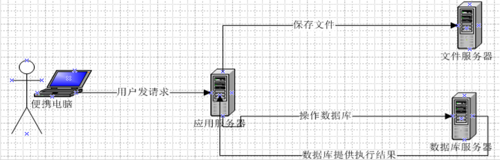
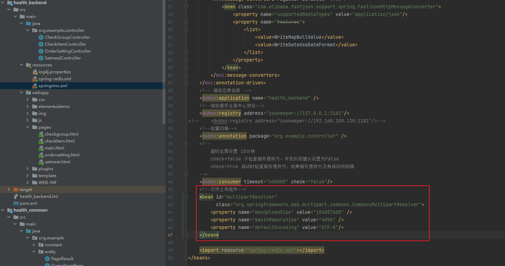

# 三、预约管理-套餐管理

## 1. 图片存储方案

### 1.1 介绍

在实际开发中，我们会有很多处理不同功能的服务器。例如：  

应用服务器：负责部署我们的应用  

数据库服务器：运行我们的数据库  

文件服务器：负责存储用户上传文件的服务器



分服务器处理的目的是让服务器各司其职，从而提高我们项目的运行效率。 

常见图片存储方案：

方案一：使用nginx搭建图片服务器

方案二：使用开源的分布式文件存储系统，例如Fastdfs，HDFS等

方案三：使用云存储，例如阿里云、七牛云

### 1.2 七牛云存储

七牛云（隶属于上海七牛信息技术有限公司）是国内领先的以视觉智能和数据智能为核心的企业级云计算服务商，同时也是国内知名智能视频云服务商，累计为 70 多万家企业提供服务，覆盖了国内80%网民。围绕富媒体场景推出了对象存储、融合 CDN 加速、容器云、大数据平台、深度学习平台等产品、并提供一站式智能视频云解决方案。为各行业及应用提供可持续发展的智能视频云生态，帮助企业快速上云，创造更广阔的商业价值。

官网：https://www.qiniu.com/

通过七牛云官网介绍我们可以知道其提供了多种服务，我们主要使用的是七牛云提供的对象存储服务来存储图片。

#### 1.2.1 注册、登录

要使用七牛云的服务，首先需要注册成为会员。地址：https://portal.qiniu.com/signup


注册完成后就可以使用刚刚注册的邮箱和密码登录到七牛云：


登录成功后点击页面右上角管理控制台：


注意：登录成功后还需要进行实名认证才能进行相关操作。

#### 1.2.2 新建存储空间

要进行图片存储，我们需要在七牛云管理控制台新建存储空间。点击管理控制台首页对象存储下的立即添加按钮，页面跳转到新建存储空间页面：


可以创建多个存储空间，各个存储空间是相互独立的。

#### 1.2.3 查看存储空间信息

存储空间创建后，会在左侧的存储空间列表菜单中展示创建的存储空间名称，点击存储空间名称可以查看当前存储空间的相关信息

#### 1.2.4 开发者中心

可以通过七牛云提供的开发者中心学习如何操作七牛云服务，地址：https://developer.qiniu.com/


点击对象存储，跳转到对象存储开发页面，地址：https://developer.qiniu.com/kodo


七牛云提供了多种方式操作对象存储服务，本项目采用Java SDK方式，地址：https://developer.qiniu.com/kodo/sdk/1239/java


使用Java SDK操作七牛云需要导入如下maven坐标：

~~~xml
<dependency>
  <groupId>com.qiniu</groupId>
  <artifactId>qiniu-java-sdk</artifactId>
  <version>7.2.0</version>
</dependency>
~~~

#### 1.2.5 鉴权

Java SDK的所有的功能，都需要合法的授权。授权凭证的签算需要七牛账号下的一对有效的Access Key和Secret Key，这对密钥可以在七牛云管理控制台的个人中心（https://portal.qiniu.com/user/key）获得，如下图：


#### 1.2.6 Java SDK操作七牛云

本章节我们就需要使用七牛云提供的Java SDK完成图片上传和删除，我们可以参考官方提供的例子。

~~~java
//构造一个带指定Zone对象的配置类
Configuration cfg = new Configuration(Zone.zone0());
//...其他参数参考类注释
UploadManager uploadManager = new UploadManager(cfg);
//...生成上传凭证，然后准备上传
String accessKey = "your access key";
String secretKey = "your secret key";
String bucket = "your bucket name";
//如果是Windows情况下，格式是 D:\\qiniu\\test.png
String localFilePath = "/home/qiniu/test.png";
//默认不指定key的情况下，以文件内容的hash值作为文件名
String key = null;
Auth auth = Auth.create(accessKey, secretKey);
String upToken = auth.uploadToken(bucket);
try {
    Response response = uploadManager.put(localFilePath, key, upToken);
    //解析上传成功的结果
    DefaultPutRet putRet = new Gson().fromJson(response.bodyString(), DefaultPutRet.class);
    System.out.println(putRet.key);
    System.out.println(putRet.hash);
} catch (QiniuException ex) {
    Response r = ex.response;
    System.err.println(r.toString());
    try {
        System.err.println(r.bodyString());
    } catch (QiniuException ex2) {
        //ignore
    }
}
~~~

~~~java
//构造一个带指定Zone对象的配置类
Configuration cfg = new Configuration(Zone.zone0());
//...其他参数参考类注释

String accessKey = "your access key";
String secretKey = "your secret key";

String bucket = "your bucket name";
String key = "your file key";

Auth auth = Auth.create(accessKey, secretKey);
BucketManager bucketManager = new BucketManager(auth, cfg);
try {
    bucketManager.delete(bucket, key);
} catch (QiniuException ex) {
    //如果遇到异常，说明删除失败
    System.err.println(ex.code());
    System.err.println(ex.response.toString());
}
~~~

#### 1.2.7 封装工具类

为了方便操作七牛云存储服务，我们可以将官方提供的案例简单改造成一个工具类，在我们的项目中直接使用此工具类来操作就可以：

~~~java
package com.itheima.utils;

import com.google.gson.Gson;
import com.qiniu.common.QiniuException;
import com.qiniu.common.Zone;
import com.qiniu.http.Response;
import com.qiniu.storage.BucketManager;
import com.qiniu.storage.Configuration;
import com.qiniu.storage.UploadManager;
import com.qiniu.storage.model.DefaultPutRet;
import com.qiniu.util.Auth;
import java.io.File;
import java.io.FileInputStream;
import java.io.InputStream;

/**
 * 七牛云工具类
 */
public class QiniuUtils {
    public  static String accessKey = "dulF9Wze9bxujtuRvu3yyYb9JX1Sp23jzd3tO708";
    public  static String secretKey = "vZkhW7iot3uWwcWz9vXfbaP4JepdWADFDHVLMZOe";
    public  static String bucket = "qiniutest";

    public static void upload2Qiniu(String filePath,String fileName){
        //构造一个带指定Zone对象的配置类
        Configuration cfg = new Configuration(Zone.zone0());
        UploadManager uploadManager = new UploadManager(cfg);
        Auth auth = Auth.create(accessKey, secretKey);
        String upToken = auth.uploadToken(bucket);
        try {
            Response response = uploadManager.put(filePath, fileName, upToken);
            //解析上传成功的结果
            DefaultPutRet putRet = 
              new Gson().fromJson(response.bodyString(), DefaultPutRet.class);
        } catch (QiniuException ex) {
            Response r = ex.response;
            try {
                System.err.println(r.bodyString());
            } catch (QiniuException ex2) {
                //ignore
            }
        }
    }

    //上传文件
    public static void upload2Qiniu(byte[] bytes, String fileName){
        //构造一个带指定Zone对象的配置类
        Configuration cfg = new Configuration(Zone.zone0());
        //...其他参数参考类注释
        UploadManager uploadManager = new UploadManager(cfg);
        //默认不指定key的情况下，以文件内容的hash值作为文件名
        String key = fileName;
        Auth auth = Auth.create(accessKey, secretKey);
        String upToken = auth.uploadToken(bucket);
        try {
            Response response = uploadManager.put(bytes, key, upToken);
            //解析上传成功的结果
            DefaultPutRet putRet = 
              new Gson().fromJson(response.bodyString(), DefaultPutRet.class);
            System.out.println(putRet.key);
            System.out.println(putRet.hash);
        } catch (QiniuException ex) {
            Response r = ex.response;
            System.err.println(r.toString());
            try {
                System.err.println(r.bodyString());
            } catch (QiniuException ex2) {
                //ignore
            }
        }
    }

    //删除文件
    public static void deleteFileFromQiniu(String fileName){
        //构造一个带指定Zone对象的配置类
        Configuration cfg = new Configuration(Zone.zone0());
        String key = fileName;
        Auth auth = Auth.create(accessKey, secretKey);
        BucketManager bucketManager = new BucketManager(auth, cfg);
        try {
            bucketManager.delete(bucket, key);
        } catch (QiniuException ex) {
            //如果遇到异常，说明删除失败
            System.err.println(ex.code());
            System.err.println(ex.response.toString());
        }
    }
}

~~~

将此工具类放在health_common工程中，后续会使用到。


## 2. 新增套餐

### 2.1 需求分析

套餐其实就是检查组的集合，例如有一个套餐为“入职体检套餐”，这个体检套餐可以包括多个检查组：一般检查、血常规、尿常规、肝功三项等。所以在添加套餐时需要选择这个套餐包括的检查组。

套餐对应的实体类为Setmeal，对应的数据表为t_setmeal。套餐和检查组为多对多关系，所以需要中间表t_setmeal_checkgroup进行关联。

### 2.2 完善页面

套餐管理页面对应的是setmeal.html页面，根据产品设计的原型已经完成了页面基本结构的编写，现在需要完善页面动态效果。

#### 2.2.1 弹出新增窗口

页面中已经提供了新增窗口，只是出于隐藏状态。只需要将控制展示状态的属性dialogFormVisible改为true接口显示出新增窗口。点击新建按钮时绑定的方法为handleCreate，所以在handleCreate方法中修改dialogFormVisible属性的值为true即可。同时为了增加用户体验度，需要每次点击新建按钮时清空表单输入项。

由于新增套餐时还需要选择此套餐包含的检查组，所以新增套餐窗口分为两部分信息：基本信息和检查组信息，如下图：


新建按钮绑定单击事件，对应的处理函数为handleCreate

```html
<el-button type="primary" class="butT" @click="handleCreate()">新建</el-button>
```

```javascript
// 重置表单
resetForm() {
  this.formData = {};
  this.activeName='first';
  this.checkgroupIds = [];
  this.imageUrl = null;
}
// 弹出添加窗口
handleCreate() {
  this.dialogFormVisible = true;
  this.resetForm();
}
```

#### 2.2.2 动态展示检查组列表

现在虽然已经完成了新增窗口的弹出，但是在检查组信息标签页中需要动态展示所有的检查组信息列表数据，并且可以进行勾选。具体操作步骤如下：

（1）定义模型数据

```javascript
tableData:[],//添加表单窗口中检查组列表数据
checkgroupIds:[],//添加表单窗口中检查组复选框对应id
```

（2）动态展示检查组列表数据，数据来源于上面定义的tableData模型数据

```html
<table class="datatable">
  <thead>
    <tr>
      <th>选择</th>
      <th>项目编码</th>
      <th>项目名称</th>
      <th>项目说明</th>
    </tr>
  </thead>
  <tbody>
    <tr v-for="c in tableData">
      <td>
        <input :id="c.id" v-model="checkgroupIds" type="checkbox" :value="c.id">
      </td>
      <td><label :for="c.id">{{c.code}}</label></td>
      <td><label :for="c.id">{{c.name}}</label></td>
      <td><label :for="c.id">{{c.remark}}</label></td>
    </tr>
  </tbody>
</table>
```

（3）完善handleCreate方法，发送ajax请求查询所有检查组数据并将结果赋值给tableData模型数据用于页面表格展示

```javascript
// 弹出添加窗口
handleCreate() {
  this.dialogFormVisible = true;
  this.resetForm();
  axios.get("/checkgroup/findAll.do").then((res)=> {
    if(res.data.flag){
      this.tableData = res.data.data;
    }else{
      this.$message.error(res.data.message);
    }
  });
}
```

（4）分别在CheckGroupController、CheckGroupService、CheckGroupServiceImpl、CheckGroupDao、CheckGroupDao.xml中扩展方法查询所有检查组数据

CheckGroupController：

```java
//查询所有
@RequestMapping("/findAll")
public Result findAll(){
  List<CheckGroup> checkGroupList = checkGroupService.findAll();
  if(checkGroupList != null && checkGroupList.size() > 0){
    Result result = new Result(true, MessageConstant.QUERY_CHECKGROUP_SUCCESS);
    result.setData(checkGroupList);
    return result;
  }
  return new Result(false,MessageConstant.QUERY_CHECKGROUP_FAIL);
}
```

CheckGroupService：

```java
List<CheckGroup> findAll();
```

CheckGroupServiceImpl：

```java
public List<CheckGroup> findAll() {
  return checkGroupDao.findAll();
}
```

CheckGroupDao：

```java
List<CheckGroup> findAll();
```

CheckGroupDao.xml：

```xml
<select id="findAll" resultType="com.itheima.pojo.CheckGroup">
  select * from t_checkgroup
</select>
```

#### 2.2.3 图片上传并预览

此处使用的是ElementUI提供的上传组件el-upload，提供了多种不同的上传效果，上传成功后可以进行预览。

实现步骤：

（1）定义模型数据，用于后面上传文件的图片预览：

```javascript
imageUrl:null,//模型数据，用于上传图片完成后图片预览
```

（2）定义上传组件：

```html
<!--
  el-upload：上传组件
  action：上传的提交地址
  auto-upload：选中文件后是否自动上传
  name：上传文件的名称，服务端可以根据名称获得上传的文件对象
  show-file-list：是否显示已上传文件列表
  on-success：文件上传成功时的钩子
  before-upload：上传文件之前的钩子
-->
<el-upload
           class="avatar-uploader"
           action="/setmeal/upload.do"
           :auto-upload="autoUpload"
           name="imgFile"
           :show-file-list="false"
           :on-success="handleAvatarSuccess"
           :before-upload="beforeAvatarUpload">
  <!--用于上传图片预览-->
  
  <!--用于展示上传图标-->
  <i v-else class="el-icon-plus avatar-uploader-icon"></i>
</el-upload>
```

（3）定义对应的钩子函数：

```javascript
//文件上传成功后的钩子，response为服务端返回的值，file为当前上传的文件封装成的js对象
handleAvatarSuccess(response, file) {
  this.imageUrl = "http://pqjroc654.bkt.clouddn.com/"+response.data;
  this.$message({
    message: response.message,
    type: response.flag ? 'success' : 'error'
  });
  //设置模型数据（图片名称），后续提交ajax请求时会提交到后台最终保存到数据库
  this.formData.img = response.data;
}

//上传文件之前的钩子
beforeAvatarUpload(file) {
  const isJPG = file.type === 'image/jpeg';
  const isLt2M = file.size / 1024 / 1024 < 2;
  if (!isJPG) {
    this.$message.error('上传套餐图片只能是 JPG 格式!');
  }
  if (!isLt2M) {
    this.$message.error('上传套餐图片大小不能超过 2MB!');
  }
  return isJPG && isLt2M;
}
```

（4）创建SetmealController，接收上传的文件

```java
package com.itheima.controller;

import com.alibaba.dubbo.config.annotation.Reference;
import com.itheima.constant.MessageConstant;
import com.itheima.entity.PageResult;
import com.itheima.entity.QueryPageBean;
import com.itheima.entity.Result;
import com.itheima.pojo.CheckGroup;
import com.itheima.pojo.Setmeal;
import com.itheima.service.CheckGroupService;
import com.itheima.service.SetmealService;
import com.itheima.utils.QiniuUtils;
import org.springframework.web.bind.annotation.RequestBody;
import org.springframework.web.bind.annotation.RequestMapping;
import org.springframework.web.bind.annotation.RequestParam;
import org.springframework.web.bind.annotation.RestController;
import org.springframework.web.multipart.MultipartFile;
import javax.servlet.ServletContext;
import javax.servlet.http.HttpServletRequest;
import java.io.File;
import java.util.List;
import java.util.UUID;
/**
 * 套餐管理
 */
@RestController
@RequestMapping("/setmeal")
public class SetmealController {
    @Reference
    private SetmealService setmealService;
  
  	//图片上传
    @RequestMapping("/upload")
    public Result upload(@RequestParam("imgFile")MultipartFile imgFile){
        try{
            //获取原始文件名
            String originalFilename = imgFile.getOriginalFilename();
            int lastIndexOf = originalFilename.lastIndexOf(".");
            //获取文件后缀
            String suffix = originalFilename.substring(lastIndexOf - 1);
            //使用UUID随机产生文件名称，防止同名文件覆盖
            String fileName = UUID.randomUUID().toString() + suffix;
            QiniuUtils.upload2Qiniu(imgFile.getBytes(),fileName);
            //图片上传成功
            Result result = new Result(true, MessageConstant.PIC_UPLOAD_SUCCESS);
            result.setData(fileName);
            return result;
        }catch (Exception e){
            e.printStackTrace();
            //图片上传失败
            return new Result(false,MessageConstant.PIC_UPLOAD_FAIL);
        }
    }
}
```

注意：别忘了在spring配置文件中配置文件上传组件



```xml
<!--文件上传组件-->
<bean id="multipartResolver" 
      class="org.springframework.web.multipart.commons.CommonsMultipartResolver">
  <property name="maxUploadSize" value="104857600" />
  <property name="maxInMemorySize" value="4096" />
  <property name="defaultEncoding" value="UTF-8"/>
</bean>
```

#### 2.2.4 提交请求

当用户点击新增窗口中的确定按钮时发送ajax请求将数据提交到后台进行数据库操作。提交到后台的数据分为两部分：套餐基本信息（对应的模型数据为formData）和检查组id数组（对应的模型数据为checkgroupIds）。

为确定按钮绑定单击事件，对应的处理函数为handleAdd

```html
<el-button type="primary" @click="handleAdd()">确定</el-button>
```

完善handleAdd方法

```javascript
//添加
handleAdd () {
  axios.post("/setmeal/add.do?checkgroupIds=" + this.checkgroupIds,this.formData).
  then((response)=> {
    this.dialogFormVisible = false;
    if(response.data.flag){
      this.$message({
        message: response.data.message,
        type: 'success'
      });
    }else{
      this.$message.error(response.data.message);
    }
  }).finally(()=> {
    this.findPage();
  });
}
```

### 2.3 后台代码

#### 2.3.1 Controller

在SetmealController中增加方法

```java
//新增
@RequestMapping("/add")
public Result add(@RequestBody Setmeal setmeal, Integer[] checkgroupIds){
  try {
    setmealService.add(setmeal,checkgroupIds);
  }catch (Exception e){
    //新增套餐失败
    return new Result(false,MessageConstant.ADD_SETMEAL_FAIL);
  }
  //新增套餐成功
  return new Result(true,MessageConstant.ADD_SETMEAL_SUCCESS);
}
```

#### 2.3.2 服务接口

创建SetmealService接口并提供新增方法

```java
package com.itheima.service;

import com.itheima.entity.PageResult;
import com.itheima.pojo.CheckGroup;
import com.itheima.pojo.Setmeal;
import java.util.List;
/**
 * 体检套餐服务接口
 */
public interface SetmealService {
    public void add(Setmeal setmeal, Integer[] checkgroupIds);
}
```

#### 2.3.3 服务实现类

创建SetmealServiceImpl服务实现类并实现新增方法

```java
package com.itheima.service;

import com.alibaba.dubbo.config.annotation.Service;
import com.github.pagehelper.Page;
import com.github.pagehelper.PageHelper;
import com.itheima.dao.SetmealDao;
import com.itheima.entity.PageResult;
import com.itheima.pojo.Setmeal;
import org.springframework.beans.factory.annotation.Autowired;
import org.springframework.transaction.annotation.Transactional;
import java.util.HashMap;
import java.util.List;
import java.util.Map;
/**
 * 体检套餐服务实现类
 */
@Service(interfaceClass = SetmealService.class)
@Transactional
public class SetmealServiceImpl implements SetmealService {
    @Autowired
    private SetmealDao setmealDao;

    //新增套餐
    public void add(Setmeal setmeal, Integer[] checkgroupIds) {
        setmealDao.add(setmeal);
        if(checkgroupIds != null && checkgroupIds.length > 0){
            //绑定套餐和检查组的多对多关系
            setSetmealAndCheckGroup(setmeal.getId(),checkgroupIds);
        }
    }
    //绑定套餐和检查组的多对多关系
    private void setSetmealAndCheckGroup(Integer id, Integer[] checkgroupIds) {
        for (Integer checkgroupId : checkgroupIds) {
            Map<String,Integer> map = new HashMap<>();
            map.put("setmeal_id",id);
            map.put("checkgroup_id",checkgroupId);
            setmealDao.setSetmealAndCheckGroup(map);
        }
    }
}
```

#### 2.3.4 Dao接口

创建SetmealDao接口并提供相关方法

```java
package com.itheima.dao;

import com.itheima.pojo.Setmeal;
import java.util.Map;

public interface SetmealDao {
    public void add(Setmeal setmeal);
    public void setSetmealAndCheckGroup(Map<String, Integer> map);
}
```

#### 2.3.5 Mapper映射文件

创建SetmealDao.xml文件并定义相关SQL语句

```xml
<?xml version="1.0" encoding="UTF-8" ?>
<!DOCTYPE mapper PUBLIC "-//mybatis.org//DTD Mapper 3.0//EN"
        "http://mybatis.org/dtd/mybatis-3-mapper.dtd" >
<mapper namespace="com.itheima.dao.SetmealDao" >
    <!--新增-->
    <insert id="add" parameterType="com.itheima.pojo.Setmeal">
        <selectKey resultType="java.lang.Integer" order="AFTER" keyProperty="id">
            SELECT LAST_INSERT_ID()
        </selectKey>
        insert into t_setmeal
      		(code,name,sex,age,helpCode,price,remark,attention,img)
        		values 
      		(#{code},#{name},#{sex},#{age},#{helpCode},#{price},#{remark},#{attention},#{img})
    </insert>
    <!--绑定套餐和检查组多对多关系-->
    <insert id="setSetmealAndCheckGroup" parameterType="hashmap">
        insert into t_setmeal_checkgroup
      		(setmeal_id,checkgroup_id) 
      			values
      		(#{setmeal_id},#{checkgroup_id})
    </insert>
</mapper>
```

### 2.4 完善文件上传

前面我们已经完成了文件上传，将图片存储在了七牛云服务器中。但是这个过程存在一个问题，就是如果用户只上传了图片而没有最终保存套餐信息到我们的数据库，这时我们上传的图片就变为了垃圾图片。对于这些垃圾图片我们需要定时清理来释放磁盘空间。这就需要我们能够区分出来哪些是垃圾图片，哪些不是垃圾图片。如何实现呢？

**方案就是利用redis来保存图片名称，具体做法为：**

**1、当用户上传图片后，将图片名称保存到redis的一个Set集合中，例如集合名称为setmealPicResources**

**2、当用户添加套餐后，将图片名称保存到redis的另一个Set集合中，例如集合名称为setmealPicDbResources**

**3、计算setmealPicResources集合与setmealPicDbResources集合的差值，结果就是垃圾图片的名称集合，清理这些图片即可**

本小节我们先来完成前面2个环节，第3个环节（清理图片环节）在后面会通过定时任务再实现。

实现步骤：

（1）在health_backend项目中提供Spring配置文件spring-redis.xml

~~~xml
<?xml version="1.0" encoding="UTF-8"?>
<beans xmlns="http://www.springframework.org/schema/beans"
	xmlns:xsi="http://www.w3.org/2001/XMLSchema-instance" 
	xmlns:p="http://www.springframework.org/schema/p"
	xmlns:context="http://www.springframework.org/schema/context"
	xmlns:dubbo="http://code.alibabatech.com/schema/dubbo" 
	xmlns:mvc="http://www.springframework.org/schema/mvc"
	xsi:schemaLocation="http://www.springframework.org/schema/beans 
                         http://www.springframework.org/schema/beans/spring-beans.xsd
        				http://www.springframework.org/schema/mvc 
                         http://www.springframework.org/schema/mvc/spring-mvc.xsd
        				http://code.alibabatech.com/schema/dubbo 
                         http://code.alibabatech.com/schema/dubbo/dubbo.xsd
        				http://www.springframework.org/schema/context 
                         http://www.springframework.org/schema/context/spring-context.xsd">

	<!--Jedis连接池的相关配置-->
	<bean id="jedisPoolConfig" class="redis.clients.jedis.JedisPoolConfig">
		<property name="maxTotal">
			<value>200</value>
		</property>
		<property name="maxIdle">
			<value>50</value>
		</property>
		<property name="testOnBorrow" value="true"/>
		<property name="testOnReturn" value="true"/>
	</bean>
	<bean id="jedisPool" class="redis.clients.jedis.JedisPool">
		<constructor-arg name="poolConfig" ref="jedisPoolConfig" />
		<constructor-arg name="host" value="127.0.0.1" />
		<constructor-arg name="port" value="6379" type="int" />
		<constructor-arg name="timeout" value="30000" type="int" />
	</bean>
</beans>
~~~

（2）在health_common工程中提供Redis常量类

~~~java
package com.itheima.constant;

public class RedisConstant {
    //套餐图片所有图片名称
    public static final String SETMEAL_PIC_RESOURCES = "setmealPicResources";
    //套餐图片保存在数据库中的图片名称
    public static final String SETMEAL_PIC_DB_RESOURCES = "setmealPicDbResources";
}
~~~

（3）完善SetmealController，在文件上传成功后将图片名称保存到redis集合中

~~~java
@Autowired
private JedisPool jedisPool;
//图片上传
@RequestMapping("/upload")
public Result upload(@RequestParam("imgFile")MultipartFile imgFile){
  try{
    //获取原始文件名
    String originalFilename = imgFile.getOriginalFilename();
    int lastIndexOf = originalFilename.lastIndexOf(".");
    //获取文件后缀
    String suffix = originalFilename.substring(lastIndexOf - 1);
    //使用UUID随机产生文件名称，防止同名文件覆盖
    String fileName = UUID.randomUUID().toString() + suffix;
    QiniuUtils.upload2Qiniu(imgFile.getBytes(),fileName);
    //图片上传成功
    Result result = new Result(true, MessageConstant.PIC_UPLOAD_SUCCESS);
    result.setData(fileName);
    //将上传图片名称存入Redis，基于Redis的Set集合存储
    jedisPool.getResource().sadd(RedisConstant.SETMEAL_PIC_RESOURCES,fileName);
    return result;
  }catch (Exception e){
    e.printStackTrace();
    //图片上传失败
    return new Result(false,MessageConstant.PIC_UPLOAD_FAIL);
  }
}
~~~

（4）在health_service_provider项目中提供Spring配置文件applicationContext-redis.xml

~~~xml
<?xml version="1.0" encoding="UTF-8"?>
<beans xmlns="http://www.springframework.org/schema/beans"
	xmlns:xsi="http://www.w3.org/2001/XMLSchema-instance" 
	xmlns:p="http://www.springframework.org/schema/p"
	xmlns:context="http://www.springframework.org/schema/context"
	xmlns:dubbo="http://code.alibabatech.com/schema/dubbo" 
	xmlns:mvc="http://www.springframework.org/schema/mvc"
	xsi:schemaLocation="http://www.springframework.org/schema/beans 
                         http://www.springframework.org/schema/beans/spring-beans.xsd
        				http://www.springframework.org/schema/mvc 
                         http://www.springframework.org/schema/mvc/spring-mvc.xsd
        				http://code.alibabatech.com/schema/dubbo 
                         http://code.alibabatech.com/schema/dubbo/dubbo.xsd
        				http://www.springframework.org/schema/context 
                         http://www.springframework.org/schema/context/spring-context.xsd">

	<!--Jedis连接池的相关配置-->
	<bean id="jedisPoolConfig" class="redis.clients.jedis.JedisPoolConfig">
		<property name="maxTotal">
			<value>200</value>
		</property>
		<property name="maxIdle">
			<value>50</value>
		</property>
		<property name="testOnBorrow" value="true"/>
		<property name="testOnReturn" value="true"/>
	</bean>
	<bean id="jedisPool" class="redis.clients.jedis.JedisPool">
		<constructor-arg name="poolConfig" ref="jedisPoolConfig" />
		<constructor-arg name="host" value="127.0.0.1" />
		<constructor-arg name="port" value="6379" type="int" />
		<constructor-arg name="timeout" value="30000" type="int" />
	</bean>
</beans>
~~~

（5）完善SetmealServiceImpl服务类，在保存完成套餐信息后将图片名称存储到redis集合中

~~~java
@Autowired
private JedisPool jedisPool;
//新增套餐
public void add(Setmeal setmeal, Integer[] checkgroupIds) {
  setmealDao.add(setmeal);
  if(checkgroupIds != null && checkgroupIds.length > 0){
    setSetmealAndCheckGroup(setmeal.getId(),checkgroupIds);
  }
  //将图片名称保存到Redis
  savePic2Redis(setmeal.getImg());
}
//将图片名称保存到Redis
private void savePic2Redis(String pic){
  jedisPool.getResource().sadd(RedisConstant.SETMEAL_PIC_DB_RESOURCES,pic);
}
~~~


## 3. 体检套餐分页

### 3.1 完善页面

#### 3.1.1 定义分页相关模型数据

```javascript
pagination: {//分页相关模型数据
  currentPage: 1,//当前页码
  pageSize:10,//每页显示的记录数
  total:0,//总记录数
  queryString:null//查询条件
},
dataList: [],//当前页要展示的分页列表数据
```

#### 3.1.2 定义分页方法

在页面中提供了findPage方法用于分页查询，为了能够在setmeal.html页面加载后直接可以展示分页数据，可以在VUE提供的钩子函数created中调用findPage方法

```javascript
//钩子函数，VUE对象初始化完成后自动执行
created() {
  this.findPage();
}
```

```javascript
//分页查询
findPage() {
  //分页参数
  var param = {
    currentPage:this.pagination.currentPage,//页码
    pageSize:this.pagination.pageSize,//每页显示的记录数
    queryString:this.pagination.queryString//查询条件
  };
  //请求后台
  axios.post("/setmeal/findPage.do",param).then((response)=> {
    //为模型数据赋值，基于VUE的双向绑定展示到页面
    this.dataList = response.data.rows;
    this.pagination.total = response.data.total;
  });
}
```

#### 3.1.3 完善分页方法执行时机

除了在created钩子函数中调用findPage方法查询分页数据之外，当用户点击查询按钮或者点击分页条中的页码时也需要调用findPage方法重新发起查询请求。

为查询按钮绑定单击事件，调用findPage方法

```html
<el-button @click="findPage()" class="dalfBut">查询</el-button>
```

为分页条组件绑定current-change事件，此事件是分页条组件自己定义的事件，当页码改变时触发，对应的处理函数为handleCurrentChange

```html
<el-pagination
               class="pagiantion"
               @current-change="handleCurrentChange"
               :current-page="pagination.currentPage"
               :page-size="pagination.pageSize"
               layout="total, prev, pager, next, jumper"
               :total="pagination.total">
</el-pagination>
```

定义handleCurrentChange方法

```javascript
//切换页码
handleCurrentChange(currentPage) {
  //currentPage为切换后的页码
  this.pagination.currentPage = currentPage;
  this.findPage();
}
```

### 3.2 后台代码

#### 3.2.1 Controller

在SetmealController中增加分页查询方法

```java
//分页查询
@RequestMapping("/findPage")
public PageResult findPage(@RequestBody QueryPageBean queryPageBean){
  PageResult pageResult = setmealService.pageQuery(
    queryPageBean.getCurrentPage(), 
    queryPageBean.getPageSize(), 
    queryPageBean.getQueryString()
  );
  return pageResult;
}
```

#### 3.2.2 服务接口

在SetmealService服务接口中扩展分页查询方法

```java
public PageResult pageQuery(Integer currentPage, Integer pageSize, String queryString);
```

#### 3.2.3 服务实现类

在SetmealServiceImpl服务实现类中实现分页查询方法，基于Mybatis分页助手插件实现分页

```java
public PageResult pageQuery(Integer currentPage, Integer pageSize, String queryString) {
  PageHelper.startPage(currentPage,pageSize);
  Page<CheckItem> page = checkGroupDao.selectByCondition(queryString);
  return new PageResult(page.getTotal(),page.getResult());
}
```

#### 3.2.4 Dao接口

在SetmealDao接口中扩展分页查询方法

```java
public Page<Setmeal> selectByCondition(String queryString);
```

#### 3.2.5 Mapper映射文件

在SetmealDao.xml文件中增加SQL定义

```xml
<!--根据条件查询-->
<select id="selectByCondition" parameterType="string" resultType="com.itheima.pojo.Setmeal">
  select * from t_setmeal
  <if test="value != null and value.length > 0">
    where code = #{value} or name = #{value} or helpCode = #{value}
  </if>
</select>
```

## 4. 定时任务组件Quartz

### 4.1 Quartz介绍

Quartz是Job scheduling（作业调度）领域的一个开源项目，Quartz既可以单独使用也可以跟spring框架整合使用，在实际开发中一般会使用后者。使用Quartz可以开发一个或者多个定时任务，每个定时任务可以单独指定执行的时间，例如每隔1小时执行一次、每个月第一天上午10点执行一次、每个月最后一天下午5点执行一次等。

官网：http://www.quartz-scheduler.org/

maven坐标：

~~~xml
<dependency>
  <groupId>org.quartz-scheduler</groupId>
  <artifactId>quartz</artifactId>
  <version>2.2.1</version>
</dependency>
<dependency>
  <groupId>org.quartz-scheduler</groupId>
  <artifactId>quartz-jobs</artifactId>
  <version>2.2.1</version>
</dependency>
~~~

### 4.2 Quartz入门案例

本案例基于Quartz和spring整合的方式使用。具体步骤：

（1）创建maven工程quartzdemo，导入Quartz和spring相关坐标，pom.xml文件如下

~~~xml
<?xml version="1.0" encoding="UTF-8"?>
<project xmlns="http://maven.apache.org/POM/4.0.0"
         xmlns:xsi="http://www.w3.org/2001/XMLSchema-instance"
         xsi:schemaLocation="http://maven.apache.org/POM/4.0.0 http://maven.apache.org/xsd/maven-4.0.0.xsd">
    <modelVersion>4.0.0</modelVersion>
    <groupId>com.itheima</groupId>
    <artifactId>quartdemo</artifactId>
    <version>1.0-SNAPSHOT</version>
    <dependencies>
        <dependency>
            <groupId>org.springframework</groupId>
            <artifactId>spring-context-support</artifactId>
            <version>5.0.2.RELEASE</version>
        </dependency>
        <dependency>
            <groupId>org.springframework</groupId>
            <artifactId>spring-tx</artifactId>
            <version>5.0.2.RELEASE</version>
        </dependency>
        <dependency>
            <groupId>org.quartz-scheduler</groupId>
            <artifactId>quartz</artifactId>
            <version>2.2.1</version>
        </dependency>
        <dependency>
            <groupId>org.quartz-scheduler</groupId>
            <artifactId>quartz-jobs</artifactId>
            <version>2.2.1</version>
        </dependency>
    </dependencies>
</project>
~~~

（2）自定义一个Job

~~~java
package com.itheima.jobs;
/**
 * 自定义Job
 */
public class JobDemo {
    public void run(){
        System.out.println("job execute...");
    }
}
~~~

（3）提供Spring配置文件spring-jobs.xml，配置自定义Job、任务描述、触发器、调度工厂等

~~~xml
<?xml version="1.0" encoding="UTF-8"?>
<beans xmlns="http://www.springframework.org/schema/beans"
       xmlns:xsi="http://www.w3.org/2001/XMLSchema-instance"
       xmlns:context="http://www.springframework.org/schema/context"
       xmlns:dubbo="http://code.alibabatech.com/schema/dubbo"
       xmlns:mvc="http://www.springframework.org/schema/mvc"
       xsi:schemaLocation="http://www.springframework.org/schema/beans
						http://www.springframework.org/schema/beans/spring-beans.xsd
						http://www.springframework.org/schema/mvc
						http://www.springframework.org/schema/mvc/spring-mvc.xsd
						http://code.alibabatech.com/schema/dubbo
						http://code.alibabatech.com/schema/dubbo/dubbo.xsd
						http://www.springframework.org/schema/context
						http://www.springframework.org/schema/context/spring-context.xsd">
	<!-- 注册自定义Job -->
    <bean id="jobDemo" class="com.itheima.jobs.JobDemo"></bean>
	<!-- 注册JobDetail,作用是负责通过反射调用指定的Job -->
    <bean id="jobDetail" 
          class="org.springframework.scheduling.quartz.MethodInvokingJobDetailFactoryBean">
        <!-- 注入目标对象 -->
        <property name="targetObject" ref="jobDemo"/>
        <!-- 注入目标方法 -->
        <property name="targetMethod" value="run"/>
    </bean>
    <!-- 注册一个触发器，指定任务触发的时间 -->
    <bean id="myTrigger" class="org.springframework.scheduling.quartz.CronTriggerFactoryBean">
        <!-- 注入JobDetail -->
        <property name="jobDetail" ref="jobDetail"/>
        <!-- 指定触发的时间，基于Cron表达式 -->
        <property name="cronExpression">
            <value>0/10 * * * * ?</value>
        </property>
    </bean>
    <!-- 注册一个统一的调度工厂，通过这个调度工厂调度任务 -->
    <bean id="scheduler" class="org.springframework.scheduling.quartz.SchedulerFactoryBean">
        <!-- 注入多个触发器 -->
        <property name="triggers">
            <list>
                <ref bean="myTrigger"/>
            </list>
        </property>
    </bean>
</beans>
~~~

（4）编写main方法进行测试

~~~java
package com.itheima.jobs.com.itheima.app;

import org.springframework.context.support.ClassPathXmlApplicationContext;

public class App {
    public static void main(String[] args) {
        new ClassPathXmlApplicationContext("spring-jobs.xml");
    }
}
~~~

执行上面main方法观察控制台，可以发现每隔10秒会输出一次，说明每隔10秒自定义Job被调用一次。

### 4.3 cron表达式

上面的入门案例中我们指定了一个表达式：0/10 * * * * ?

这种表达式称为cron表达式，通过cron表达式可以灵活的定义出符合要求的程序执行的时间。本小节我们就来学习一下cron表达式的使用方法。如下图：


cron表达式分为七个域，之间使用空格分隔。其中最后一个域（年）可以为空。每个域都有自己允许的值和一些特殊字符构成。使用这些特殊字符可以使我们定义的表达式更加灵活。

下面是对这些特殊字符的介绍：

逗号（,）：指定一个值列表，例如使用在月域上1,4,5,7表示1月、4月、5月和7月

横杠（-）：指定一个范围，例如在时域上3-6表示3点到6点（即3点、4点、5点、6点）

星号（*）：表示这个域上包含所有合法的值。例如，在月份域上使用星号意味着每个月都会触发

斜线（/）：表示递增，例如使用在秒域上0/15表示每15秒

问号（?）：只能用在日和周域上，但是不能在这两个域上同时使用。表示不指定

井号（#）：只能使用在周域上，用于指定月份中的第几周的哪一天，例如6#3，意思是某月的第三个周五 (6=星期五，3意味着月份中的第三周)

L：某域上允许的最后一个值。只能使用在日和周域上。当用在日域上，表示的是在月域上指定的月份的最后一天。用于周域上时，表示周的最后一天，就是星期六

W：W 字符代表着工作日 (星期一到星期五)，只能用在日域上，它用来指定离指定日的最近的一个工作日

### 4.4 cron表达式在线生成器

前面介绍了cron表达式，但是自己编写表达式还是有一些困难的，我们可以借助一些cron表达式在线生成器来根据我们的需求生成表达式即可。

http://cron.qqe2.com/


## 5. 定时清理垃圾图片

前面我们已经完成了体检套餐的管理，在新增套餐时套餐的基本信息和图片是分两次提交到后台进行操作的。也就是用户首先将图片上传到七牛云服务器，然后再提交新增窗口中录入的其他信息。如果用户只是上传了图片而没有提交录入的其他信息，此时的图片就变为了垃圾图片，因为在数据库中并没有记录它的存在。此时我们要如何处理这些垃圾图片呢？

解决方案就是通过定时任务组件定时清理这些垃圾图片。为了能够区分出来哪些图片是垃圾图片，我们在文件上传成功后将图片保存到了一个redis集合中，当套餐数据插入到数据库后我们又将图片名称保存到了另一个redis集合中，通过计算这两个集合的差值就可以获得所有垃圾图片的名称。

本章节我们就会基于Quartz定时任务，通过计算redis两个集合的差值找出所有的垃圾图片，就可以将垃圾图片清理掉。

操作步骤：

（1）创建maven工程health_jobs，打包方式为war，导入Quartz等相关坐标

~~~xml
<?xml version="1.0" encoding="UTF-8"?>
<project xmlns="http://maven.apache.org/POM/4.0.0" 
         xmlns:xsi="http://www.w3.org/2001/XMLSchema-instance"
         xsi:schemaLocation="http://maven.apache.org/POM/4.0.0 
                             http://maven.apache.org/xsd/maven-4.0.0.xsd">
    <parent>
        <artifactId>health_parent</artifactId>
        <groupId>com.itheima</groupId>
        <version>1.0-SNAPSHOT</version>
    </parent>
    <modelVersion>4.0.0</modelVersion>
    <artifactId>health_jobs</artifactId>
    <packaging>war</packaging>
    <name>health_jobs Maven Webapp</name>
    <url>http://www.example.com</url>
    <properties>
        <project.build.sourceEncoding>UTF-8</project.build.sourceEncoding>
        <maven.compiler.source>1.8</maven.compiler.source>
        <maven.compiler.target>1.8</maven.compiler.target>
    </properties>
    <dependencies>
        <dependency>
            <groupId>com.itheima</groupId>
            <artifactId>health_interface</artifactId>
            <version>1.0-SNAPSHOT</version>
        </dependency>
        <dependency>
            <groupId>org.quartz-scheduler</groupId>
            <artifactId>quartz</artifactId>
        </dependency>
        <dependency>
            <groupId>org.quartz-scheduler</groupId>
            <artifactId>quartz-jobs</artifactId>
        </dependency>
    </dependencies>
    <build>
        <plugins>
            <plugin>
                <groupId>org.apache.tomcat.maven</groupId>
                <artifactId>tomcat7-maven-plugin</artifactId>
                <configuration>
                    <!-- 指定端口 -->
                    <port>83</port>
                    <!-- 请求路径 -->
                    <path>/</path>
                </configuration>
            </plugin>
        </plugins>
    </build>
</project>
~~~

（2）配置web.xml

~~~xml
<!DOCTYPE web-app PUBLIC
 "-//Sun Microsystems, Inc.//DTD Web Application 2.3//EN"
 "http://java.sun.com/dtd/web-app_2_3.dtd" >
<web-app>
  <display-name>Archetype Created Web Application</display-name>
  <!-- 加载spring容器 -->
  <context-param>
    <param-name>contextConfigLocation</param-name>
    <param-value>classpath*:applicationContext*.xml</param-value>
  </context-param>
  <listener>
    <listener-class>org.springframework.web.context.ContextLoaderListener</listener-class>
  </listener>
</web-app>
~~~

（3）配置log4j.properties

~~~properties
### direct log messages to stdout ###
log4j.appender.stdout=org.apache.log4j.ConsoleAppender
log4j.appender.stdout.Target=System.err
log4j.appender.stdout.layout=org.apache.log4j.PatternLayout
log4j.appender.stdout.layout.ConversionPattern=%d{ABSOLUTE} %5p %c{1}:%L - %m%n

### direct messages to file mylog.log ###
log4j.appender.file=org.apache.log4j.FileAppender
log4j.appender.file.File=c:\\mylog.log
log4j.appender.file.layout=org.apache.log4j.PatternLayout
log4j.appender.file.layout.ConversionPattern=%d{ABSOLUTE} %5p %c{1}:%L - %m%n

### set log levels - for more verbose logging change 'info' to 'debug' ###

log4j.rootLogger=info, stdout
~~~

（4）配置applicationContext-redis.xml

~~~xml
<?xml version="1.0" encoding="UTF-8"?>
<beans xmlns="http://www.springframework.org/schema/beans"
	xmlns:xsi="http://www.w3.org/2001/XMLSchema-instance" 
	xmlns:p="http://www.springframework.org/schema/p"
	xmlns:context="http://www.springframework.org/schema/context"
	xmlns:dubbo="http://code.alibabatech.com/schema/dubbo" 
	xmlns:mvc="http://www.springframework.org/schema/mvc"
	xsi:schemaLocation="http://www.springframework.org/schema/beans 
                         http://www.springframework.org/schema/beans/spring-beans.xsd
        				http://www.springframework.org/schema/mvc 
                          http://www.springframework.org/schema/mvc/spring-mvc.xsd
        				http://code.alibabatech.com/schema/dubbo 
                          http://code.alibabatech.com/schema/dubbo/dubbo.xsd
        				http://www.springframework.org/schema/context
                          http://www.springframework.org/schema/context/spring-context.xsd">

	<!--Jedis连接池的相关配置-->
	<bean id="jedisPoolConfig" class="redis.clients.jedis.JedisPoolConfig">
		<property name="maxTotal">
			<value>200</value>
		</property>
		<property name="maxIdle">
			<value>50</value>
		</property>
		<property name="testOnBorrow" value="true"/>
		<property name="testOnReturn" value="true"/>
	</bean>
	<bean id="jedisPool" class="redis.clients.jedis.JedisPool">
		<constructor-arg name="poolConfig" ref="jedisPoolConfig" />
		<constructor-arg name="host" value="127.0.0.1" />
		<constructor-arg name="port" value="6379" type="int" />
		<constructor-arg name="timeout" value="30000" type="int" />
	</bean>
</beans>
~~~

（5）配置applicationContext-jobs.xml

~~~xml
<?xml version="1.0" encoding="UTF-8"?>
<beans xmlns="http://www.springframework.org/schema/beans"
	xmlns:xsi="http://www.w3.org/2001/XMLSchema-instance" 
	xmlns:context="http://www.springframework.org/schema/context"
	xmlns:dubbo="http://code.alibabatech.com/schema/dubbo" 
	xmlns:mvc="http://www.springframework.org/schema/mvc"
	xsi:schemaLocation="http://www.springframework.org/schema/beans
							http://www.springframework.org/schema/beans/spring-beans.xsd
							http://www.springframework.org/schema/mvc
							http://www.springframework.org/schema/mvc/spring-mvc.xsd
							http://code.alibabatech.com/schema/dubbo
							http://code.alibabatech.com/schema/dubbo/dubbo.xsd
							http://www.springframework.org/schema/context
							http://www.springframework.org/schema/context/spring-context.xsd">
	<context:annotation-config></context:annotation-config>
	<bean id="clearImgJob" class="com.itheima.jobs.ClearImgJob"></bean>
	<bean id="jobDetail" 
          class="org.springframework.scheduling.quartz.MethodInvokingJobDetailFactoryBean">
		<!-- 注入目标对象 -->
		<property name="targetObject" ref="clearImgJob"/>
		<!-- 注入目标方法 -->
		<property name="targetMethod" value="clearImg"/>
	</bean>
	<!-- 注册一个触发器，指定任务触发的时间 -->
	<bean id="myTrigger" class="org.springframework.scheduling.quartz.CronTriggerFactoryBean">
		<!-- 注入JobDetail -->
		<property name="jobDetail" ref="jobDetail"/>
		<!-- 指定触发的时间，基于Cron表达式 -->
		<property name="cronExpression">
			<value>0 0 2 * * ?</value>
		</property>
	</bean>
	<!-- 注册一个统一的调度工厂，通过这个调度工厂调度任务 -->
	<bean id="scheduler" class="org.springframework.scheduling.quartz.SchedulerFactoryBean">
		<!-- 注入多个触发器 -->
		<property name="triggers">
			<list>
				<ref bean="myTrigger"/>
			</list>
		</property>
	</bean>
</beans>
~~~

（6）创建ClearImgJob定时任务类

~~~java
package com.itheima.jobs;

import com.itheima.constant.RedisConstant;
import com.itheima.utils.QiniuUtils;
import org.springframework.beans.factory.annotation.Autowired;
import redis.clients.jedis.JedisPool;
import java.util.Set;

/**
 * 自定义Job，实现定时清理垃圾图片
 */
public class ClearImgJob {
    @Autowired
    private JedisPool jedisPool;
    public void clearImg(){
        //根据Redis中保存的两个set集合进行差值计算，获得垃圾图片名称集合
        Set<String> set = 
            jedisPool.getResource().sdiff(RedisConstant.SETMEAL_PIC_RESOURCES, 
                                          RedisConstant.SETMEAL_PIC_DB_RESOURCES);
        if(set != null){
            for (String picName : set) {
                //删除七牛云服务器上的图片
                QiniuUtils.deleteFileFromQiniu(picName);
                //从Redis集合中删除图片名称
                jedisPool.getResource().
                    srem(RedisConstant.SETMEAL_PIC_RESOURCES,picName);
            }
        }
    }
}
~~~


## 6. 完整代码

### 6.1 前端

```html
<!DOCTYPE html>
<html>
    <head>
        <!-- 页面meta -->
        <meta charset="utf-8">
        <meta http-equiv="X-UA-Compatible" content="IE=edge">
        <title>传智健康</title>
        <meta name="description" content="传智健康">
        <meta name="keywords" content="传智健康">
        <meta content="width=device-width,initial-scale=1,maximum-scale=1,user-scalable=no" name="viewport">
        <!-- 引入样式 -->
        <link rel="stylesheet" href="../plugins/elementui/index.css">
        <link rel="stylesheet" href="../plugins/font-awesome/css/font-awesome.min.css">
        <link rel="stylesheet" href="../css/style.css">
        <!-- 引入组件库 -->
        <script type="text/javascript" src="../js/jquery.min.js"></script>
        <script src="../js/vue.js"></script>
        <script src="../plugins/elementui/index.js"></script>
        <script src="../js/axios-0.18.0.js"></script>
        <style>
            .avatar-uploader .el-upload {
                border: 1px dashed #d9d9d9;
                border-radius: 6px;
                cursor: pointer;
                position: relative;
                overflow: hidden;
            }
            .avatar-uploader .el-upload:hover {
                border-color: #409EFF;
            }
            .avatar-uploader-icon {
                font-size: 28px;
                color: #8c939d;
                width: 178px;
                height: 178px;
                line-height: 178px;
                text-align: center;
            }
            .avatar {
                width: 178px;
                height: 178px;
                display: block;
            }
            .datatable {
                position: relative;
                box-sizing: border-box;
                -webkit-box-flex: 1;
                width: 100%;
                max-width: 100%;
                font-size: 14px;
                color: rgb(96, 98, 102);
                overflow: hidden;
                flex: 1 1 0%;
            }
            .datatable td, .datatable th {
                padding: 12px 0;
                min-width: 0;
                -webkit-box-sizing: border-box;
                box-sizing: border-box;
                text-overflow: ellipsis;
                vertical-align: middle;
                position: relative;
                text-align: left;
            }
        </style>
    </head>
    <body class="hold-transition">
        <div id="app">
            <div class="content-header">
                <h1>预约管理<small>套餐管理</small></h1>
                <el-breadcrumb separator-class="el-icon-arrow-right" class="breadcrumb">
                    <el-breadcrumb-item :to="{ path: '/' }">首页</el-breadcrumb-item>
                    <el-breadcrumb-item>预约管理</el-breadcrumb-item>
                    <el-breadcrumb-item>套餐管理</el-breadcrumb-item>
                </el-breadcrumb>
            </div>
            <div class="app-container">
                <div class="box">
                    <div class="filter-container">
                        <el-input placeholder="编码/名称/助记码" v-model="pagination.queryString" style="width: 200px;" class="filter-item" @keyup.enter.native="handleFilter"></el-input>
                        <el-button @click="findPage()" class="dalfBut">查询</el-button>
                        <el-button type="primary" class="butT" @click="handleCreate()">新建</el-button>
                    </div>
                    <el-table size="small" current-row-key="id" :data="dataList" stripe highlight-current-row>
                        <el-table-column type="index" align="center" label="序号"></el-table-column>
                        <el-table-column prop="code" label="套餐编码" align="center"></el-table-column>
                        <el-table-column prop="name" label="套餐名称" align="center"></el-table-column>
                        <el-table-column label="适用性别" align="center">
                            <template slot-scope="scope">
                                <span>{{ scope.row.sex == '0' ? '不限' : scope.row.sex == '1' ? '男' : '女'}}</span>
                            </template>
                        </el-table-column>
                        <el-table-column prop="age" label="适用年龄" align="center"></el-table-column>
                        <el-table-column prop="helpCode" label="助记码" align="center"></el-table-column>
                        <el-table-column prop="remark" label="说明" align="center"></el-table-column>
                        <el-table-column label="操作" align="center">
                            <template slot-scope="scope">
                                <el-button type="primary" size="mini" @click="handleUpdate(scope.row)">编辑</el-button>
                                <el-button size="mini" type="danger" @click="handleDelete(scope.row)">删除</el-button>
                            </template>
                        </el-table-column>
                    </el-table>
                    <div class="pagination-container">
                        <el-pagination
                            class="pagiantion"
                            @current-change="handleCurrentChange"
                            :current-page="pagination.currentPage"
                            :page-size="pagination.pageSize"
                            layout="total, prev, pager, next, jumper"
                            :total="pagination.total">
                        </el-pagination>
                    </div>
                    <!-- 新增标签弹层 -->
                    <div class="add-form">
                        <el-dialog title="新增套餐" :visible.sync="dialogFormVisible">
                            <template>
                                <el-tabs v-model="activeName" type="card">
                                    <el-tab-pane label="基本信息" name="first">
                                        <el-form label-position="right" label-width="100px">
                                            <el-row>
                                                <el-col :span="12">
                                                    <el-form-item label="编码">
                                                        <el-input v-model="formData.code"/>
                                                    </el-form-item>
                                                </el-col>
                                                <el-col :span="12">
                                                    <el-form-item label="名称">
                                                        <el-input v-model="formData.name"/>
                                                    </el-form-item>
                                                </el-col>
                                            </el-row>
                                            <el-row>
                                                <el-col :span="12">
                                                    <el-form-item label="适用性别">
                                                        <el-select v-model="formData.sex">
                                                            <el-option label="不限" value="0"></el-option>
                                                            <el-option label="男" value="1"></el-option>
                                                            <el-option label="女" value="2"></el-option>
                                                        </el-select>
                                                    </el-form-item>
                                                </el-col>
                                                <el-col :span="12">
                                                    <el-form-item label="助记码">
                                                        <el-input v-model="formData.helpCode"/>
                                                    </el-form-item>
                                                </el-col>
                                            </el-row>
                                            <el-row>
                                                <el-col :span="12">
                                                    <el-form-item label="套餐价格">
                                                        <el-input v-model="formData.price"/>
                                                    </el-form-item>
                                                </el-col>
                                                <el-col :span="12">
                                                    <el-form-item label="适用年龄">
                                                        <el-input v-model="formData.age"/>
                                                    </el-form-item>
                                                </el-col>
                                            </el-row>
                                            <el-row>
                                                <el-col :span="24">
                                                    <el-form-item label="上传图片">
                                                        <!--在这里发送一个图片上传请求到SetmealController-->
                                                        <el-upload
                                                                class="avatar-uploader"
                                                                action="/setmeal/upload.do"
                                                                :auto-upload="autoUpload"
                                                                name="imgFile"
                                                                :show-file-list="false"
                                                                :on-success="handleAvatarSuccess"
                                                                :before-upload="beforeAvatarUpload">
                                                            
                                                            <i v-else class="el-icon-plus avatar-uploader-icon"></i>
                                                        </el-upload>
                                                    </el-form-item>
                                                </el-col>
                                            </el-row>
                                            <el-row>
                                                <el-col :span="24">
                                                    <el-form-item label="说明">
                                                        <el-input v-model="formData.remark" type="textarea"></el-input>
                                                    </el-form-item>
                                                </el-col>
                                            </el-row>
                                            <el-row>
                                                <el-col :span="24">
                                                    <el-form-item label="注意事项">
                                                        <el-input v-model="formData.attention" type="textarea"></el-input>
                                                    </el-form-item>
                                                </el-col>
                                            </el-row>
                                        </el-form>
                                    </el-tab-pane>
                                    <el-tab-pane label="检查组信息" name="second">
										<div class="checkScrol">
											<table class="datatable">
												<thead>
												<tr>
													<th>选择</th>
													<th>项目编码</th>
													<th>项目名称</th>
													<th>项目说明</th>
												</tr>
												</thead>
												<tbody>
												<tr v-for="c in tableData">
													<td>
														<input :id="c.id" v-model="checkgroupIds" type="checkbox" :value="c.id">
													</td>
													<td><label :for="c.id">{{c.code}}</label></td>
													<td><label :for="c.id">{{c.name}}</label></td>
													<td><label :for="c.id">{{c.remark}}</label></td>
												</tr>
												</tbody>
											</table>
										</div>
                                    </el-tab-pane>
                                </el-tabs>
                            </template>
                            <div slot="footer" class="dialog-footer">
                                <el-button @click="dialogFormVisible = false">取消</el-button>
                                <el-button type="primary" @click="handleAdd()">确定</el-button>
                            </div>
                        </el-dialog>
                    </div>

                    <!-- 编辑标签弹层 -->
                    <div class="add-form">
                        <el-dialog title="新增套餐" :visible.sync="dialogFormVisible4Edit">
                            <template>
                                <el-tabs v-model="activeName" type="card">
                                    <el-tab-pane label="基本信息" name="first">
                                        <el-form label-position="right" label-width="100px">
                                            <el-row>
                                                <el-col :span="12">
                                                    <el-form-item label="编码">
                                                        <el-input v-model="formData.code"/>
                                                    </el-form-item>
                                                </el-col>
                                                <el-col :span="12">
                                                    <el-form-item label="名称">
                                                        <el-input v-model="formData.name"/>
                                                    </el-form-item>
                                                </el-col>
                                            </el-row>
                                            <el-row>
                                                <el-col :span="12">
                                                    <el-form-item label="适用性别">
                                                        <el-select v-model="formData.sex">
                                                            <el-option label="不限" value="0"></el-option>
                                                            <el-option label="男" value="1"></el-option>
                                                            <el-option label="女" value="2"></el-option>
                                                        </el-select>
                                                    </el-form-item>
                                                </el-col>
                                                <el-col :span="12">
                                                    <el-form-item label="助记码">
                                                        <el-input v-model="formData.helpCode"/>
                                                    </el-form-item>
                                                </el-col>
                                            </el-row>
                                            <el-row>
                                                <el-col :span="12">
                                                    <el-form-item label="套餐价格">
                                                        <el-input v-model="formData.price"/>
                                                    </el-form-item>
                                                </el-col>
                                                <el-col :span="12">
                                                    <el-form-item label="适用年龄">
                                                        <el-input v-model="formData.age"/>
                                                    </el-form-item>
                                                </el-col>
                                            </el-row>
                                            <el-row>
                                                <el-col :span="24">
                                                    <el-form-item label="上传图片">
                                                        <!--在这里发送一个图片上传请求到SetmealController-->
                                                        <el-upload
                                                                class="avatar-uploader"
                                                                action="/setmeal/upload.do"
                                                                :auto-upload="autoUpload"
                                                                name="imgFile"
                                                                :show-file-list="false"
                                                                :on-success="handleAvatarSuccess"
                                                                :before-upload="beforeAvatarUpload">
                                                            
                                                            <i v-else class="el-icon-plus avatar-uploader-icon"></i>
                                                        </el-upload>
                                                    </el-form-item>
                                                </el-col>
                                            </el-row>
                                            <el-row>
                                                <el-col :span="24">
                                                    <el-form-item label="说明">
                                                        <el-input v-model="formData.remark" type="textarea"></el-input>
                                                    </el-form-item>
                                                </el-col>
                                            </el-row>
                                            <el-row>
                                                <el-col :span="24">
                                                    <el-form-item label="注意事项">
                                                        <el-input v-model="formData.attention" type="textarea"></el-input>
                                                    </el-form-item>
                                                </el-col>
                                            </el-row>
                                        </el-form>
                                    </el-tab-pane>
                                    <el-tab-pane label="检查组信息" name="second">
                                        <div class="checkScrol">
                                            <table class="datatable">
                                                <thead>
                                                <tr>
                                                    <th>选择</th>
                                                    <th>项目编码</th>
                                                    <th>项目名称</th>
                                                    <th>项目说明</th>
                                                </tr>
                                                </thead>
                                                <tbody>
                                                <tr v-for="c in tableData">
                                                    <td>
                                                        <input :id="c.id" v-model="checkgroupIds" type="checkbox" :value="c.id">
                                                    </td>
                                                    <td><label :for="c.id">{{c.code}}</label></td>
                                                    <td><label :for="c.id">{{c.name}}</label></td>
                                                    <td><label :for="c.id">{{c.remark}}</label></td>
                                                </tr>
                                                </tbody>
                                            </table>
                                        </div>
                                    </el-tab-pane>
                                </el-tabs>
                            </template>
                            <div slot="footer" class="dialog-footer">
                                <el-button @click="dialogFormVisible4Edit = false">取消</el-button>
                                <el-button type="primary" @click="handleEdit()">确定</el-button>
                            </div>
                        </el-dialog>
                    </div>

                </div>
            </div>
        </div>
    </body>

    <script>

        // import {axios} from "../js/axios-0.18.0";

        var vue = new Vue({
            el: '#app',
            data:{
                autoUpload:true,//自动上传
                imageUrl:null,//模型数据，用于上传图片完成后图片预览
                activeName:'first',//添加/编辑窗口Tab标签名称
                pagination: {//分页相关属性
                    currentPage: 1,
                    pageSize:10,
                    total:100,
                    queryString:null,
                },
                dataList: [],//列表数据
                formData: {},//表单数据
                tableData:[],//添加表单窗口中检查组列表数据
                checkgroupIds:[],//添加表单窗口中检查组复选框对应id
                dialogFormVisible: false, //控制添加窗口显示/隐藏
                dialogFormVisible4Edit: false  // 控制编辑窗口显示/隐藏
            },
            created() {
                this.findPage();
            },
            methods: {
                //文件上传成功后的钩子，response为服务端返回的值，file为当前上传的文件封装成的js对象
                handleAvatarSuccess(response, file) {
                    this.$message({
                        type:response.flag?"success":"error",
                        message: response.message
                    });
                    if(response.flag){
                        // 预览刚刚上传的文件
                        this.imageUrl = "http://r45vr0a1w.hd-bkt.clouddn.com/"+response.data;
                        this.formData.img = response.data;  // 将文件名称赋值给模型数据，用于表单提交
                    }
                },
                //上传图片之前执行
                beforeAvatarUpload(file) {
				  const isJPG = file.type === 'image/jpeg';
				  const isLt2M = file.size / 1024 / 1024 < 2;
				  if (!isJPG) {
					this.$message.error('上传套餐图片只能是 JPG 格式!');
				  }
				  if (!isLt2M) {
					this.$message.error('上传套餐图片大小不能超过 2MB!');
				  }
				  return isJPG && isLt2M;
                },
                //添加
                handleAdd () {
                    // 发送ajax请求，将表单数据(套餐基本信息，检查组ID)提交到后台进行处理
                    axios.post("/setmeal/add.do?checkgroupIds="+this.checkgroupIds, this.formData).then((res)=>{
                        // 关闭新增窗口
                        this.dialogFormVisible = false;
                        if(res.data.flag){
                            // 执行成功，提示信息
                            this.$message({
                                type:'success',
                                message:res.data.message
                            });
                        }else{
                            // 执行失败
                            this.$message.error(res.data.message);
                        }
                    }).finally(()=>{
                        // 分页查询
                        this.findPage();
                    });
                },
                //分页查询
                findPage() {
                    // 分页参数
                    var param = {
                        currentPage:this.pagination.currentPage, // 页码
                        pageSize: this.pagination.pageSize,  // 每页显示的记录数
                        queryString: this.pagination.queryString // 查询条件
                    };
                    // 请求后台
                    axios.post("/setmeal/findPage.do",param).then((res)=>{
                        // 为模型数据赋值，基于VUE的双向绑定展示页面
                        this.pagination.total = res.data.total;
                        this.dataList = res.data.rows;
                    });
                },
                // 重置表单
                resetForm() {
                    this.formData = {};//表单数据
                    this.activeName = 'first';
                    this.checkgroupIds = [];
                    this.imageUrl = null;
                },
                // 弹出添加窗口
                handleCreate() {
                    // 重置表单数据
                    this.resetForm();
                    this.dialogFormVisible = true;
                    // 发送ajax请求，查询所有检查组信息，以表格的形式展示到窗口中
                    axios.get("/checkgroup/findAll.do").then((res)=>{
                        if(res.data.flag){
                            // 为tableData赋值，基于VUE数据绑定将数据展示到表格
                            this.tableData = res.data.data;
                        }else {
                            this.$message.error(res.data.message);
                        }
                        // this.$message({
                        //     message:res.data.message,
                        //     type:res.data.flag?'success':'error'
                        // });
                        // if(res.data.flag){
                        //     this.tableData = res.data.data;
                        // }
                    });
                },

                // 编辑
                handleUpdate(row){
                    // 1. 弹出编辑窗口, 检查项回显
                    this.dialogFormVisible4Edit = true;
                    this.resetForm();
                    this.activeName = "first";
                    // 2. 根据套餐id回显
                    axios.get("/setmeal/findById.do?id="+row.id).then((res)=>{
                        if(res.data.flag){
                            // 回显数据
                            this.formData = res.data.data;
                            // 回显图片在指定位置，因为服务器传过来的数据是文件名，所以需要在前面加上url地址才能访问
                            this.imageUrl = "http://r45vr0a1w.hd-bkt.clouddn.com/"+res.data.data.img;
                            // 3.发送ajax请求查询所有检查组信息,用于检查组表格列表展示
                            axios.get("/checkgroup/findAll.do").then((res)=>{
                                if (res.data.flag){
                                    // 为模型赋值，通过VUE数据双向绑定进行数据的回显
                                    this.tableData = res.data.data;
                                    // 查询当前检查组包含的所有id，用于页面复选框显示
                                    axios.get("/setmeal/findCheckGroupIdsBySetmealId.do?id="+row.id).then((res)=>{
                                        // 为模型数据赋值，通过VUE数据双向绑定进行信息的回显
                                        this.checkgroupIds = res.data;
                                    });
                                }else {
                                    this.$message.error(res.data.message);
                                }
                            });
                        }else {
                            this.$message.error(res.data.message);
                        }
                    });
                },

                // 弹出编辑窗口
                handleEdit(){
                    /**
                     * 逻辑：
                     * 前端：编辑->回显套餐数据，检查组列表，检查组跟套餐关系勾选
                     * 修改套餐数据->提交套餐对象，检查组ids
                     * 后端：更新套餐表，先删除套餐检查组的关系，重新建立套餐检查组的关系
                     */
                    // 发送ajax请求，提交模型数据
                    axios.post("/setmeal/edit.do?checkgroupIds="+this.checkgroupIds, this.formData).then((res)=>{
                        // 隐藏编辑窗口
                        this.dialogFormVisible4Edit = false;
                        // 返回true，表示成功，否则表示失败
                        if(res.data.flag){
                            this.$message({
                                type:"success",
                                message:res.data.message
                            });
                        }else {
                            this.$message.error(res.data.message);
                        }
                    }).finally(()=>{
                        this.findPage();
                    });
                },

                // 删除
                handleDelete(row){
                    this.$confirm('确认要删除套餐吗,是否继续?','提示',{
                        confirmButtonText:'确定',
                        cancelButtonText:'取消',
                        type:'warning'
                    }).then(()=>{
                        // 发送删除请求
                        axios.get("/setmeal/deleteById.do?id="+row.id).then((res)=>{
                            this.$message({
                                message:res.data.message,
                                type:res.data.flag?'success':'error'
                            });
                            //重新加载数据
                            this.findPage();
                        });
                    }).catch(()=>{
                        this.$message({
                            type:'info',
                            message:'已取消删除'
                        });
                    });
                },

                //切换页码
                handleCurrentChange(currentPage) {
                    this.pagination.currentPage = currentPage;
                    this.findPage();
                }
            }
        })
    </script>
</html>

```

### 6.2 Controller

```java
package org.example.controller;

import com.alibaba.dubbo.config.annotation.Reference;
import org.example.constant.MessageConstant;
import org.example.constant.RedisConstant;
import org.example.entity.PageResult;
import org.example.entity.QueryPageBean;
import org.example.entity.Result;
import org.example.pojo.Setmeal;
import org.example.service.SetmealService;
import org.example.utils.QiniuUtils;
import org.springframework.beans.factory.annotation.Autowired;
import org.springframework.web.bind.annotation.RequestBody;
import org.springframework.web.bind.annotation.RequestMapping;
import org.springframework.web.bind.annotation.RequestParam;
import org.springframework.web.bind.annotation.RestController;
import org.springframework.web.multipart.MultipartFile;
import redis.clients.jedis.JedisPool;

import java.util.List;
import java.util.UUID;

/**
 * 体检套餐管理
 */

@RestController
@RequestMapping("/setmeal")
public class SetmealController {
    @Reference
    protected SetmealService setmealService;

    @Autowired
    protected JedisPool jedisPool;

    /**
     * 分页展示套餐管理信息
     * @param queryPageBean
     * @return
     */
    @RequestMapping("/findPage")
    public PageResult findPage(@RequestBody QueryPageBean queryPageBean){
        return setmealService.findPage(queryPageBean);
    }

    /**
     * 上传图片到七牛云服务器
     * @param imgFile
     * @return
     */
    @RequestMapping("/upload")
    public Result upload(@RequestParam("imgFile") MultipartFile imgFile){
        String originalFilename = imgFile.getOriginalFilename();//原始文件名
        int index = originalFilename.lastIndexOf(".");
        String suffix = originalFilename.substring(index);// 文件扩展名
        String fileName = UUID.randomUUID().toString() + suffix;  // 文件上传之后的名称
        try{
            //文件上传成功后，需要将文件名称保存到redis中
            jedisPool.getResource().sadd(RedisConstant.SETMEAL_PIC_RESOURCES,fileName);
            //将图片保存到七牛云
            QiniuUtils.upload2Qiniu(imgFile.getBytes(),fileName);
            return new Result(true, MessageConstant.PIC_UPLOAD_SUCCESS,fileName);
        }catch (Exception e){
            e.printStackTrace();
            return new Result(false,MessageConstant.PIC_UPLOAD_FAIL);
        }
    }

    /**
     * 新增套餐
     * @param setmeal
     * @param checkgroupIds
     * @return
     */
    @RequestMapping("/add")
    public Result add(@RequestBody Setmeal setmeal, Integer[] checkgroupIds){
        try{
            setmealService.add(setmeal,checkgroupIds);
            return new Result(true,MessageConstant.ADD_SETMEAL_SUCCESS);
        }catch (Exception e){
            e.printStackTrace();
            return new Result(false,MessageConstant.ADD_SETMEAL_FAIL);
        }
    }

    /**
     * 根据id查询套餐
     * @param id
     * @return
     */
    @RequestMapping("/findById")
    public Result findById(Integer id){
        try {
            Setmeal setmeal = setmealService.findById(id);
            return new Result(true, MessageConstant.QUERY_SETMEAL_SUCCESS, setmeal);
        }catch (Exception e){
            e.printStackTrace();
            return new Result(false, MessageConstant.QUERY_SETMEAL_FAIL);
        }
    }

    /**
     * 使用套餐id，查询检查组的id集合，返回list
     * @param id
     * @return
     */
    @RequestMapping("/findCheckGroupIdsBySetmealId")
    public List<Integer> findCheckGroupIdsBySetmealId(Integer id){
        List<Integer> list = setmealService.findCheckGroupIdsBySetmealId(id);
        return list;
    }

    /**
     * 编辑套餐
     * @param setmeal
     * @param checkgroupIds
     * @return
     */
    @RequestMapping("/edit")
    public Result edit(@RequestBody Setmeal setmeal, Integer[] checkgroupIds){
        try {
            setmealService.edit(setmeal, checkgroupIds);
            return new Result(true, MessageConstant.EDIT_SETMEAL_SUCCESS);
        }catch (Exception e){
            e.printStackTrace();
            return new Result(false, MessageConstant.EDIT_SETMEAL_FAIL);
        }
    }

    /**
     * 删除
     * @param id
     * @return
     */
    @RequestMapping("/deleteById")
    public Result deleteById(Integer id){
        try {
            setmealService.deleteById(id);
            return new Result(true, MessageConstant.DELETE_SETMEAL_SUCCESS);
        }catch (RuntimeException e){
            e.printStackTrace();
            return new Result(false, e.getMessage());
        }catch (Exception e){
            e.printStackTrace();
            return new Result(false, MessageConstant.DELETE_SETMEAL_FAIL);
        }
    }

}
```


### 6.3 Service

```java
package org.example.service;

import org.example.entity.PageResult;
import org.example.entity.QueryPageBean;
import org.example.pojo.CheckGroup;
import org.example.pojo.Setmeal;

import java.util.List;

/**
 * @author jml
 * @email ziguiyue@163.com
 * @date 2021/12/16 20:49
 */
/*由于项目采用的是分布式的框架，所以不管是后台管理界面还是移动端界面获取的服务是在同一个接口里面的方法*/
public interface SetmealService {
    /**
     * 从套餐中查出信息然后进行分页展示
     * @param queryPageBean
     * @return
     */
    PageResult findPage(QueryPageBean queryPageBean);

    /**
     * 新增套餐
     * @param setmeal
     * @param checkgroupIds
     */
    void add(Setmeal setmeal, Integer[] checkgroupIds);

    /**
     * 使用套餐id，查询检查组的id集合，返回list
     * @param id
     * @return
     */
    List<Integer> findCheckGroupIdsBySetmealId(Integer id);

    /**
     * 编辑套餐
     * @param setmeal
     * @param checkgroupIds
     */
    void edit(Setmeal setmeal, Integer[] checkgroupIds);

    /**
     * 根据套餐id查询
     * @param id
     * @return
     */
    Setmeal findById(Integer id);

    /**
     * 根据id删除套餐
     * @param id
     */
    void deleteById(Integer id);

    /**
     * 获取所有套餐信息
     * @return
     */
    List<Setmeal> findAll();
}
```

### 6.4 ServiceImpl

```java
package org.example.service.impl;

import com.alibaba.dubbo.config.annotation.Service;
import com.github.pagehelper.Page;
import com.github.pagehelper.PageHelper;
import com.github.pagehelper.StringUtil;
import freemarker.template.Configuration;
import freemarker.template.Template;
import org.example.constant.RedisConstant;
import org.example.dao.SetmealDao;
import org.example.entity.PageResult;
import org.example.entity.QueryPageBean;
import org.example.pojo.Setmeal;
import org.example.service.SetmealService;
import org.example.utils.QiniuUtils;
import org.springframework.beans.factory.annotation.Autowired;
import org.springframework.beans.factory.annotation.Value;
import org.springframework.transaction.annotation.Transactional;
import org.springframework.web.servlet.view.freemarker.FreeMarkerConfigurer;
import redis.clients.jedis.JedisPool;

import java.io.*;
import java.util.HashMap;
import java.util.List;
import java.util.Map;

/**
 * @author jml
 * @email ziguiyue@163.com
 * @date 2021/12/16 20:50
 */
@Service(interfaceClass = SetmealService.class)
@Transactional
public class SetmealServiceImpl implements SetmealService {
    @Autowired
    private SetmealDao setmealDao;

    @Autowired
    private JedisPool jedisPool;

    @Autowired
    private FreeMarkerConfigurer freeMarkerConfigurer;

    @Value("${out_put_path}")  // 从属性文件读取输出目录的路径
    private String outputPath;

    @Override
    public PageResult findPage(QueryPageBean queryPageBean) {
        Integer currentPage = queryPageBean.getCurrentPage();
        Integer pageSize = queryPageBean.getPageSize();
        String queryString = queryPageBean.getQueryString();// Theadlocal
        PageHelper.startPage(currentPage, pageSize);  // 分页插件，会在执行sql之前将分页关键字最佳到SQL后面
        Page<Setmeal> page = setmealDao.findByCondition(queryString);
        return new PageResult(page.getTotal(), page.getResult());
    }


    // 新增套餐，同时关联检查组
    @Override
    public void add(Setmeal setmeal, Integer[] checkgroupIds) {
        // 将套餐信息添加到setmeal中，然后将对应关系封装进t_setmeal_checkgroup中
        setmealDao.add(setmeal);
        // 获取套餐id
        Integer setmealId = setmeal.getId();
        // 通过一个方法将套餐信息和检查组的多对多关系存储进t_setmeal_checkgroup中
        this.setSetmealAndCheckGroup(setmealId, checkgroupIds);
        // 完成数据库操作后将图片名称保存到redis
        jedisPool.getResource().sadd(RedisConstant.SETMEAL_PIC_DB_RESOURCES,setmeal.getImg());


        // 当添加套餐后需要重新生成静态页面
        generateMobileStaticHtml();
    }

    /**
     * 生成当前方法所需的静态页面
     */
    public void generateMobileStaticHtml() {
        // 准备模板文件所需的数据
        List<Setmeal> setmealList = this.findAll();
        // 生成套餐列表静态页面
        generateMObileSetmealListHtml(setmealList);
        // 生成套餐详情静态页面
        generateMobileSetmealDetailHtml(setmealList);
    }

    /**
     * 生成套餐详情静态页面
     * @param setmealList
     */
    private void generateMobileSetmealDetailHtml(List<Setmeal> setmealList) {
        for (Setmeal setmeal :
                setmealList) {
            Map<String, Object> dataMap = new HashMap<>();
            dataMap.put("setmeal", this.findById(setmeal.getId()));
            this.generateHtml("mobile_setmeal_detail.ftl", "setmeal_detail_"+setmeal.getId()+".html", dataMap);
        }
    }

    /**
     * 生成套餐列表静态页面
     * @param setmealList
     */
    private void generateMObileSetmealListHtml(List<Setmeal> setmealList) {
        Map<String, Object> dataMap = new HashMap<>();
        dataMap.put("setmealList", setmealList);
        this.generateHtml("mobile_setmeal.ftl","m_setmeal.html", dataMap);
    }

    /**
     * 用于生成静态页面
     * @param templateName  模板名称
     * @param htmlPageName
     * @param dataMap  生成页面需要的数据
     */
    public void generateHtml(String templateName, String htmlPageName, Map<String, Object> dataMap){
        // 获得配置文件
        Configuration configuration = freeMarkerConfigurer.getConfiguration();
        Writer out = null;
        try {
            // 加载模板文件
            Template template = configuration.getTemplate(templateName);
            // 生成数据
            File docFile = new File(outputPath+"\\"+htmlPageName);
            out = new BufferedWriter(new OutputStreamWriter(new FileOutputStream(docFile)));
            // 输出文件
            template.process(dataMap,
                    out);
        } catch (Exception e) {
            e.printStackTrace();
        }finally {
            try {
                if (null != out){
                    out.flush();
                }
            }catch (Exception e2){
                e2.printStackTrace();
            }
        }
    }

    /**
     * 使用套餐id，查询检查组的id集合，返回list
     *
     * @param id
     * @return
     */
    @Override
    public List<Integer> findCheckGroupIdsBySetmealId(Integer id) {
        return setmealDao.findCheckGroupIdsBySetmealId(id);
    }

    /**
     * 编辑套餐
     *
     * @param setmeal
     * @param checkgroupIds
     */
    @Override
    public void edit(Setmeal setmeal, Integer[] checkgroupIds) {
        // 使用套餐id，查询数据库对应的套餐，获取数据库存放img
        Setmeal setmeal_db = setmealDao.findById(setmeal.getId());
        String img = setmeal_db.getImg();
        // 如果页面传递的图片名称和数据库存放的图片名称不一致，说明图片更新，需要删除七牛云之前的数据库的图片
        if(setmeal.getImg()!=null && !setmeal.getImg().equals(img)){
            QiniuUtils.deleteFileFromQiniu(img);
        }

        // 1. 根据套餐id删除中间表数据（清理原有关联数据)
        setmealDao.deleteAssociation(setmeal.getId());
        // 2. 向中间表(t_setmeal_checkgroup)插入数据（建立套餐和检查组关联关系)
        this.setSetmealAndCheckGroup(setmeal.getId(),checkgroupIds);
        // 3. 更新套餐基本信息
        setmealDao.edit(setmeal);
        // 完成数据库操作后将图片名称保存到redis
        jedisPool.getResource().sadd(RedisConstant.SETMEAL_PIC_DB_RESOURCES,setmeal.getImg());
    }

    /**
     * 设置套餐和检查组多对多关联关系, 往中间表新增套餐记录
     * @param setmealId
     * @param checkgroupIds
     */
    private void setSetmealAndCheckGroup(Integer setmealId, Integer[] checkgroupIds) {
        if(checkgroupIds!=null && checkgroupIds.length>0){
            for (Integer checkgroupId :
                    checkgroupIds) {
                Map<String, Integer> map = new HashMap<>();
                map.put("setmealId", setmealId);
                map.put("checkgroupId", checkgroupId);
                setmealDao.setSetmealAndCheckGroup(map);
            }
        }
    }


    /**
     * 根据套餐id查询
     *
     * @param id
     * @return
     */
    @Override
    public Setmeal findById(Integer id) {
        return setmealDao.findById(id);
    }

    /**
     * 根据id删除套餐
     *
     * @param id
     */
    @Override
    public void deleteById(Integer id) {
        // 1. 根据套餐id查询数据库对象
        Setmeal setmeal = setmealDao.findById(id);
        // 2. 根据套餐id查询套餐和检查组中间表
        int count = setmealDao.findSetmealAndCheckGroupCountBySetMealId(id);
        // 如果有关联，则不允许删除
        if(count>0){
            throw new RuntimeException("当前套餐和检查组存在关系，不能直接删除");
        }
        // 4. 删除套餐
        setmealDao.deleteById(id);
        // 5. 将七牛云的图片删除
        String img = setmeal.getImg();
        if(!StringUtil.isEmpty(img)){
            QiniuUtils.deleteFileFromQiniu(img);
        }

    }

    /**
     * 获取所有套餐信息
     *
     * @return
     */
    @Override
    public List<Setmeal> findAll() {
        return setmealDao.findAll();
    }


//
//    //查询套餐占比统计数据
//    public List<Map> getSetmealReport() {
//        return setmealDao.getSetmealReport();
//    }
}
```

### Dao接口

```java
package org.example.dao;

import com.github.pagehelper.Page;
import org.example.pojo.Setmeal;

import java.util.List;
import java.util.Map;

/**
 * @author jml
 * @email ziguiyue@163.com
 * @date 2021/12/16 20:51
 */
public interface SetmealDao {
    /**
     * 从套餐中查出信息然后进行分页展示
     * @param queryString
     * @return
     */
    Page<Setmeal> findByCondition(String queryString);

    /**
     * 增加套餐
     * @param setmeal
     */
    void add(Setmeal setmeal);

    /**
     * 设置套餐和检查组多对多关系
     * @param map
     */
    void setSetmealAndCheckGroup(Map<String, Integer> map);

    /**
     *
     * @param id
     * @return
     */
    List<Integer> findCheckGroupIdsBySetmealId(Integer id);

    void deleteAssociation(Integer id);

    void edit(Setmeal setmeal);

    void deleteById(Integer id);

    int findSetmealAndCheckGroupCountBySetMealId(Integer id);

    Setmeal findById(Integer id);

    /**
     * 移动端获取所有的套餐信息
     * @return
     */
    List<Setmeal> findAll();

}
```

### Mapper

```xml
<?xml version="1.0" encoding="UTF-8" ?>
<!DOCTYPE mapper PUBLIC "-//mybatis.org//DTD Mapper 3.0//EN"
        "http://mybatis.org/dtd/mybatis-3-mapper.dtd" >
<mapper namespace="org.example.dao.SetmealDao">


    <insert id="add" parameterType="org.example.pojo.Setmeal">
        <selectKey keyColumn="id" keyProperty="id" resultType="Integer" order="AFTER">
            select  LAST_INSERT_ID()
        </selectKey>
        insert into t_setmeal
        (code,name,sex,age,helpCode,price,remark,attention,img)
        values
        (#{code},#{name},#{sex},#{age},#{helpCode},#{price},#{remark},#{attention},#{img})
    </insert>

    <!--设置套餐和检查组多对多关系，操作的是中间关系表-->
    <update id="setSetmealAndCheckGroup" parameterType="map">
        insert into t_setmeal_checkgroup(setmeal_id,checkgroup_id)
        values
            (#{setmealId}, #{checkgroupId})
    </update>

    <!--根据条件查询-->
    <select id="findByCondition" parameterType="string" resultType="org.example.pojo.Setmeal">
        select * from t_setmeal
        <if test="value!=null and value.length>0">
            where name like concat('%',#{value},'%') or code=#{value} or helpCode=#{value}
        </if>
    </select>

<!--    &lt;!&ndash;套餐id查询&ndash;&gt;-->
<!--    <select id="findById" parameterType="int" resultType="org.example.pojo.Setmeal">-->
<!--        select * from t_setmeal where id=#{id}-->
<!--    </select>-->

    <!--使用套餐id，查询检查组的集合ID-->
    <select id="findCheckGroupIdsBySetmealId" parameterType="Integer" resultType="Integer">
        select checkgroup_id from t_setmeal_checkgroup where setmeal_id = #{setmealId}
    </select>

    <!--使用套餐id，删除套餐和检查组中间表数据-->
    <delete id="deleteAssociation" parameterType="int">
        delete
        from t_setmeal_checkgroup
        where setmeal_id=#{id};
    </delete>

    <!--编辑-->
    <update parameterType="org.example.pojo.Setmeal" id="edit">
        update t_setmeal
        <set>
            <if test="name!=null and name.length>0">
                name=#{name},
            </if>
            <if test="code!=null and code.length>0">
                code=#{code},
            </if>
            <if test="helpCode!=null and helpCode.length>0">
                helpCode=#{helpCode},
            </if>
            <if test="sex!=null and sex.length>0">
                sex=#{sex},
            </if>
            <if test="age!=null and age.length>0">
                age=#{age},
            </if>
            <if test="price!=null">
                price=#{price},
            </if>
            <if test="remark!=null and remark.length>0">
                remark=#{remark},
            </if>
            <if test="attention!=null and attention.length>0">
                attention=#{attention},
            </if>
            <if test="img!=null and img.length>0">
                img=#{img},
            </if>
        </set>
            where id=#{id}
    </update>

    <!--根据套餐id查询套餐和检查组中间表-->
    <select id="findSetmealAndCheckGroupCountBySetMealId" parameterType="int" resultType="int">
        select count(*) from t_setmeal_checkgroup where setmeal_id=#{setmeal_id}
    </select>

    <!--根据id删除套餐-->
    <delete id="deleteById" parameterType="int">
        delete from t_setmeal where id=#{id}
    </delete>

    <!--移动端获取所有的套餐信息-->
    <select id="findAll" resultType="org.example.pojo.Setmeal">
        select * from t_setmeal
    </select>

<!--    <resultMap id="baseResultMap" type="org.example.pojo.Setmeal">-->
<!--        <id column="id" property="id"/>-->
<!--        <result column="name" property="name"/>-->
<!--        <result column="code" property="code"/>-->
<!--        <result column="helpCode" property="helpCode"/>-->
<!--        <result column="sex" property="sex"/>-->
<!--        <result column="age" property="age"/>-->
<!--        <result column="price" property="price"/>-->
<!--        <result column="remark" property="remark"/>-->
<!--        <result column="attention" property="attention"/>-->
<!--        <result column="img" property="img"/>-->
<!--    </resultMap>-->

<!--    &lt;!&ndash;配置多对多映射关系&ndash;&gt;-->
<!--    <resultMap id="findByIdResultMap"-->
<!--               type="org.example.pojo.Setmeal"-->
<!--               extends="baseResultMap">-->
<!--        &lt;!&ndash;column用于指定将哪个字段的值传递给第二条sql&ndash;&gt;-->
<!--        <collection property="checkGroups"-->
<!--                    javaType="ArrayList"-->
<!--                    ofType="org.example.pojo.CheckGroup"-->
<!--                    column="id"-->
<!--                    select="org.example.dao.CheckGroupDao.findCheckGroupById">-->
<!--        </collection>-->
<!--    </resultMap>-->

    <resultMap id="findSetMealById" type="org.example.pojo.Setmeal">
        <id column="id" property="id"></id>
        <result column="name" property="name"></result>
        <result column="code" property="code"></result>
        <result column="helpCode" property="helpCode"></result>
        <result column="sex" property="sex"></result>
        <result column="age" property="age"></result>
        <result column="price" property="price"></result>
        <result column="remark" property="remark"></result>
        <result column="attention" property="attention"></result>
        <result column="img" property="img"></result>
        <collection property="checkGroups"
                    column="id"
                    ofType="org.example.pojo.CheckGroup"
                    select="org.example.dao.CheckGroupDao.findCheckGroupBySetmealId"></collection>
    </resultMap>

    <!--套餐id查询-->
    <select id="findById" parameterType="int" resultMap="findSetMealById">
        select * from t_setmeal where id=#{id}
    </select>


</mapper>
```


