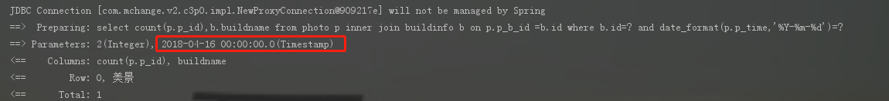
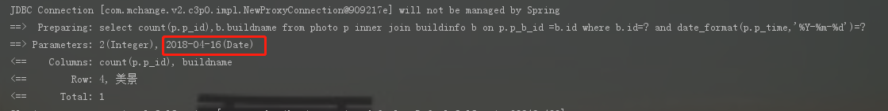
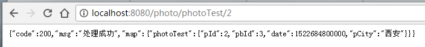

#  MyBatis的Date类型

在写select的时候，里面的查询语句。where后面如果jdbcType=DATE没有写的话是 这个形式的。

```
<select id="selectPhoto" parameterType="com.jbj.bean.Photo" resultType="java.lang.Integer">
         select count(p.p_id),b.buildname from photo p
            inner join buildinfo b
            on p.p_b_id =b.id
            where b.id=#{pbId}
            and date_format(p.p_time,'%Y-%m-%d')=#{pTime}
    </select>
```



写上后： 

```
#{pTime,jdbcType=DATE}
```

 



知识点2：

创建的日期。是从1900-01-00开始的。 下面的例子是2018-04-16

```
Date date=new Date(2018-1900,04-01,16);
```

 知识点3：

在实体中加上注解：

```
@DateTimeFormat(pattern = "yyyy-MM-dd")
    private Date pTime;
```

 知识点4：

　　　　返回的JSON数据是从1970年1月1日至今的毫秒数。

　　　　

解决方案：

　　　　在对应的属性的set方法上加上注解。

　　　　@JsonFormat(pattern = "yyyy-MM-dd HH:mm:ss", timezone = "GMT+8")
　　　　public void setDate(Date date) {
　　　　　　this.date = date;
　　　　}

　　　　