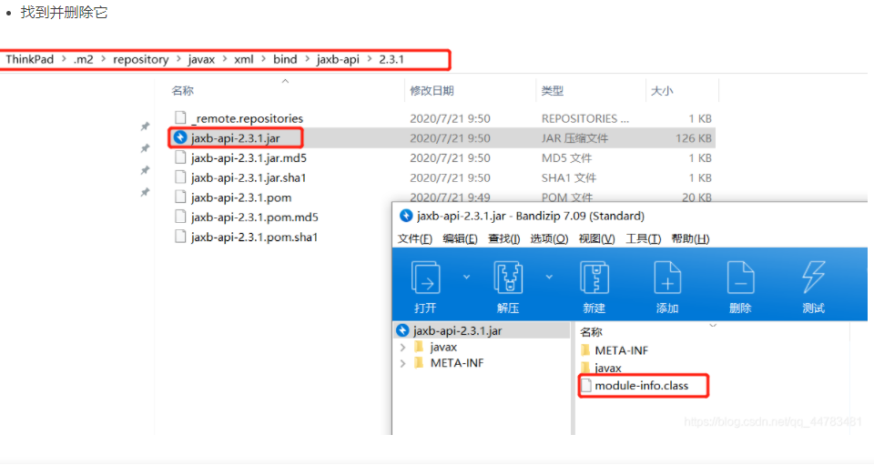

# Tomcat报错[module-info.class]

https://blog.csdn.net/qq_44783481/article/details/109668707



# 解决Maven项目下添加HttpServletRequest 或 HttpServletResponse**需引用的依赖包报错**

```xml
    <dependency>
      <groupId>javax.servlet</groupId>
      <artifactId>servlet-api</artifactId>
      <version>2.5</version>
      <scope>provided</scope>
    </dependency>
```

